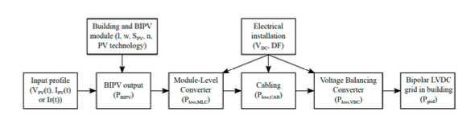
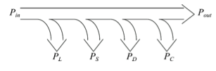

- ### context
	- **BIPV**
		- Building Integrated Photovoltaics
		- Integrate PV cells/modules in structural building elements
		- <->BAPV (building applied voltaics): Placed on existing structures
	- **Why?**
		- Climate awareness
		  collapsed:: true
			- Reduce the use of fossil fuels and increase the share of renewable energy generation
		- Legislation
		  collapsed:: true
			- EPBD (European
			  Performance on Buildings Directive), SET plan (Strategic Energy Technology)
		- Cost
		  collapsed:: true
			- Higher CAPEX but lower OPEX
			- Material savings
		- Image
		  collapsed:: true
			- Green building
		- Roof space
		  collapsed:: true
			- Can be scarce in urban areas
			- Too small to cover building’s energy demand
	- **Build-up**
		- BIPVs all connected to ==Module Level Converters== (MLC)
			- Module level MPPT
			  collapsed:: true
				- Why?
				  collapsed:: true
					- High partial shading risk
					- Allows to use modules with different ratings
					- converter pre-installment -> cost reduction
				- Leads to higher efficiency
			- Challenges
			  collapsed:: true
				- Lifetime
				  collapsed:: true
					- 25+ years of lifetime required
					- No maintenance (when integrated in frame)
					- High temperature environment
				- Compactness
				  collapsed:: true
					- Needs to fit in the frame of a curtain wall module
				- Cost
		- MLCs all connected in parallel to ==Low Voltage DC== (LVDC)
			- Why?
				- Compatibility
				  collapsed:: true
					- DC loads, DC generators, DC storage
					- Fewer conversion steps
					  collapsed:: true
						- Less components required
						- Higher efficiency
						- Lower cost
				- Capability
					- No skin effect
					- More power can be transferred over the same cross section
				- Controllability
					- Due to power electronics converters
- ### Research question and methodology
	- #+BEGIN_QUOTE
	  How is the total conversion efficiency affected by reducing the DC bus voltage and/or choosing a different PV technology?
	  #+END_QUOTE
		- Important design parameters: DC bus voltage level, PV technology
	- 
		- **Input profile**
		- **PV technology** (DOF)
			- Cristaline Si
				- Regular, Half, Shingled Cell
			- Thin film technologies
		- **MLC**
			- Boost converter
			- Topology (DOF)
				- depends on maximum gain
			- Components (DOF)
				- Depend on voltage and current of the case and extra boundary conditions (e.g. max current ripple)
				- Automatically selected from (small) database
			- Losses
			  collapsed:: true
				- 
				- Inductor and transformer
					- Winding losses
						- DC losses
						- AC losses (skin & proximity effect)
					- Core losses (hysteresis)
				- Transistor and diode
					- Conduction losses
					- Switching losses
				- Capacitor
					- ESR losses
						- ESR: Equivalent Series Resistance
			- Power derating
				- Why?
				  collapsed:: true
					- Lower cost (CAPEX)
					- Small influence on the generated power and thus faster return on investment
					- Smaller converter
					- Smaller cable cross section
				- Ideal rating
				  collapsed:: true
					- depends on the geographical location and economical factors such as feed-in tariffs
				- Derating
				  collapsed:: true
					- -> current curtailment
					- Lost energy -> look at remaining energy production
					- For mono-Si at $$90^{\circ}$$, Derating up to 50% has low impact on yearly energy yield
		- **Cabling**
			- Selection
				- Max current rating (=thermal limit!)
				- Max voltage drop along the line
				- Max power loss
			- -> combining equations allows to determine suitable voltage levels (sl.20)
				- Cable thickness (DOF)
		- **Voltage balancing converter**
			- Not custom designed -> fixed design
- ### Case Study
	- Minder important ->Zie slides
	- System efficiency
		- Low in the beginning
			- impact constant losses > injected power
		- plateau
			- relative importance of constant losses decreases
	- Loss distribution
		- Majority of the losses is always situated in the MLC
		- Reducing the DC bus voltage shifts the losses from the MLC to the VBC and the cabling
			- Thus DC voltage decrease is effective way to increase MLC lifetime
		- Also the total losses decrease when DC bus voltage decreases
	- slide 28
		- CIGS cheaper (case 9-11)
		- But Energy yield of c-SI SC (shingled; case 7-8)
		- So can maybe be more economically attractive over lifetime