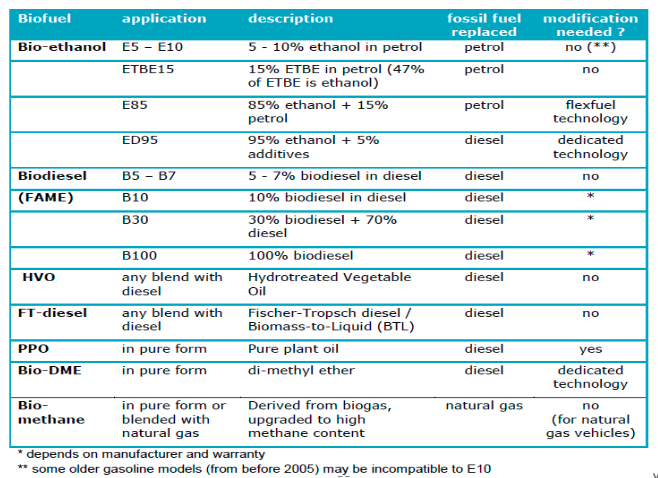
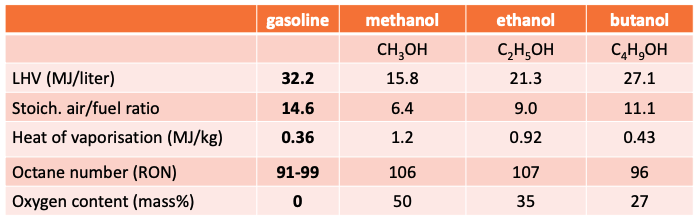
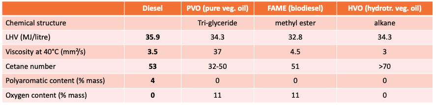
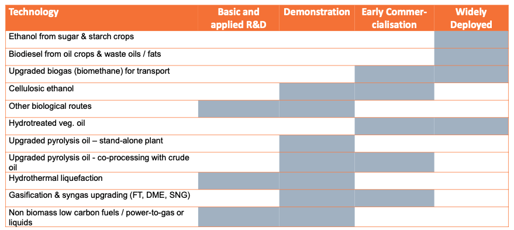
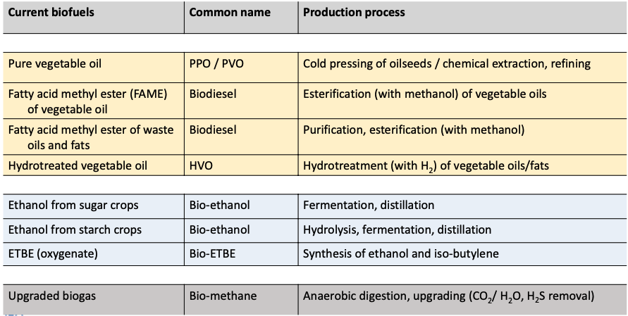
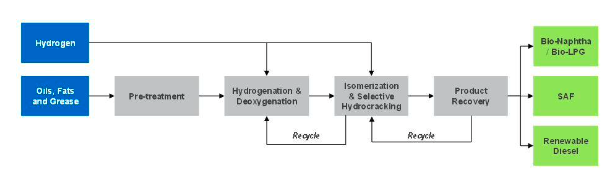

- ### Biofuel types and resources
	- Oils & fats
		- biodiesel
		- pure vegetable oil
		- hydrotreated veg.oil
		- HEFA jet fuel
	- Sugars & starch
		- ethanol
		  butanol
		  sugar- or alcohol-to-jetfuel
	- Digestible products
		- -> anything that can be put in anaerobic digestion
		- bio-methane
	- lignocellulose
		- = fibrous part of plant material
			- consists mainly of three polymeric components bound together in a complex
			  structure: cellulose, hemicellulose, and lignin.
		- types
			- FT (synthetic) diesel / BTL
			- bio-methanol
			- bio-DME (di-methyl ether)
			- cellulose ethanol & butanol
			- synthetic natural gas (SNG)
			- bio-hydrogen
- ### Evolution in the past and biofuel scenarios for the future
	- Trends
		- Global transport energy consumption continued to grow in the past decade
			- STEPS
				- Although alternatives (biofuels, EV) gain importance, dominance of fossil fuels remains
				- Not compatible with climate targets!
			- NZE
				- While demand of transport services more than doubles, biofuels complement end-use efficiency and strong growth in electricity (and derived fuels), providing ~16% of transport final energy demand in 2050
				- Evolutions in road transport sectors
					- Strong growth of electricity (particularly for cars), but it takes time to replace the fleet
					- Biofuels have a strong role to displace fossils in the coming decade (in ICE dominated fleet)
					- In future this will be complemented with hydrogen- based fuels (‘e-fuels’)
				- Global biofuels production
					- Liquid biofuels to quadruple
					- Up to 2030 (main focus still on road transport):
						- Continued growth of conventional
						  ethanol & biodiesel
						- Strong growth of advanced biofuels
						  needed (mainly for road transport)
					- Post 2030
						- Role of conventional biofuels goes down
						- Addition of carbon capture & storage in biofuel processes
						- Shift from road biofuels to marine and aviation fuels (as road transport becomes more electric)
		- Two main biofuels at the moment: bio-ethanol & biodiesel
			- increase in the last two decades
			- Still crop dependent
				- Dominant feedstocks Ethanol:
					- Brazil: sugar cane
					- USA: corn
					- Europe: corn, wheat, sugar beet
				- Dominant feedstocks Biodiesel:
					- EU: rapeseed oil, palm oil, used
					  cooking oil, soybean oil
					- USA/Brazil: soybean oil
					- SE Asia: palm oil
- ### Application of biofuels in vehicles
	- #### Overview
		- 
	- #### Engines
		- Spark ignition engines (Otto)
			- compatible fuel types
				- Ethanol / ETBE
				- Methanol / MTBE
				- ...
		- Compression ignition (CI) engines (diesel)
			- compatible fuel types
				- Biodiesel (FAME)
				- Hydrotreated veg. oil (HVO)
		- Gas turbines (jet engines)
			- Synthetic Paraffinic Kerosene (SPK)
				- HEFA (hydroprocessed esters and fatty acids)
	- #### Alcohol biofuels
		- Methanol, ethanol, butanol
		- Properties
			- overview
				- 
			- Lower LHV
				- → higher volumetric fuel consumption => lower radius with same tank volume
				- → lower LHV usually links with fuel oxygen content
			- Lower stoichiometric air/fuel ratio
				- -> more fuel injection per engine cycle => increased power
			- High octane number
				- → suitable for SI engines;
				- → higher compression ratio possible
			- High heat of vaporisation
				- → lower cylinder inlet temperature → better charging, higher power → potential cold start problems
		- **Ethanol applications** #.ol
			- ==As a blending component==
				- Up to 10% ethanol with gasoline (“E5” or “E10”):
				- Applied as ‘oxygenate’ to lower exhaust emissions
				- No technical problems in terms of
					- power and efficiency,
					- material compatibility,
					- lubricating oil degradation
				- Avoid water => very dry ethanol
					- Water could result in phase separation
				- Increased vapour pressure of the gasoline-ethanol blend
					- could increase evaporative emissions, unless captured by canistor
				- Application of ETBE (oxygenate, produced from ethanol + iso-butylene) => reduced vapour pressure
			- ==High ethanol concentration==
				- Typically up to 85% ethanol (E85), sometimes also E100 (Brazil)
				- For the same energy: fuel supply (volume) x 1,6
					- => Implication on fuel tank, tubes, injection system, engine control
				- High heat of vaporisation
					- => Heating system or limited gasoline component (typically 15-30%)
				- Higher compression ratio
					- =>More power, higher efficiency
				- Material compatibility => dedicated materials
					- rubbers and plastics: avoid problems of swelling, permeability
					- metal corrosion (e.g. fuel tank)
				- Practical example: FFV technology
					- “Flexible Fuel Vehicles”
					- Flexibility between 100% gasoline and 85% ethanol (in Brazil 100%
					  ethanol)
					- All materials compatible with ethanol, sufficient sizing of tubes and injectors
					- Engine control unit detects type of fuel and adapts parameters (injection quantity, ignition timing), without interference of the driver
					- Engineering mainly in the engine control software
					- Also applicable for methanol in some cases
			- ==Ethanol blending in diesel==
				- Tests with up to 15% ethanol in diesel (‘E-diesel’)
				- Problems with mixability
					- => stabilising additives
				- Low cetane number
					- => ignition improvers
			- ==Diesel engine with high ethanol concentration== #.ol
				- Ethanol with ignition improvers (e.g. ED95)
					- Engine to be adapted (see Scania)
					- Very low NOx and PM emissions
				- Dual-Fuel principal
					- two fuel systems
					- Diesel pilot injection for ignition
				- Conversion to Otto engine
					- sparkplugs, lubricating additives, lower compression ratio
	- #### Vegetable oil biofuels
		- Pure vegetable oil (PVO), Fatty acid methyl ester (FAME), HVO
		- properties
			- Overview
				- 
			- Cetane number
				- → Indicates the speed of self-ignition in a diesel engine
				- → Low cetane number gives lower combustion quality/stability
			- Viscosity
				- measure of a fuel's resistance to flow ; temperature dependent
				- → High viscosity impacts pumping and atomization of the fuel during
				  injection => combustion quality
				- → Also links to lubrication in the fuel system
			- **Fuels**
				- ==Biodiesel/Fatty acid methyl ester (FAME)==
					- Fuel properties
						- Heating value (by volume) 9% lower than diesel
						- Cetane value similar to diesel
						- Kinematic viscosity slightly higher
						- Other distillation curve => more difficult to evaporate from lubricating oil (drops of lubricatiing oil stay down)
						- Additives for cold flow properties
						- Fully mixable with diesel
							- Up to 7% blending allowed in EN590 (diesel norm)
							- For higher blends:
								- Compatibility with rubber materials and plastics (tubes and seals) to be checked (mainly problematic for older models)
								- Compatibility with particulate filter systems (because of post-injection)
								- Shorter service interval
				- ==Pure vegetable oil (PVO)==
					- Fuel properties
						- Heating value (by volume) 4% lower than diesel
						- Cetane value lower than diesel => lower combustion stability
						- Kinematic viscosity much higher => vegetable oil needs preheating(-) before injection
					- Engine conversion needed (mainly preheating) to run on vegetable oil
					- Collaboration of manufacturers is low (only for tractors, e.g. John Deere)
					- Mostly done by specialised companies
					- Production in smaller scale installations (short chain), lower cost than biodiesel
					- Pure plant oil consumption in Germany peaked in 2007 at 0.7 million tonnes
				- ==Hydrotreated vegetable oil (HVO)==
					- Synthetic diesel (like FT diesel) => DROP-IN BIOFUEL
					- Fully compatible with diesel fuel, with superior properties
						- Higher cetane number
						- Less impurities (no sulphur, aromatics, benzene,...)
					- Lubrication additive needed
					- Two options for production
						- Dedicated production where hydrogen is available (close to refineries)
						- Use crude oil refinery process (mix few % of veg. oil in hydrotreating facilities)
					- Vehicle emissions: Reduction in NOx (up to 10%), CO and PM emissions (up to 30%)
				- ==Fischer-Tropsch diesel==
					- From gasified lignocellulosic biomass
					- Technology still in early commercialisation phase
					- ~ Synthetic diesel (like HVO) => DROP-IN BIOFUEL
					- Fully compatible with diesel fuel, with superior properties
						- Higher cetane number
						- Less impurities (no sulphur, aromatics, benzene, ...)
					- Lubrication additive needed
					- Process can also be steered towards bio-kerosene (and diesel as co-product)
				- ==Di-Methyl-Ether (DME)==
					- From gasified lignocellulosic biomass
					- $H_3C-O-CH_3$
					- properties
						- Gaseous in atmospheric circumstances Liquid under limited pressure (>5 bar)
							- Storage ~ LPG
						- Cetane: 55-60 => good diesel fuel properties
					- Engine adjustments: fuel and injection system
					- Lubrication additives needed
	- #### Other
		- ==Biomethane==
			- Upgraded biogas, or methane produced through biomass gasification (SNG) or
			  power-to-gas (in future)
				- Natural gas technology
				- Need natural gas infrastructure (fuel stations)
				- On-board storage usually gaseous (CNG, 200 bar), sometimes also in liquid form (LNG, -160°C)
- ### Production processes
	- Commercialisation status
		- {:height 279, :width 589}
	- #### Current biofuels
		- Overview
			- {:height 342, :width 513}
		- ==Biodiesel – Fatty acid methyl ester (FAME)==
			- Process #.ol
				- Vegetable oil extraction => protein meal (animal feed) as co-product
				- Transesterification (with methanol & catalyst)
				- Phase separation & distillation (separate glycerol co-product, recycle remaining methanol & catalyst)
		- ==Hydrotreated vegetable oil (HVO)==
			- 
			- Can start from broader spectrum of vegetable oils, fats and greases than FAME
			- Requires input of hydrogen in refinery type processes
				- currently hydrogen is mostly natural gas based, but will evolve to green hydrogen in future
			- Alkanes as product (no double bonds, oxygen or aromatics)
			- Output ratio of diesel / kerosene / bio-naphta can be steered according to market demand
				- Current focus on renewable diesel, but interest in HEFA as sustainable aviation fuel (SAF) is growing
				- Bio-propane as co-product
		- ==Bio-ethanol==
			- C2H5OH = Ethyl-alcohol (drink alcohol)
			  Production via sugar fermentation
			- Use in food industry, in chemical industry, as transport fuel
			- Base conversion processes (from starch) #.ol
				- Feedstock pretreatment/crushing (to meal)
				- Hydrolysis (saccharification/sugar formation):
				  polysaccharides + H2O + enzymes → soluble sugars => animal feed as co-product
				- Fermentation (from hexose, e.g. glucose):
				  C6H12O6 + yeast → 2 C2H5OH + 2 CO2 => ~ pure CO2 as by-product
				- Product separation (remove stillage waste)
				- Ethanol distillation and dehydration to achieve <0.3% water content
		- ==Bio-methane (from biogas)==
			- Methane = CH4 : main product of anaerobic digestion (AD)
			- Anaerobic digestion = breakdown of organic material by micro-organisms in the absence of oxygen
			- Base conversion processes:
				- Anaerobic digestion of wet biomass: products are
					- raw biogas (50-60% CH4, 20-40% CO2 + fractions of H2S, water, nitrogen, oxygen, ...)
					- digestate (nutrient-rich soil conditioner)
				- Biogas upgrading: adsorption, absorption (gas scrubbing), membrane separation or cryogenic separation to remove CO2, water, H2S and other components to reach natural gas quality (=> substantial amount of high concentration CO2 that could be captured)
				- Pressurise (to 200 bar) or liquefy to fuel the vehicle, or inject in the natural gas grid
	- #### advanced biofuels
		- Thermochemical conversion options
			- Gasification, syngas cleaning & conditioning + further synthesis of the syngas to fuels, e.g.
				- Fischer-Tropsch synthesis + refining to fuels
				- Methanol synthesis
				- DME synthesis
				- Biological gas fermentation
				- Methanation
			- Production and upgrading of pyrolysis products and lignin-rich fractions
				- Pyrolysis/liquefaction + upgrading and hydroprocessing
				- Pyrolysis/liquefaction + upgrading and co-processing in a refinery
		- ==Fischer-Tropsch diesel== #.ol
			- Pretreatment: drying, crushing of lignocellulosic feedstock
			- Gasification
				- Biomass + $O_2$ (or $H_2O$) -> $CO$, $CO_2$, $H_2O$, $CH_4$, + other CHs + tar + char + ash
			- Syngas cleaning to remove
				- organic impurities (tars, benzene, toluene, xylenes)
				- inorganic impurities (O2, NH3, HCN, H2S, COS, HCl)
				- other impurities (dust, soot)
				- reduce CO2
			- Syngas conditioning
				- CH4 reforming
				- Water-gas shift to get the right H2/CO ratio
					- or direct addition of renewable H2
			- Fischer Tropsch synthesis
				- $(2n+1)H_2 +n CO \rightarrow C_n H_{2n+2}+nH_2O$
			- Hydrocracking of FT waxes to increase diesel and/or kerosine fraction
		- Pyrolysis/liquefaction pathways
			- Pyrolysis = thermal decomposition of organic material in the absence of oxygen
			  id:: 646e70e5-68b1-4762-838c-bcfe38719f66
			- products
				- pyrolysis oil
					- high oxygen content, high water content & acidic
					- => difficult to mix with conventional oil
					- => need to upgrade before co-processing
				- char & gas
					- Gas normally used for internal process energy
					- biochar can be used as soil improver (form of carbon storage)
		- Biochemical conversion
			- ==Ethanol and higher alcohols== from lignocellulosic sugar via fermentation
				- Process #.ol
					- Pretreatment:
						- mechanical treatment to reduce the size;
						- chemical/thermo-chemical treatment to separate cellulose and hemi-cellulose from the lignin
						  solids (steam explosion, organosolv, ...)
					- Lignin separated and dried to be used as fuel for process heat
					- Enzymatic hydrolysis: Saccharification (sugar formation) of the cellulose polysaccharides and hemicelluloses oligomers
					- Fermentation of C6 and C5 sugars, mostly through genetically modified yeasts 5. Product separation (distillation, dehydration)
		- Power to Gas / Power to Liquid conversion
			- Input:
				- Renewable hydrogen (e.g. from electrolysis, based on excess green electricity)
				- CO2 – preferably atmospheric
					- Captured biogenic CO2 from a point source (e.g. from biogas upgrading, ethanol production, or industrial flue gases)
					- from Direct Air Capture (DAC) (high cost & energy requirement to extract CO2 from the air at 0.04%)
			- Main products:
				- Methane
				- Methanol
				- FT fuel
			- High technology cost & energy losses;
				- All energy comes from the hydrogen ; all carbon comes from CO2
				- Final product higher value than hydrogen?
- ### Climate impacts
	- Read slides
- ### Biofuel policies and markets in the EU
- ### Conclusions
	- Strong growth in crop based biofuels between 2005 and 2010; markets have stagnated in the EU up to 2016 due to policy uncertainty; increasing again in recent years, with higher focus on waste & residues
	- General blending with common (fossil) fuels most successful
	- Various discussions in society - policies try to avoid side-effects
	- GHG in focus => technological solutions (efficiency), feedstock type + land use / agriculture
	- Further growth of biofuels to be expected / needed (IEA scenario); on medium to long term shift to long-distance transport (where electrification is more difficult)
	- New technologies based on lignocellulose (more focus on residues), but market uptake needs acceleration
	- Biorefinery technology in the future