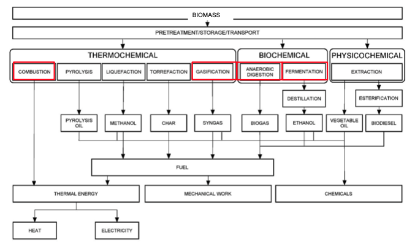

- ### Introduction
	- #### Generations
		- 1-st generation: bio mass also used for food supply
		- 2-nd generation: “woody” (ligno cellulosic) biomass and waste recovery
		- 3-rd generation: genetically modified crops, algae
		- Old classification (now advanced biomass)
	- #### Types
		- Bioethanol
		  collapsed:: true
			- Lower energy content compared to gasoline -> lower energy density -> more quantity required
		- Corn ethanol
		  collapsed:: true
			- Energy balance: 1.3 (Low)
			- Emissions: $-22\%$
		- Cane Ethanol
		  collapsed:: true
			- Energy balance: 8 (Higher)
			- Emissions: $-56\%$
		- Cellulosic ethanol
		  collapsed:: true
			- Energy balance: 2-36 (High range depending on production method)
			- Emissions: $-91\%$
		- Biodiesel
		  collapsed:: true
			- Energy balance: 2.5
			- Emissions: $-68\%$
		- Algae
		- Palmoil
		  collapsed:: true
			- Expropriation of rain forest; drying of wetlands, loss of biodiversity, etc.
	- #### Definition
		- = *all material of organic origin that is not of fossil nature*
		  collapsed:: true
			- Usually, distinction between biomass and fossil is put at peat (NL: turf)
		- = *Stored solar energy*
		- Sorts of biomass considered
			- ==energy crops==:
			  collapsed:: true
				- willow,
				- poplar
				- sugar beet
			- ==organic rest streams==:
			  collapsed:: true
				- rest wood from forests,
				- remainders wood industry (sawdust, wood chips ...),
				- straw,
				- manure,
				- selectively collected “GFT” (“VFG”) waste,
				- organic fraction household waste
	- #### Perspective
	  collapsed:: true
		- Only 0.64% of total annual solar energy is made available in the crop through photosynthesis
		- Contribution to energy supply (as percentage of total global energy)
			- 2004: 20-44% -> ±33%
			- 2012: Very big range
			- 2018: 15-25% (realistically, by Peak)
- ### Conversion Technology
	- #### Direct Combustion
		- = *Thermo-chemical process releasing heat*
		- $C_aH_b + Ox \rightarrow CO_2+H_2O +heat$
			- Use heat directly or convert to electricity with steam generators (Rankine cycle)
		- E.g.
			- wood stoves for heat generation
			- waste incinerators for electricity and/or heat generation
		- Interesting applications
			- Interesting route could be cofiring / co-combustion with coal in regions with ample recent investments in coal-fired plants (China, India)
	- #### Conversion to secondary energy carrier
		- Categories
			- thermo chemical
			- physico chemical
			- bio chemical
			- {:height 301, :width 429}
		- Major processes
			- **Thermo-chemical-gasification**
				- Thermo-chemical = *decomposition of biomass by means of heat*
					- resulting secondary energy carrier later on to be used in combustion process
				- Gasification = *sub-stoechiometric oxidation of biomass*
					- Amount of oxygen we add is lower than for a full oxidation (partial oxidation)
					- Mainly using heat (globally endothermic)
					- Aim to generate a gas that is still combustible ($CO, H_2$ = Syngas)
						- producer gas, cleaned to synthesis gas = syngas, usable in CHP
				- Systems/installations
					- ==BIG-STIG== (=biomass-integrated gasifier/steam injected gas turbine)
						- Most advanced system
						- part of steam produced in heat recovery boiler injected in gas turbine to boost efficiency
						- power values 2-5 MWe
					- ==IGCC== (Integrated gasification combined cycle)
						- for large-scale installations
						- Also called BIGCC
						- Process (3 places where energy is generated)
							- gasifier $Q_{produced} \rightarrow$ steam turbine (1)
							- Synthesis gas $\rightarrow$ in gas turbine (2)
							- Exhaust gases turbine $Q \rightarrow$ steam cycle (3)
						- Advantages/disadvantages
							- (+)  easily capture CO2 (but then need to develop H2 gas turbines)
								- leads to negative CO2 emissions when BIGCC
							- (+/-) BIGCCs can benefit from experience with coal-fired IGCCs, but currently not too many IGCCs built
							- (-) Major problem: gas cleaning purification