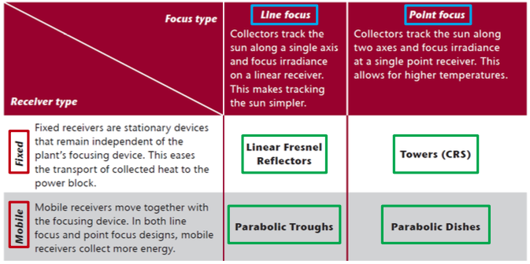
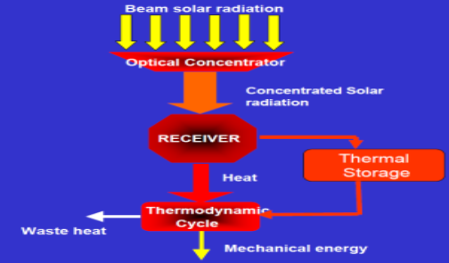
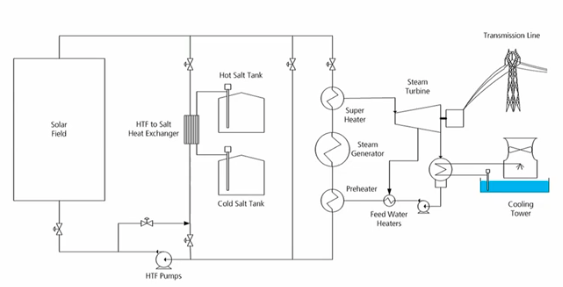

- ### Direct Normal Irradiance - DNI
	- DNI = *incoming radiation energy per m^2 orthogonal to rays, per year*
	- Hotspots
		- MENA
		- (less) Southern EU
		- (Even less in) Middle EU countries
- ### CSP Solar Receiver Technologies
	- Categories
		- ==Linear Fresnel Reflector== (LFR)
			- Long rows of flat or slightly curved mirrors (mimic total parabolic shape) to reflect the sun's rays onto a downward-facing linear, fixed receiver
				- (+) Simple design (no HT) -> low investment cost
				- (-) less efficient
		- ==Central Receiver or Solar Tower==
			- Use hundreds of thousands small reflectors to concentrate the sun's rays on a central receiver placed atop a fixed tower. Use DSG or molten salts as HT and storage fluid.
				- (+) High $$T$$ -> High $$\eta$$+low cost of storage
				- (+) flexible design
		- ==Parabolic Trough==
			- Parallel rows of mirrors curved in one dimension to focus the sun's rays. Stainless steel pipes with a selective coating serve as the heat collectors.  Synthetic oil is heat transfer fluid, in the heat exchanger water is superheated that runs the turbine.
				- (+) mature
				- (-) no thermal storage
		- ==Parabolic Dish==
			- Concentrates the sun's rays at a focal point propped above the centre of the dish. The entire apparatus tracks the sun, with the dish and the receiver moving in tandem. Most dishes have an independent engine/generator (e.g. Stirling machine) at the focal point. This eliminates the need for a heat transfer fluid and for cooling water.
				- (+) Highest solar-to-electric conversion performance
				- (-) Limited in size -> smaller capacities
	- Classification
		- Fixed vs mobile
		- Linear and point focus types
	- {:height 281, :width 507}
- ### CSP conversion technologies
	- 
		- Solar field <-> Thermal storage <-> Power Block
	- Efficiency
		- Thermodynamic Cycle
			- Limited by $$\eta_{carnot}$$
			- With $$\eta_{carnot}\nearrow\; \leftarrow T \nearrow$$
		- Capture efficiency $$\eta_{capt}$$
			- Decreases with $$T$$
			- Decreases steeper for linear than for point focus
			- Increases with $$\alpha_c$$
				- Concentration ratio $$\alpha_c$$: ratio of the radiant power density at the receiver divided by the radiant power density of the sun without any concentration
	- Thermodynamic Cycle
		- CSP Rankine Steam Cycle
		- {:height 270, :width 503}
		- Excess heat collected in the solar field is sent to the heat exchanger and warms the molten sats going from
	-
	-
	-