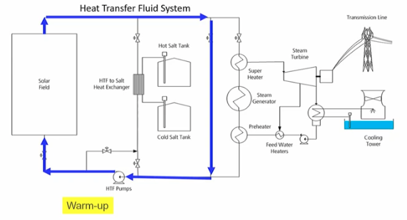
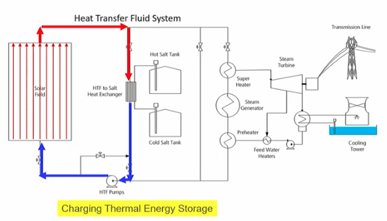
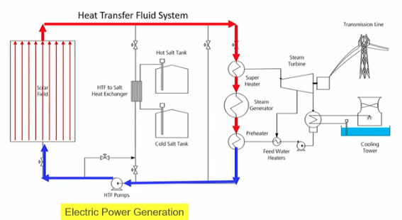
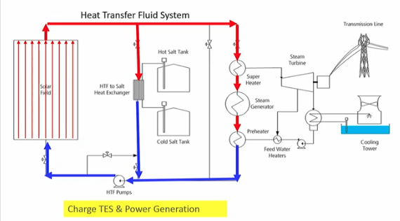
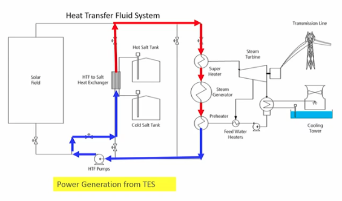
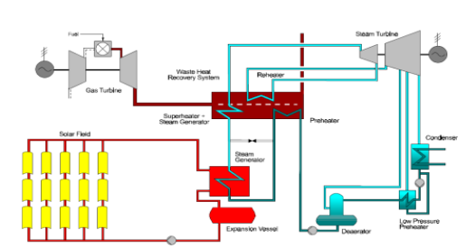

- ### Direct Normal Irradiance - DNI
	- DNI = *incoming radiation energy per m^2 orthogonal to rays, per year*
	- Hotspots
		- MENA
		- (less) Southern EU
		- (Even less in) Middle EU countries
- ### CSP Solar Receiver Technologies
	- Categories
		- ==Linear Fresnel Reflector== (LFR)
			- Long rows of flat or slightly curved mirrors (mimic total parabolic shape) to reflect the sun's rays onto a downward-facing linear, fixed receiver
				- (+) Simple design (no HT) -> low investment cost
				- (-) less efficient
		- ==Central Receiver or Solar Tower==
			- Use hundreds of thousands small reflectors to concentrate the sun's rays on a central receiver placed atop a fixed tower. Use DSG or molten salts as HT and storage fluid.
				- (+) High $$T$$ -> High $$\eta$$+low cost of storage
				- (+) flexible design
		- ==Parabolic Trough==
			- Parallel rows of mirrors curved in one dimension to focus the sun's rays. Stainless steel pipes with a selective coating serve as the heat collectors.  Synthetic oil is heat transfer fluid, in the heat exchanger water is superheated that runs the turbine.
				- (+) mature
				- (-) no thermal storage
		- ==Parabolic Dish==
			- Concentrates the sun's rays at a focal point propped above the centre of the dish. The entire apparatus tracks the sun, with the dish and the receiver moving in tandem. Most dishes have an independent engine/generator (e.g. Stirling machine) at the focal point. This eliminates the need for a heat transfer fluid and for cooling water.
				- (+) Highest solar-to-electric conversion performance
				- (-) Limited in size -> smaller capacities
	- Classification
		- Fixed vs mobile
		- Linear and point focus types
	- {:height 281, :width 507}
- ### CSP conversion technologies
	- 
		- Solar field <-> Thermal storage <-> Power Block
	- Efficiency
		- Thermodynamic Cycle
			- Limited by $$\eta_{carnot}$$
			- With $$\eta_{carnot}\nearrow\; \leftarrow T \nearrow$$
		- Capture efficiency $$\eta_{capt}$$
			- Decreases with $$T$$
			- Decreases steeper for linear than for point focus
			- Increases with $$\alpha_c$$
				- Concentration ratio $$\alpha_c$$: ratio of the radiant power density at the receiver divided by the radiant power density of the sun without any concentration
	- Thermodynamic Cycle
		- CSP Rankine Steam Cycle
		  collapsed:: true
			- {:height 270, :width 503}
			- Excess heat collected in the solar field is sent to the heat exchanger and warms the molten sats going from the cold tank to the hot tank. When needed, the heat from the hot tank can be returned to the heat transfer fluid and sent to the steam generator.
			- Regimes
				- Warm-up
					- {:height 262, :width 332}
					- e.g. morning
				- Charging Thermal Energy storage
					- {:height 256, :width 343}
					- No demand yet
				- Electric Power Generation
					- {:height 207, :width 349}
				- Charge TES & Power Generation
					- {:height 251, :width 346}
				- Power Generation from TES
					- {:height 261, :width 346}
					- Still generation when no Solar energy available anymore
		- CSP Brayton Cycle
		- Integrated Solar Combined Cycle
			- {:height 215, :width 394}
			- Example of a hybrid concept, the combination of solar heat to vaporize the feedwater after the preheating in the Heat Recovery Steam Generator
		- Solar-Driven Gas Turbine Combined Cycle (SD-GTCC)
			- Set up of a solar-driven gas turbine complemented with a steam cycle (CCGT)
			- Combustion chamber replaced by Futuristic receiver/duct burner?
- ### Storage
	- Different uses
		- Delayed intermediate load
		- Base load
			- need for large energy storage and small power turbine.
			  id:: 643b9f91-36a2-4a85-b4df-56a1c275b319
		- Peak load
			- need for large energy storage and large power turbine. Aims to generate a lot of electrical power when peak-load prices are high
- ### Cost
  collapsed:: true
	- Costs
		- 2011-2013: CapEx and LCOE were projected to decrease
		- 2021:
			- CapEx clearly did decrease (±/2)
			- Capacity factor: 30%->42%
			- LCOE substantial reduction (±/3)
		- No auctioning yet
	- Market trends
		- CSP market grew slowly in 2020
			- Competition from PV
			- Expiry of CSP incentive programmes
			- Operational issues at existing facilities
		- More than 1GW capacity under construction in 2020
			- China was the only country to add new capacity
		- CSP costs fell 50% from 2010-2020
			- CSP facilities with thermal energy storage co-located with solar PV
- ### Prospects for CSP
	- Growth of dispatchable renewables slows with 5%
		- Beacause of wind, PV competition
	- Less than 3GW to be commissioned by 2026
	- No visible share in projected renewables
	- To achieve NZE targets, requires increased ambitions for all renewables
	-