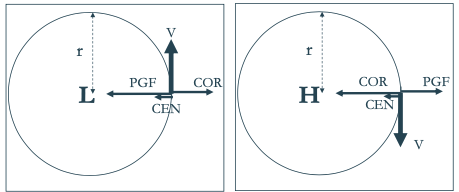
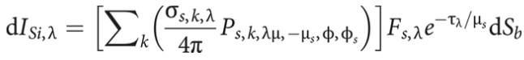

- ### Intro
  collapsed:: true
	- Global challenge
		- Energy security while
			- Mitigate global warming -> decarbonization
			- Reducing air pollution
		- Safe and clean energy
		- Renewable energy generation increases
			- Global: larger hydropower trend
	- **Idea**: *Energy production largely dependent on atmospheric conditions*
		- Wind energy: windspeed
		- Solar energy: clouds, pollution, haze (optical depth atmosphere), temperature
		- Hydropower: Precipitation, evaporation
		- Biomass: precipitation, temperature, evapotranspiration affect growth
### Why, when and where is it windy?
	- #### General circulation
	  collapsed:: true
		- No rotation
			- convection cells driven by $$T$$ gradient
		- Rotation
			- Coriolis acceleration
				- Deflection of the wind
			- Structure (Per hemisphere)
				- Hadley cell
				- Forell Cell
				- Polar cell
	- #### Geostrophic wind
	  collapsed:: true
		- Forces
			- Pressure gradient force
				- Acceleration of the air package
				- Why doesn't the air flow from high to low pressure? <- Coriolis force
					- Deflection (to the right on the N hemi)
			- Coriolis force
				- apparent deviation to the right for counterclockwise rotation
		- Equation
			- Def.: Geostrophic wind -> equilibrium Coriolis and pressure gradient
			- Synoptetische schaal: $$\sum F = F_D +F_C =0 \Rightarrow V_g = \frac{1}{\rho f}\frac{\partial p}{\partial n}$$
				- Afleiding
					- $$
					  \begin{equation*}
					  \begin{aligned}
					  \frac{\mathrm{D}\boldsymbol{U}}{\mathrm{D}t} &= -2\boldsymbol{\Omega} \times \boldsymbol{U} - \frac{1}{\rho} \nabla P + \mathbf{g} + \mathbf{F}_\mathrm{r}\\
					  \Rightarrow \frac{\mathrm{d}u}{\mathrm{d}t} &= -\frac{1}{\rho}\frac{\partial P}{\partial x} + f \cdot v
					  \end{aligned}
					  \end{equation*}
					  $$
					- Coriolis parameter $$f$$, varies with latitude
				- geostrophic wind blows parallel to the isobars: low-pressure on the left
				- large PGF (isobars or contour lines tightly packed together)-> large COR ->large Vg
		-
		- Pressure systems
			- NH
				- L -> cyclonic (=direction same as the rotation of the earth)
				- R -> anticyclonic (=direction opposite to the rotation of the earth)
			- SH
				- L -> anticyclonic
				- R -> cyclonic
	- #### Accounting for Centripetal force
	  collapsed:: true
		- Centripetal force: *The force that maintains the circular motion of the object. $$F_{ctp}$$ is directed inwards.*
			- Accounting for the rotation of the flow
			- In order for the object to deviate from that straight line, a force is needed.
		- Equation
			- Synoptic scale: $$\sum F = F_D +F_C =F_{ctp}$$
			- NH
				- 
					- PGF: H->L
					- Cor: to right of wind speed (NH)
		- Where is windspeed higher?
			- In high pressure system:
			  $$
			  \begin{equation*}
			  \begin{aligned}
			  F_{D}&<F_C\\
			  \frac{1}{\rho}\frac{\partial P}{\partial x}&<V_G f\\
			  \Rightarrow V_G &> \frac{1}{\rho f}\frac{\partial P}{\partial x}
			  \end{aligned}
			  \end{equation*}
			  $$
			- ->super geostrophic, thus higher windspeed
	- #### Effect of altitude
	  collapsed:: true
		- Jet stream
			- Horizontal (not in vertical height direction) pressure gradient:
				- caused by temperature difference between cold polar air and warmer subtropical air
			- Pressure gradient becomes steeper with increasing altitude
			- Meanders because of slower moving air masses at lower latitudes
				- H -> Supergeotrophic
				- L -> Subgeotrophic
			- Waves
				- Trough
					- Dips down to lower altitudes -> Air masses forced together = region of convergence -> higher speed and lower pressure (in the jetstream) -> but creates high pressure system
				- Ridge
					- Vice versa
					- Rises to higher altitudes -> region of divergence -> lower speed and higher pressure (in the stream) -> but creates low pressure system
	- #### Answer: Where is it windy?
	  collapsed:: true
		- Three cells and jet streams determine wind climate
		- Low near equator
		- Higher at jet streams
### What is the effect of the earth's surface on the wind?
	- #### Atmospheric Boundary Layer (ABL)
		- **Definiton**
		  collapsed:: true
			- = *lowest part of the atmosphere that is directly influenced by the surface*
			- = Planetary boundary layer (PBL)
			- depth can vary from a few 100m to several km depending on time of day, season, and weather conditions
		- **Stratification**
		  collapsed:: true
			- = Temperature height relation
			- Thermal stability
				- dry-adiabatic processes: temperature of parcel decreases with a fixed rate per unit height; potential temperature is constant with height
					- Dry-> condensation
					- Adiabatic -> no heat exchange
				- Stable stratification
					- surpresses vertical motions
					- Environmental air cools slower than parcel -> falls
				- unstable stratification
					- enhances vertical motion/mixing
					- Environmental air cools faster than parcel -> rises further
				- -> Stability is property of environmental air
			- virtual temperature: temperature that dry dry air would have if its pressure and density were equal to those of a given sample of moist air
		- **Modeling vertical ABL profiel - Inner layer**
		  collapsed:: true
			- inner layer: viscous shear dominates
			- outer layer: large scale turbulent eddy shear dominates
			- Assumptions
				- Turbines in inner layer
				- Outer layer dynamics decoupled
			- Relations
				- Dimensionless wind velocity and dimensionless height:
					- Analytical: $$\frac{u}{u_*} = \frac{1}{\kappa}ln\left(\frac{z}{z_0}\right)$$
						- with:
						  collapsed:: true
							- $$\kappa = Von\; Karman\; constant$$
							- $$z_0 = roughness\; length$$
							- $$u^* = shear; stress$$
					- Heuristic/empirical
				- With stability correction
					- Obukhov length
						- expressing the relative roles of shear and buoyancy in the production/consumption of turbulence kinetic energy
						- Formula: $$L=\frac{u_*^3}{\kappa(\frac{g}{T_0})(\frac{q}{\rho c_p})}$$
					- Corrected formula: $$\frac{du}{dz}=\frac{u_*}{\kappa z}\psi(\frac{z}{L})$$
						- Zie slides voor: $$\psi(\frac{z}{L})$$
			-
	- #### Wind: impact of drag
	  collapsed:: true
		- near surface
		- Now four forces need to be balanced
		- Drag force always opposite to wind speed
		- thus, $$F_D$$ can only be canceled by vectorial sum of $$F_{ctp}, F_{drag}, F_C$$
			- => Wind not perpendicular anymore on isobars
		- Flow around H/L
			- H: extra outwards component because of drag
			- L: extra inward component because of drag
### Why, when and where is it sunny?
	- #### Top of the atmosphere
	  collapsed:: true
		- ==Solid angle==
			- Incremental solid angle is the incremental surface area on a unit sphere.
			- Formlula: $$\Omega = \int_0^{2\pi}\int_0^{\pi}sin(\theta)d\theta d\phi=4\pi$$ (area of a sphere with $$r=1$$)
		- ==Radiance or spectral radiance== ($$I_\lambda$$)
			- is the energy emitted by a body per unit area per unit time per unit wavelength per incremental solid angle
		- ==Spectral irradiance or spectral power== ($$F_\lambda$$)
			- is the normal perpendicular components of spectral radiance hitting a flat plane where the radiance originates from all directions in a hemisphere above the plane
			- $$F_\lambda = \int_0^{2\pi}\int_0^{\pi/2}I_\lambda cos(\theta)sin(\theta)d\theta d\phi$$
			- Isotropic: $$F_\lambda = \pi I_\lambda$$
			- black body spectral irradiance is a function of wavelength and temperature (Planck’s law)
			- at TOA
				- Stefan Boltzmann law: The total power flux from any object: integrating over the spectral irradiance
				- total energy per unit time passing through a concentric sphere any distance from the photosphere equals that originally emitted by the spherical photosphere: $$4\pi R^2_{es}F_e=4\pi R^2_{p}F_p\Rightarrow F_e =1365W/m^2$$
	- #### Surface
		- Irradiance on surface dependent on amount of scattering and absorption
		  collapsed:: true
			- Which is determined by:
				- Aerosols
				- Hydrometers
		- Radiative transfer
			- Extinction coefficient ($$\sigma_\lambda$$):
			  collapsed:: true
				- fractional loss of EM radiation due to gas scattering, gas absorption, particle scattering, or particle absorption per unit distance through the atmosphere
				- Number concentration $$\times$$ crss-sectional area of particle $$\times$$ Absorption/scattering efficiency
			- ==Optical depth==
			  collapsed:: true
				- is the integral of the extinction coefficient from the top of the atmosphere down to a point of interest in the direction of the surface normal
				- $$\tau_\lambda = \int_\infty^z\sigma_\lambda dz=\int_\infty^{S_b}\sigma_\lambda \mu_s dS_b$$
			- Radiative transfer equation
				- Factors
					- ==Spectral radiance scattered out of the beam==: $$dI_{SO,\lambda}$$
					  collapsed:: true
						- Formula: $$dI_{SO,\lambda}=I_{\lambda}\sigma_{s,\lambda}dS_b$$
					- ==Spectral radiance absorbed along the beam==: $$dI_{ao,\lambda}$$
					  collapsed:: true
						- Formula: $$dI_{ao,\lambda}=I_{\lambda}\sigma_{a,\lambda}dS_b$$
					- ==Multiple scattering of diffuse radiation into the beam==
					  collapsed:: true
						- {:height 79, :width 495}
						- Scattering phase function ($$P_S$$): angular distribution of radiance scattered by particle or gas molecule at a given wavelength
					- ==solar radiation is scattered into the beam==
					  collapsed:: true
						- {:height 64, :width 465}
							- No need to integrate over all solid angles, as position of the sun is known
				- Scattering phase function ($$P_S$$)
				  collapsed:: true
					- Isotropic scattering
						- equal scattering in all directions
					- Rayleigh scattering
						- Gasses
						- most scattering in the forward and backward direction
						- Wavelength dependent
							- *Why is the sky blue?*
							  collapsed:: true
								- Solar radiation scattered on gas (air) molecules -> rayleigh scattering which is wavelength dependent, preferable for shorter wavelengths of which we can only visibly see the blue color
					- Mie scattering
						- Particles (aerosol and hydrometeor)
						- strongly peaked in the forward direction
							- Aerosols 60 to 85% scatters in the forward direction
							- hydrometeor 70 to 85%
						- Less wavelength dependent
- ### Measurements
	- #### How is wind measured?
		- General
			- Anemometer: device to measure wind speed (and direction)
		- In situ observations
			- Three cup anemometer: speed of rotation is theoretically proportional to the wind speed, but other factors can influence it in practice
			- Vane anemometer : combines propeller and tail for speed and direction
			- Sonic anemometers: measuring how much ultrasonic sound waves are sped up or slowed down by the effect of the wind; advantage of no moving parts (extreme weather); Lower accuracy in precipitation due to variation of speed of sound
	- #### How is Solar radiation measured?
	-