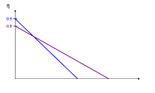
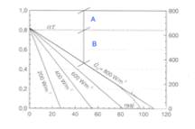
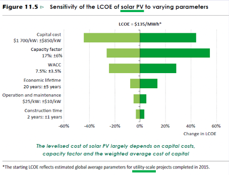
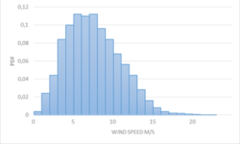
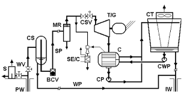
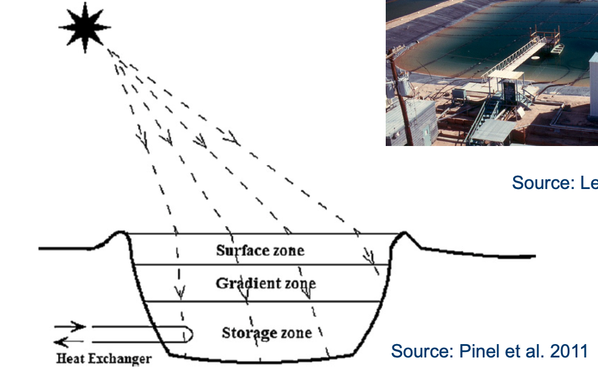
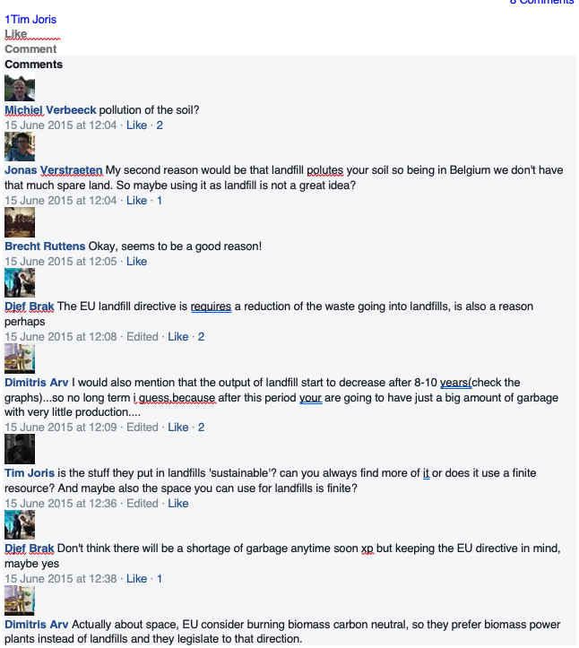

- ## Old questions
	- ### 22 June 2022
		- Intro: #intro_EX
			- Explain how EU member states with low RES-potential reached their RES goal for 2020. So basically explain the statistical transfer of RES and give for one example the numbers of price and quantity.
			- Graph of hydro production of the IEA was given, with the total production of 2019. What would be the total production in the BP graph and why?
			- Why is there a different number for the total primary fuel use between IEA and BP? 2 reasons
			- What is gross total consumption?
				- *Includes primary energy consumption + non energy (feedstock) consumption*
		- Wind: Explain the control mechanism for a modern wind turbine. (max. 3 pages) #wind_EX
		- Storage: Do you get more sustainable energy production, when you combine a battery with a PV system? What might be a negative effect? (max. 1 page) #storage_EX
			- sl. 17
		- Geothermal: #geothermal_EX
			- Layout of a double flash power plant was given. Name the plant and does this work on a primarily liquid-well or steam-well?
			- Draw and explain the turbine in more detail. (So give the drawing where the turbine is split with a mixer in between)
			- Explain the working principle of the plant.
			- Give the T-s diagram.
	- ### 11 June 2022
		- Q1
			- Part 1
				- 
				- 
				- What is on the x axis of the first image?
				- What do these lines represent?
				- What is on the x axis of the other image?
				- What is dominant in A?
				- Indicate the vacuum curve
			- Part 2
				- 
				- Explain the colors on this graph and what it means for the capital cost and the capacity factor
				- Explain the asymmetry for capacity factor
				- Explain the asymmetry for the economic lifetime
		- PV #PV_EX
			- What is the difference between bifacial and monofacial PV systems?
				- Monofacial PV panels are the traditional and most common type of solar panels. They consist of a single layer of photovoltaic cells mounted on a supporting structure. These panels are designed to capture sunlight only from one side, usually the front or top surface of the panel. The front surface is where the active photovoltaic material is located, which converts sunlight into electricity. The back surface of a monofacial panel typically consists of a protective layer and a backing material, most commonly used is an Aluminium backside.
					- {:height 236, :width 216}
				- Bifacial PV panels, on the other hand, are designed to capture sunlight from both the front and back surfaces of the panel. They feature photovoltaic cells on both sides, allowing them to generate electricity from sunlight that strikes the front surface as well as from sunlight that is reflected or diffused onto the back surface. Bifacial panels are typically constructed with a transparent or translucent backsheet or glass back cover, which allows light to pass through to the rear cells. Note that back side generation also requires the necessary busbars and fingering designs on the rear side.
			- Why is it difficult to estimate the production of these systems?
				- No consensus on gain estimates
				- Lack of standardization in calculation methods
				- A lot of uncertainty
					- rear side irradiance is non-uniform and dependent on:
						- characteristics on the ground
						- shading
						- location and stance of the modules
						- Neigbouring PV systems
			- What is the typical gain of this bifacial module compared to a monofacial? What is the reason of these gain?
		- Biofuels #Biofuels_EX
			- Give at least four characteristics that are important for alcohol-based biofuels for otto engines. Also give the name of these fuels. Discuss briefly how the characteristics influence the working principle.
			  background-color:: blue
				- ((646e54d7-a058-4a57-b4ea-07753c1ec75e))
		- Q4
			- Explain chemical looping (calcium looping) and give a schematic indicating the charging and discharging process?
			- What are the main properties and strengths?
			- How can it be used for carbon capture?
	- ### 18 June 2021
		- Intro #intro_EX
			- slide 79 deel 4 van william in zijn intro, leg uit waarom de stippelijn stijgt en dan weer daalt en waarom de volle lijn constant stijgt
			- Hoe bepaalt ge de waarde van 'residential PV' (2 lijnen) en is een batterij bij uw home PV een goed idee bij net metering? #PV_EX
		- Wind #wind_EX
			- het nominaal vermogen en snelheid van een windturbine gegeven, cut in and off snelheden ook en de Cp, bereken het maximale buigmoment van de fundering (neem voor
			  ontbrekende waardes goeie aannames)
		- Hydro #Hydro_EX
			- Doe een SWOT analyse van een floating PV
			  background-color:: blue
				- Strenghts
					- (+) better performance than regular PV due to cooling effect of the ocean (15% more yield)
					- (+) mature technology
						- Low LCOE, ease of deployment
					- (+) no land required
					- (+) limits evaporation
					- (+) limits algae development
				- Weaknesses
					- (-) Wear out, corrosion
					- (-) difficult maintenance
					- (-) floating movement increases mppt difficulty
					- (-) difficult grid connection
					- (-) environmental impact
						- sea life, fish in the pond,...
				- Opportunities
					- In combination with off-shore windparks
						- -> complementarity
					- In combination with dams+reservoir
						- limits evaporation
					- In combination with ponds next to greenhouses
						- limit algae and evaporation
				- Threats
					- Storms
					- Watercraft navigation
					- Soiling by birds
					- Mooring and anchoring
					- electrical safety
					- longevity of equipment
						- salt water spray
		- Solar_thermal #Solar_thermal_EX
			- waarom moet de reflectie coeff van een absorber gelijk zijn aan 1 vanaf 3µm? en die figuur op slide 55 van die kost met waarom 16 jaar, wat is daar fout aan en hoe beter?
	- ### 4 June 2021
		- Intro #intro_EX
			- Lcoe, wacc, figure from slides given, what are the green diamonds, what is missing in the right figure?
				- *Zie June 2019*
		- PV #PV_EX
			- same question as below, diode with j0 given, find v_oc, FFmax, efficiency, compare with typical efficiency
		- TES #Solar_thermal_EX
			- TES is important for cross-sectorial decarbonization, give four examples
		- Hydrogen #Hydrogen_EX
			- Fuel cells, which can be fueled with methane and which not, why?
	- ### 19 June 2020
		- CSP #Solar_thermal_EX
			- Give the 4 techs for CSP in a 2x2 grid schape and give on major advantage and disadvantage for each tech
			  background-color:: blue
				- ((643afa84-4773-43f3-9362-9b9762473cce))
			- Give the 2 main components of solar collection efficiency
				- $\eta_{carnot}$ of thermodynamic cycle, increases with increasing $T$
					- depends therefore on the chosen cycle
				- $\eta_{capt}$, decreases with increasing $T$
				- -> global maximum exists
			- Give the range of the efficiencies for each of the 4 techs
				- Peak efficiency
					- LFR: $18-22\%$
					- Tower : $20-27\%$
					- PT: $23-27\%$
					- PD: $20-30\%$
			- If you could build a large PV plant in a suitable location, would you prefer CSP or PV and why?
				- *PV, lower pay-back-period to win back my investment as technology is cheaper (LCOE)*
				-
		- Wind #wind_EX
			- Wind density diagram given at 60 meters (weibull distribution) , needed to be converted to 15m and you needed to get the nominal power from that and the estimated capacity factor
		- Hydro #Hydro_EX
			- Give 2 major reasons why big hydro can be unsustainable
				- ((644404d6-04e3-49a0-8153-c2f722c40060))
			- Give 2 major reasons why small hydro can be unsustainable
				- Can disturb local fish stocks
					- Have to provide fish protection measures
					- e.g. fish ladder
				- No economies of scale
					- a lot of small scale powerplants will need more cabling, generators (With copper etc.) than one large power plant
		- Geothermal #geothermal_EX
			- Hybrid plant given, explain workings in 10 lines
			- Vapor or liquid field?
			- Temperature range of field?
			- What working fluids for what part of the system?
			- Draw TS diagrams for both parts of the system
	- ### 19 June 2019
		- Intro
			- Dhassler: past exam question about fuel cells which can use methane (CH4) and which can with adjustments, and which cant. #Hydrogen_EX
			- Second question a graph of LCOE for PV and wind was given. #intro_EX
				- What is LCOE
					- ((646fb863-d1ec-428a-9bae-255c696dd80f))
				- what is WACC
					- *Opportunity cost of capital*
				- why does LCOE curves go down for PV and wind
					- *Technological Advancements: Advances in solar panel and wind turbine technologies have significantly increased their efficiency and energy output*
						- *-> increases denominator*
						- *->decreases CapEX*
						- *->increases lifetime (cost spread over longer period)*
						- *Also caused by learning curve effect*
						- *Driven by subsidies, tax incentives and other policies*
					- *Economies of Scale: The increasing deployment of solar and wind power installations worldwide has led to economies of scale. As the manufacturing and installation volumes have risen, the costs associated with producing solar panels and wind turbines have decreased.*
						- *Capital expense (annuity) will decrease*
					- *Learning curve effect: cumulative experience and production volume, the costs of renewable energy technologies tend to decrease*
						- *e.g. O&M will decrease*
					- *No or little cost of carbon, cost of fuel*
				- why is LCOE dependent of WACC
					- *LCOE is the average price during operation hours needed to break even over the lifetime of the plant. It thus makes the balance of the needed future revenue against the projected future costs of the plant. When calculating future money streams, one should account for the time-price value of money and therefore discount the streams to the present (NPV) as money is worth less in the future than it is today. This discount is embodied by the WACC, which can be seen as the opportunity cost of capital. Therefore using another discount (WACC) value will give other results in terms of average price needed to break even. This shows the dependency.*
				- what are the green diamonds on the graph? What is missing on the right hand side graph?
		- Solar PV #PV_EX
			- same as past exam question where he gives the equation for the efficiency of the solar cell and you have to explain what all the terms mean.
			  background-color:: blue
				- ((64341221-a033-4a55-b6e6-171f1a1c37a3))
			- Explain why there is a theoretical maximum efficiency for a given bandgap.
			  background-color:: blue
				- *Shockley-Queisser limit*
				- *Considers only radiative recombination mechanism (+ see other assumptions)*
				- *It provides an upper bound on the amount of solar energy that can be converted into electrical energy by a solar cell under ideal conditions.*
				- *In single cells there exists a trade-off between bandgap and extraction voltage. A higher bandgap allows higher absorbance (more photons with lower energy absorbed), but extraction* 
				    ($V_{OC}$) *happens at lower voltages, and vice versa*
				- *Limit is mainly formed by*
					- *Absorption limit -> incomplete absorption*
					- *thermalization limit -> excess-energy losses*
					- *Other inevitable loss factors*
						- *Long-wavelength losses*
						- *Voltage factor*
						- *FF*
				- *Shockley queissler limit* $\approx 30\%$
			- Why can multijunctions increase efficiency?
			  background-color:: blue
				- *Multijunction cells try to increase the limited efficiency of single cells (Shockley-Queisser) by increasing absorption. Absorption in a single cell is limited by long-wavelength (absorption limit, only photons with sufficient energy to let electron bridge bandgap are absorbed) and excess energy (thermalization limit, absorbed photons with energy higher than bandgap -> excess energy will be lost through heat dissipation). See figure.*
				- *Multijunction cells try to reduce those limits and increase absorption by stacking multiple cells with different (increasing) bandgaps upon each other. The higher range of bandgaps allows to absorb photons with lower energy (higher wave length) ->decreases long-wavelength losses. Additionally photons with higher energies can be absorbed by subsequent cells with larger bandgaps which reduces thermalization (excess energy) losses. Finally as the thickness of the cell improves, also incomplete absorption losses decrease.*
				-
		- Wind #wind_EX
			- Some Crazy question for you to derive an equation a' and torque using Cq (yes CQ, not CT or CP).
		- Geothermal #geothermal_EX
			- asked you to draw an entire scheme for a hybrid plant (single flash + orc binary), draw TS diagrams for both. Is it vapor dominated or liquid dominated? what is the temperature range?
		- Electric Storage #storage_EX
			- Compare supercapacitors and batteries, how can these help renewable energy generation?
			  background-color:: blue
				- Both
					- storage can offer the flexibility needed to equate demand and supply
					- Even more important in the renewable context of intermittent generation that makes the supply curve unpredictable
				- Supercapacitors
					- Electromagnetic storage device that stores electric energy in the electric field between two electrodes separated with a dielectric/electrolyte
					- (+) high power density
					- (-) low energy density
					- (-) costly
					- Mainly because of last reason, not widely deployed
						- Had some applications in hybrid buses but now pushed out of the market too
				- Battery
					- Definition
						- Induced redox reaction results in current flowing in a closed circuit
						- Li-ion batteries have the best properties for static storage
							- Acceptable efficiencies
							- High power and energy densities
					- Useful
						- Local storage
							- as it is modular, compact and has high power/energy density
							- Self consumption of PV
								- Shift and levelize own demand curve
					- Technical
						- mature
						- on-market
					- Economical
						- Available technologies become cheaper but still no cheap alternatives for large scale storage
		- Biofuels #Biofuels_EX
			- What are the 3 types of biooils that can be produced from vegetable oils? What are the main parameters that describe them and their main differences?
	- ### 14 June 2016
		- PV #PV_EX
			- Explain the problem of the perturb-and-observe control on a day with fast passing cumulus clouds. Do these clouds have the most effect on diffuse or direct light? Does this change the spectrum?
		- Wind #wind_EX
			- Derive the expressions for Cp and Ct in function of a using the momentum theory. Use these expressions to determine the maximum value of both coefficients. Discuss the assumptions and limitations of this theory during the derivation.
		- Electrical storage #storage_EX
			- You have the possibility of either using a battery at a house with a PV installation or placing it at the feeder on the distribution grid to which this household is connected. Discuss the benefits and problems of both options.
			  background-color:: blue
				- Substation devaluators
					- Complex islanding
					- Storage size
					- Location
					- Medium security risk
				- Residential devaluators
					- safety concerns
					- no load diversity
					- no cost sharing
					- little grid benefits
					- no standardization
		- Thermal storage #Solar_thermal_EX
			- Due to the increasing use of renewables more and more thermal storage applications are used. Does the use of thermals storage always lead to a gain? Discuss using 6 points.
		- CSP #Solar_thermal_EX
			- Make a diagram depicting the four CSP technologies (according to receiver and focus type). Give the most important advantage & disadvantage of all types.
			  background-color:: blue
				- The efficiency of a CSP consists of two parts, give them.
					- *Zie 2019*
				- What is the efficiency range of this type of plants? Which technology has the highest and lowest efficiency?
					- *Zie 2019*
				- Suppose you are a project manager in Arizona and you have to choose between a CSP or a large PV plant. Give one important advantage and disadvantage of CSP in comparison to PV and explain which option you would choose.
		- Hydrogen - Power to Gas #Hydrogen_EX
			- Which of the above fuel cells can be fuelled directely with methane ? (AFC, PEMFC, PAFC, SOFC & MCFC)
				- Which can be fuelled by methane using some additions? Which additions?
				- Which one cannot be fuelled by methane in practice?
				- Explain the idea of renewable methane?
				- Which are the steps in the thought process?
				- What is the overall effiency? (electricity - methane - electricity) Why?
				- Some people would leave out the last step of the methane process and use the intermediate gas instead. Give one advantage and disadvantage of both.
	- ### 5 June 2015
		- BIOMASS #Biomass_EX
			- What is the “zero-yield” distance?
			  background-color:: blue
				- *= the distance over which a fossil-fueled vehicle emits as much CO2 as the CO2 contents of the biomass*
			- What are the two reasons that landfill gas not a long-term energy option? Consider the case of a region/country that aims at high environmental standards like Flanders/Belgium.
			  background-color:: blue
				- Declining landfill gas flow rate
				- Low technical/theoretical potential (TWh/y)
			- Consider the situation of Belgian (average) meteorological conditions. On an annual basis, there is a total energetic accumulation of 230 GJ in a generic set of crops/plants that is grown on 1 ha of land. What is the energetic efficiency of the biomasss growth, defined as the energetic contents of the crops/plants divided by the incoming solar energy on the same surface area? Explain.
			  background-color:: blue
				- $230GJ/ha$
				- $\eta \approx 20-40\%$
				- Only need incident irradiance
					- Solar constant is $1368W/m^2$, but is at TOA
					- ->annual irradiated solar energy density in Belgium is $\approx 1kW/m^2$
					- 1000h sun, so $1000kWh_{th}/m^2$
					- and $1ha=100\times 100 = 10^4mˆ2$
				- $\Rightarrow = \frac{230\times 10^9 \times 0.3 \times 3600}{1000\times 10^3\times 10^4}=$
				-
		- PV #PV_EX
			- Given: A diode with J0 = 10-16 A/cm²
			- Under AM1.5 illumination, this cell gives a current of 20 mA/cm²
				- Compute the illuminated I-V-characteristic under AM1.5 (100 mW/cm²) illumination and T=300K (the value of Boltzmann constant = 1.4 * 10-23 m² kg s-2 K-1)
				- What is the open-circuit voltage of this cell?
				- What is the max fill factor of this cell? (ideality factor = 1)
				- What is the efficiency of this cell?
				- How does this compare to the
				  efficiency of a typical crystalline Si solar cell?
				- What is the physical meaning of J0?
		- Wind #wind_EX
			- 
			- (looked more or less like this)
			- Consider an off-shore wind project for which a measured wind histogram at 15m is available (cf. Figure). The average roughness length of the sea at that site corresponds to 0.002m. We want to build a large offshore turbine on this site with a hub height of 130m and a rotor diameter of 150m. The estimated power coefficient of the turbine corresponds to 0.45. Furthermore, the cut-in wind speed is 3 m/s, and the cut-out wind speed is 25 m/s. The rated power of the turbine is 6MW. Estimate the expected capacity factor of this wind turbine. [Note: It is sufficient to sample the histogram at 6 to 8 well-selected points to demonstrate the approach]
		- Electrical Storage #storage_EX
			- Compare the usefulness, technical as well as economical, of energy storage by means of an “energy island” on the one hand and batteries on the other hand in the frame of renewable electricity integration? [max. 1 page]
				- Both
					- storage can offer the flexibility needed to equate demand and supply
					- Even more important in the renewable context of intermittent generation that makes the supply curve unpredictable
				- Energy island
					- ((644434c5-a6be-4994-a54a-906bc62b063b))
					- ((64444551-f71c-4154-ae46-dd359ef65825))
					- Definition
						- *solution to buffer energy in a pumped storage at sea in artificial “atoll”*
							- inner water level can be pumped up (e.g. store wind power) and released again
						- Can be combined with other storage methods too
					- Useful
						- Can be valuable as substation for zones further at sea -> but maybe better to use real islands for this
							- proximity to the off-shore renewables can be an advantage (direct coupling, less transmission losses and faster response)
						- Can be useful for storage of large capacities in the absence of the geographical possibilities in-land
						- long duration storage
					- Technical
						- Feasible in theory, but no mature technology
						- very resource intensive dredging process
					- Economical
						- Not cost efficient
				- Battery
					- Definition
						- Induced redox reaction results in current flowing in a closed circuit
						- Li-ion batteries have the best properties for static storage
							- Acceptable efficiencies
							- High power and energy densities
					- Useful
						- Local storage
							- as it is modular, compact and has high power/energy density
							- Self consumption of PV
								- Shift and levelize own demand curve
					- Technical
						- mature
						- on-market
					- Economical
						- Available technologies become cheaper but still no cheap alternatives for large scale storage
		- TES #Solar_thermal_EX
			- In the context of thermal energy storage (TES) both energy density and power density are crucial.
			  background-color:: blue
				- Define energy density. Which properties determine the energy density of a TES system?
					- *Amount of heat that can be stored per unit volume*
						- *dependent on the thermal capacity of the medium and* $\Delta T$ *allowed, or the latent heat or the reaction heat*
				- Define power density. Which properties impact the power density of a TES system?
					- *rate at which heat can be absorbed or released*
					- *dependent on thermal conductivity and convective heat transfer rates*
				- What is the typical ratio of energy density between a thermochemical storage material (TCM) and water (typically at a ΔT of 70°C)
					- *20-to-1 ?* (±100/±5.8)
				- How can the power density of a phase change material (PCM) be improved? [max. 1 page]
		- Geothermal Energy #geothermal_EX
			- In the figure below, the scheme of a geothermal power plant is given. #.ol-nested
			- 
				- For which type of geothermal heat source is this power plant typically used (multiple choices possible):
					- Liquid-dominated field with a brine temperature lower than 150°C
					- Liquid-dominated field with a brine
					  temperature higher than 150°C
					- Vapor-dominated field
				- Draw a temperature-entropy diagram
				  and number the state points as given in the figure below.
				- The efficiency of this power plant is relatively low. Often, the configuration is changed to improve this efficiency. Explain how it is changed and draw the temperature-entropy diagram of the improved cycle.
	- ### 6 June 2015
		- PV #Solar_thermal_EX
			- Explain functioning of solar pond: 1 page
			  background-color:: blue
				- ((643bbf93-18be-485a-afd6-fb8b964a6c4b))
				- {:height 407, :width 529}
		- Hydro #Hydro_EX
			- How to gain renewable energy from sea, if you have to stay within 5 km of the beach and you can’t build high walls and the level of the sea changes quickly.
		- Wind turbine: #wind_EX
			- Given: angle of attack =10degrees, CL=1.5, P=2MW, wind speed =11m/s, tip speed
			  ratio = 7,
				- determine the pitch angle at 0.2R, 0.5R and R, and the cord length and determine the number of blades
		- Enoh of wind and solar if: #intro_EX
			- End 2011: .. GW solar, 28.8GW wind
			- End 2012: … GW solar and 29.9 GW wind
			- Extra capacity of solar installed right in the middle of 2012.
			- Wind is installed linearly over the year.
			- the total produced energy of wind and solar are … and ….
		- Geothermal: Binary power plant (dual pressure) was given #geothermal_EX
			- for what fluid is it typically used? Multiple possible
				- water dominated (T<150degrees)
				- water dominated (T>150degrees)
				- vapor dominated
			- draw the log p – h diagram and the turbines in the right way
			- draw Q-T diagram if you can assume the brine runs CONSEQUENTLY through:
			  HPE, HPPH, LPE, LPPH.
		- PV: #PV_EX
			- what goes wrong with the perturb and observe algorithm? Which component is affected most by a passing cloud: the direct or the indirect component? Does it change the frequency distribution of the incoming radiation?
			  background-color:: blue
				- Mijn antwoord
					- Perturb and observe is a mppt algorithm that uses measurements of current and voltage at discrete time steps in a closed loop control system to converge towards the voltage to extract maximum power. In short it determines its next voltage value based on the previous measurements. The computed change in power determines the direction of the next step while the voltage determines the magnitude of that step. (draw flow chart if spare time).
						- If P increases, than V follows the current change in V (decrease, decrease further)
						- If P decreases, than V counteracts the current change in V
					- However P&O fails in rapidly varying weather conditions. If the granularity of the time of the changes is much smaller than that of the discrete time steps, than the algorithm could make wrong decisions because it reacts too slow.
					- It affects the direct component as only direct irradiance is affected heavily in partially clouded situations
					- Yes, it affects the spectrum
						- Shorter wavelengths, such as blue and green light, are more easily scattered by clouds, leading to a larger proportion of diffuse light in the spectrum reaching the surface. As a result, the presence of clouds can cause a shift towards longer wavelengths in the overall spectrum of incoming irradiance.
				- Antwoord burgieclan
					- Perturb and observe fails in fast changing weather conditions. It works
					  by measuring V(t) and I(t) at discrete time steps. If both P and V increase or
					  decrease, V will be increased during the next measurement to increase P and get
					  closer to Pmax. Otherwise, V will be decreased to get closer to Pmax. + draw
					  slide 9
					- When solar radiation increases, Pmax increases and we could end up on
					  the wrong side of the graph giving the wrong commands.
		- Renewable Energy:
		  What are two reasons landfillgas is not a long-term option? One reason I can
		  come up with is that direct combustion of landfills produces more energy.
		  Is there someone who has a clear view on this?
			- {:height 579, :width 348}
	- ### 24 August 2014
		- Solar Thermal #Solar_thermal_EX
			- 1)How do you get to a payback ratio of 16 years for a vacuum plate collector vs a electrical boiler
				- Why is this incorrect? What should it be and why?
			- 2) Why should the absorber of a vacuum plate collector have a reflection coefficient of 1 above a wavelength of 3 µm?
		- #PV_EX
			- J_0=10 fA/cm²
			  I=0.040 A/cm² at AM1.5 (100mW/cm²)
			  T=300K #.ol
				- Compute the I-V characteristic
				- Calculate open circuit voltage
				- Calculate fill factor
				- Calculate efficiency
				- How does the efficiency change if the temperature changes from 300K to 350K
				- What is the physical meaning of I_0?
		- Wind #wind_EX
			- A histogram with with windspeeds is given
				- 1) Calculate nominal Power of the windmill
				- 2) Calculate capacity factor
				- 3) Calculate energy yield of a year
		- Biofuels #Biofuels_EX
			- Explain mixing ethanol with gasoline in low and high concentrations
			- What are the 4 major feedstocks of ethanol?
		- Hydro #Hydro_EX
			- Design a hydro power plant for the Schelde in Antwerp? No environmental restrictions
				- Large scale
				- run-of-river powerplant
					- Relatively large flow rate in combination with low hydraulic pressure head
					- -> $n_s = n\frac{Q^{1/2}}{H^{3/4}}$ will be high -> Kaplan turbine
					- In combination with synchronous generator with salient poles
						- high amount of pole pairs as rotational speed will be much lower than grid frequency
			- Design a hydro power plant in Norway for a fjord in Norway
				- Large scale
				- Reservoir/pumped hydro/dam type
				- Relatively low (to medium) flow rate, but high hydraulic pressure head
				- -> $n_s = n\frac{Q^{1/2}}{H^{3/4}}$ will be high -> Francis or Pelton
					- But Francis is more efficient and more industry standard
				- In combination with synchronous generator with salient poles
					- high amount of pole pairs as rotational speed will be much lower than grid frequency
				- Maybe also foresee, reversible pump/motor duality to use the reservoir as a storage mechanism
		- Geothermal #geothermal_EX
			- A picture of a  geothermal plant given
				- 1) For what temperature is this design? wet steam <150°, wet steam > 150° or dry steam
				- 2) Draw T-s
				  diagram
				- 3) The plant has a low efficiency, how can the e
	- ### 6 June 2014
		- Question 1: #intro_EX
			- Consider an island, without electrical interconnections with other countries
			  Requirement 20% of the end energy = renewable.
			  The end energy consists of 26% (of which is 10% renewable) for transport, 53%
			  for heating (of which 19.6% renewable), 21% electrical energy.
			  peak demand is 80GW
			  lowest demand 40GW
			  annual electricity consumption = 630TWh/a
			  renewable electricity = 1/3 biomass and hydro; 1/3 PV; 1/3 wind
			  ENOH for wind = 2333h/a
			  ENOH for PV = 1000h/a
				- a.) How much capacity for wind and PV?
				- b.) Low demand and a lot of sun + wind. What happens?
				- c.) Assume peak 80GW and no sun +wind. How does the system react? How much
				  dispatchable capacity is needed?
				- d.) What does this all mean for the total production capacity of the entire
				  elec. system?
		- Question 2: #PV_EX
			- Given: Short circuit current = 35mA/cm^2 and J_0 = 10^-14 A/cm^2, T = 350K,
			  BoltzmanCte = 1.4*10^-23
				- 1. Compute V_oc
				- 2. Compute V_oc if shunt resistance is not neglected, R_shunt = 100 ohm.cm^2
		- Question 3: #wind_EX
			- Given: P_nom = 1MW, Speed wind = 11m/s, lamba = 7, C_L=1.5, angle of attack =
			  10°
			- Calculate blade chord length and twist angle at 0.2R; 0.5R and 1R (R=radius of
			  turbine)
		- Question 4: #Biofuels_EX
			- Discuss the 3 types of biofuels that can be produced from vegetable oils which properties are important? What is the impact applicability of these fuels in combustion engines?
			  background-color:: blue
			- Important properties
				- LHV
					- Lower LHV indicates more volumetric fuel consumption for same energy use -> smaller radius with same tank volume
						- implicates fuel tank (larger), tubes (larger), injection system...
				- cetane number
					- Indicates speed of self-ignition in a diesel engine.
					- Lower cetane number results in less stable/qualityful combustion
						- -> more robust, solid tubes, engine framework
				- viscosity
					- Measure of a fuel's resistance to flow, dependent on temperature
					- -> high viscosity impacts pumping and atomization of the fuel during injection => combustion quality
					- High viscosity can require
						- additives for cold start properties
						- extra lubrication/lubrication additives
						- preheating -> structural changes, engine conversion needed
			- Fuels
				- Biodiesel/FAME
					- ((646e5d9f-f183-4027-8b4a-fa231c0059c9))
				- Pure vegetable Oil
					- ((646e5e68-5665-4345-acb6-6117272c5f23)) )
				- Hydrotreated vegetable oil
					- ((646e5ed6-886e-4855-91e2-783cab26bb1c))
		- Question 5: #Solar_thermal_EX
			- TES allows decoupling of thermal and electrical energy fluxes. Discuss this
			  aspect at different energy vectors, their interaction, time and space issues
			  and the global system. (max 1 page)
		- Question 6: #geothermal_EX
			- 1.) Picture of geothermal power plant -> give T-s-diagram
			- 2.) 40% of all geothermal power plants are binary, but installed capacity is
			  only 6.6%. Where does this mismatch come from?
			- 3.) Two different types of geothermal heat sources exist:
				- a. give the name of the classical heat source type (just name)
				- b. give the name and the working principle of the heat source type, which can
				  be used when the classical one is not possible.
	- ### 17 June 2014
		- #Hydrogen_EX
			- A for AFC, PEMFC, PAFC, MCFC and SOFC.
				- i which ones can easily be fueled with methane and why?
				- ii which ones can be fueled with methane with some changes and why? What do you
				  need to add?
				- iii which fuel cell can't be used after reforming CH4 (in practice) and why?
			- B
				- i give the idea of renewable methane
				- ii give the different thought steps in the process
				- iii give an order of magnitude of the overal efficiency after the cycle is
				  closed (electricity --> CH4 --> electricity)
				- iv what is the biggest cost and uncertainty for renewable methane?
		- #PV_EX
			- i give a physical interpretation of the different terms in the efficiency for
			  PV panels (equation was given)
			- ii explain qualitatively why there is a maximum efficiency for a given bandgap
			- iii explain how multi junction cells reduce the losses from term 1 and 2 (long
			  wavelength & thermalisation losses)
				- *Zie 2019*
		- #wind_EX
			- Derive the expressions for Cp and Ct and the Betz limit of both
				- *See notes*
			- If you mount a wind turbine on an airplane, and the airplane flies at speed
			  U_infinity on a day with no wind, which fraction of the used fuel energy can be
			  recuperated in the turbine? (assume no friction losses from the airplane, ideal
			  transmissions,...)
				- *Experiences a relative speed of* $U_\infty$, *So same as inertial case with same windspeed, only world reference frame changed.* So I would answer $C_P\times \eta_{motor}$?
		- #Solar_thermal_EX
			- The German regulator wants to subsidize storage for small scale PV production at residential houses. Why? Design a system for this storage. Which size should it be (order of
			  magnitude)?
		- #Meteorology_EX #Solar_thermal_EX
			- i Stratification is very important for the quality of energy stored in tanks
			  for sensible heat storage. Why?
				- ((643c5ded-471d-43db-b1ed-7f11ae66911d))
			- ii How can buoyancy induces mixing be reduced?
		- #geothermal_EX
			- a given design scheme of a geothermal plant (of a dual pressure plant)
				- i for which type of geothermal source is this plant: steam dominated, liquid
				  dominated > 150° or liquid dominated < 150° (multiple choice)
				- ii give the Ts diagram & indicate the states
				- iii give the TQ diagram for heat exchange between the brine and the fluids
	- ### X June 2014
		- Vraag 1: #intro_EX
			- gegeven energie-eiland met 21% energie vervoer 51% verwarming en 29% elektriciteit. Totale energie verbruik moet 20% hernieuwbare zijn: 10% voor vervoer en 19% voor verwarming.
			  Elektriciteit (567TWh/a) bestaat voor 1/3 uit biomassa/hydroenergie, 1/3 uit wind
			  (3333h/a) en 1/3 uit PV-cellen (1000h/a).
				- Wat is de nodige geïnstalleerde capaciteit voor wind en zonneenergie
				- Veronderstel dat er op een dag in mei 40 GW energievraag is. Het is een extreem zonnige en winderige dag? Wat gebeurt er? Hoeveel energie is er teveel veel en wat doe je hiermee zodanig dat het net stabiel blijft.
				- Op een koude dag in de winter is er temperatuursinversie (geen wind en zon) er is een vraag van 80  GW. Hoeveel GW controlleerbare capaciteit moet er beschikbaar zijn zodat deze variatie kan opgevangen worden met een veiligheidsmarge van 20%?
				- Wat betekent dit voor het totale energiegebruik?
		- #PV_EX
			- klassieke PV-oefening
		- windenergie #wind_EX
			- Een turbine heeft een tiploopgetal van 7 en een windsnelheid van 11m/s. Het vermogen van de turbine is 50MW en de aanvalshoek is 10°. Wat is de draaihoek (pitchangle) en de dikte van de koorde op 0.2R, 0.5R en R.
		- Biofuels #Biofuels_EX
			- Bespreek de 3 vormen van brandstof die je kan maken en plantaardige olie. Wat zijn de belangrijke kenmerken en wat is hun invloed op de verbrandingsmotor. Wat zijn de 3 dominante feedstocks van biodiesel?
		- warmteopslag #Solar_thermal_EX
			- Bespreek de warmteopslag (TES). Hoe kan TES de warmte- en electriciteitsflux loskoppelen? (bespreek vectoren, tijd en ruimteopslag ...)
		- geothermal #geothermal_EX
			- a) Schema: maak TS diagram van bovenstaande tekening (double flash plant). Duid alle nummers aan.
			- b) Hoewel binaire energiebronnen 56% uitmaken van de totale hoeveelheid centrales, leveren ze maar 6% van de totale geproduceerde elektriciteit aan geothermische energie. Van waar komt deze discrepantie (5 regels max)
			- c) Er zijn 2 typen van bron? (liquid
			  dominated en vapordominated)
				- Geef de naam van de klassieke warmtebron.
				- Wat is de andere warmtebron en hoe wordt
				  die ontgonnen? ( Enhanced geothermal systems)
	- ### Random
		- De eerste vraag ging over ENOH berekenen. #intro_EX
		- De tweede vraag ging over zonnepanelen, een oefening, redelijk simpel als ge de formules snapt #PV_EX
		- De derde was over windenergie, maar die kan ik nie herhalen #wind_EX
		- De vierde was over hydroenergy, alle soorten (op land) bespreken naargeland hun geografische ligging. #Hydro_EX
			- Large-scale
				- Dam
					- rivers
					- lakes
				- pump-hydro/reservoir
					- Mountain power plant
				- run-of-river
					- Power plant in plain
					- Power plant in plain but with large height drop due to bend
						- Natural waterfall
			- small-scale
				- Waterwheels
					- small local rivers
					- small local lakes
		- De vijfde ging moest ge uitleggen wat ge wist over GEOTABS. #Solar_thermal_EX
		- De 6de was een vd circuits van geothermal. #geothermal_EX
			- Moest ge een Ts diagram maken en ook TQ diagram van een gegeven circuit
		- De 7e ging over dat extra boek op internet dat we moesten lezen. Wat er fout was aan de groene "stack", een fout die MacKay zelf toegaf ook #intro_EX
- ## Per Chapter
	- ### [[intro_EX]]