- Deep Geothermal Energy
- ### Intro
	- Thermal energy (“heat”) of the earth
		- Primordialheat–earthformation
		- Decay of long-lived radioactive isotopes
	- Energy extraction from crust
		- Up to~10km
		- Temperature gradient
	- Source that can be used as baseload (<->intermittent)
- ### Geothermal resource exploitation
	- #### Resource classification
		- Mostly via hydrothermal system
		- Viable hydrothermal geothermal resource
			- characteristics
				- Supply of water > water presence
				- Overlying layer of impervious rock > high pressure source
				- Permeable reservoir > allows water seeping through
				- Large heat source > causes T-gradient
				- Reliable recharge mechanism > lifetime
			- classification
				- Water-dominated fields
					- Hot water <100°C
					- Wet steam >100°C
				- Vapor-dominated fields
		- Enhanced/Engineered geothermal system (EGS)
			- No geothermal reservoir needed
			- increase permeability
			- How?
				- Rocks are fractioned (hydro-fractioned)
				- Fluid at high pressure + chemicals -> subsurface heat exchanger
			- But
				- Loss of fluid
				- Risk of earthquakes -> proper reservoir modeling needed
				- Environmental issues
			- No mature technology
	- #### Location
		- near plate tectonics
	- #### Applications
		- Heating
			- Indirect: ground-coupled heat pump (shallow-geoth.)
			- Direct: houses, industrial processes, swimming pools, greenhouses, ...
		- Electricity generation
			- Dry-steampowerplants
			- Flash powerplants
			- Binary powerplants
		- Cooling
			- Absorption chillers
			- Adsorption chillers
- ### Geothermal power plants
	- #### Thermodynamic intro
		- see slides
	- #### Types
		- ==Dry-steam power plants== (T>250-300°C)
			- Characteristics
				- Vapor-dominated fields
				- Direct expansion turbine
			- Layout
				- {:height 191, :width 328}
			- T-s
				- {:height 217, :width 283}
		- ==Flash power plants==
			- Characteristics
				- Liquid-dominated fields
				- Separation of liquid and vapor phase
				- Expansion of vapor in turbine
				- Possible second (third) separation at lower pressure + expansion of vapor in turbine
			- Layout
				- 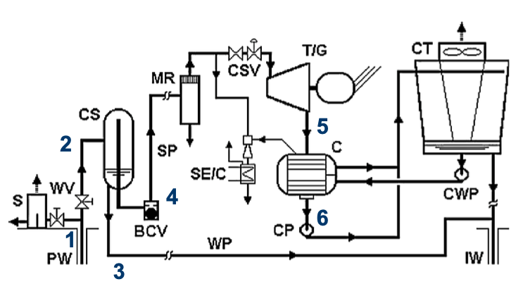{:height 258, :width 352}
			- T-s
				- 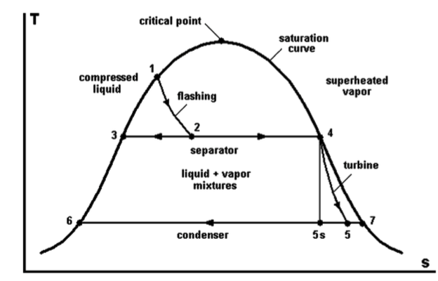{:height 272, :width 360}
			- Optimisation: ==Double flash power plant==
				- Layout
					- 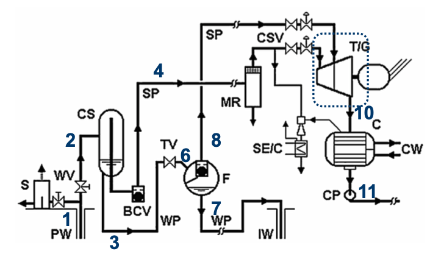{:height 270, :width 341}
				- T-s
					- 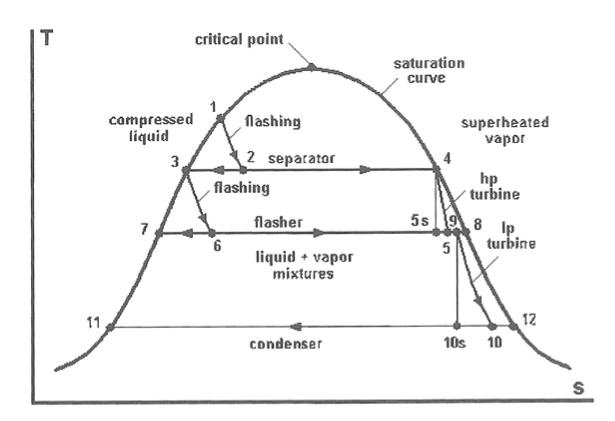{:height 309, :width 345}
		- Binary power plants (100°C<T<150°C)
			- Characteristics
				- Liquid-dominated field
				- Highliquid fraction
				- Heat transfer to secondary fluid which undergoes the energy conversion cycle (ORC or Kalina)
				- Binary -> geofluid (= ‘brine’) delivers heat to a secondary fluid (= working fluid) which undergoes the cycle
					- <-> direct-steam/flash with direct use of geofluid
					- Working fluid = water ?
						- Hard to evaporate at low temperatures
						- Very low pressures are needed
							- Large components -> expensive
							- Condenser pressure below environmental pressure -> air intrusion
						- Expansion in two-phase region -> erosion turbine blades
					- Use other working fluid in
						- Organic Rankine Cycle (ORC)
							- Organic working fluid
								- Hydrocarbons, refrigerants, ...
								- Lower critical point -> easier to evaporate and condense for lower geofluid temperatures (T<150°C)
								- Dry or isentropic working fluid -> single-phase expansion
						- Kalina cycle
							- Workingfluid
								- Mixture of ammonia (NH3) & water (H2O)
							- Evaporation at changing temperature of the mixture
								- -> fewer losses (irreversibilities) in evaporator
							- More complex (more expensive) than ORC
			- ==ORC==
				- Layout
					- 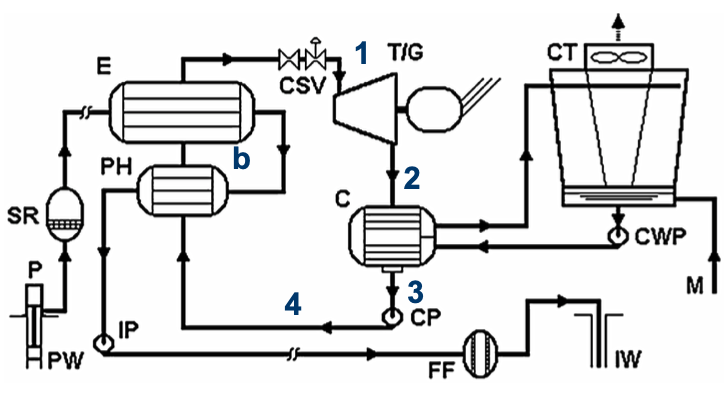{:height 264, :width 379}
				- p-h
					- 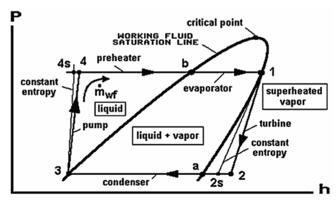{:height 273, :width 387}
				- T-s
					- 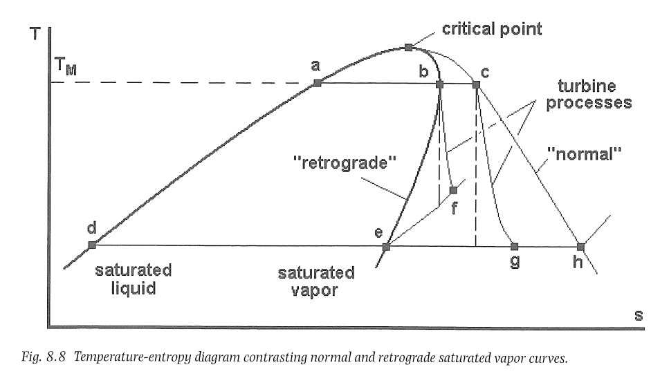{:height 297, :width 403}
			- ==ORC Dual-fluid==
				- Layout
					- 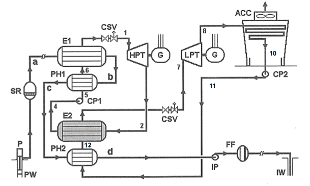{:height 302, :width 417}
				- T-s1s2
					- 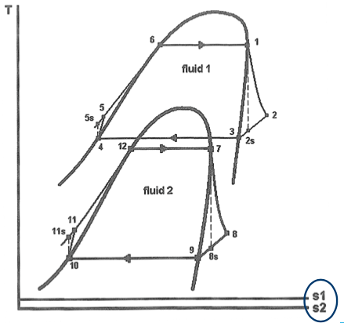{:height 338, :width 350}
				- T-Q
					- 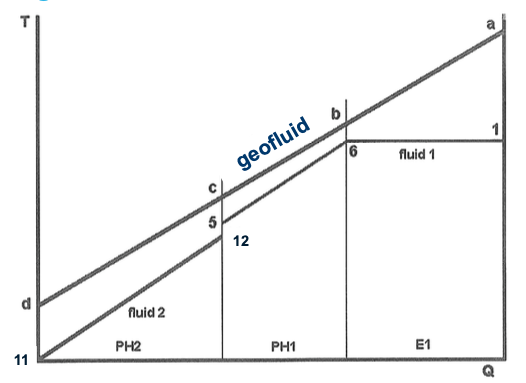{:height 320, :width 353}
			- ==ORC Dual pressure==
				- Layout
					- 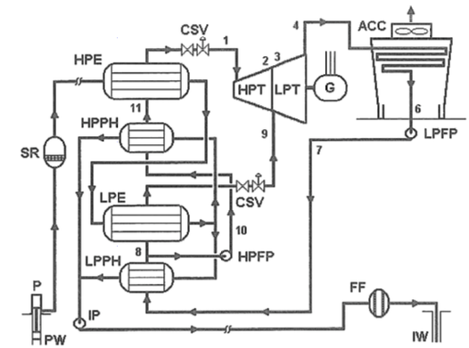{:height 331, :width 345}
				- p-h
					- 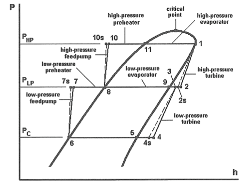{:height 314, :width 344}
		- ==Hybrid power plants==
			- Combination of dry-steam/flash & binary
			- example
				- 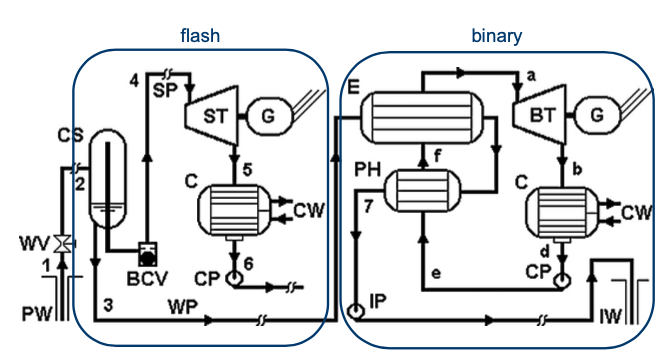{:height 247, :width 345}
	- #### Efficiency/feasibility improvements
		- Use of multiple (renewable) energy sources
			- Geothermal/solar
			- Geothermal/biomass
		- Multi-energy systems
			- Electricalpower
			- Heat(CHP)
			- Cold(CCP)–via chillers o Potable water
			- Hydrogen via electrolysis
- ### Technical and operational features
	- Geofluid contains
		- Non-condensable gases (H2CO3, H2S, ...)
			- ->Up to 15% of turbine power to remove these
		- Chemical components (Fe, Zn, Cu, salts,...)
			- -> Causes scaling and corrosion
	- Only for dry-steam and flash plants
		- Loss of geofluid when using wet cooling tower
			- Only for dry-steam and flash plants + Kalina
		- Expansion in two-phase region
			- Erosion in turbine due to liquid droplets