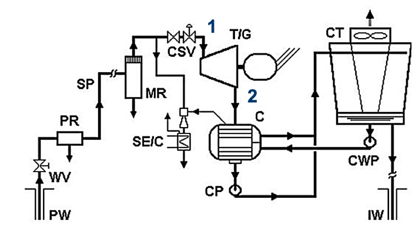
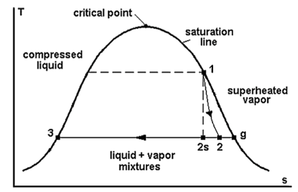

- Deep Geothermal Energy
- ### Intro
	- Thermal energy (“heat”) of the earth
		- Primordialheat–earthformation
		- Decay of long-lived radioactive isotopes
	- Energy extraction from crust
		- Up to~10km
		- Temperature gradient
	- Source that can be used as baseload (<->intermittent)
- ### Geothermal resource exploitation
	- #### Resource classification
		- Mostly via hydrothermal system
		- Viable hydrothermal geothermal resource
			- characteristics
			  collapsed:: true
				- Supply of water > water presence
				- Overlying layer of impervious rock > high pressure source
				- Permeable reservoir > allows water seeping through
				- Large heat source > causes T-gradient
				- Reliable recharge mechanism > lifetime
			- classification
			  collapsed:: true
				- Water-dominated fields
					- Hot water <100°C
					- Wet steam >100°C
				- Vapor-dominated fields
		- Enhanced/Engineered geothermal system (EGS)
			- No geothermal reservoir needed
			- increase permeability
			- How?
			  collapsed:: true
				- Rocks are fractioned (hydro-fractioned)
				- Fluid at high pressure + chemicals -> subsurface heat exchanger
			- But
			  collapsed:: true
				- Loss of fluid
				- Risk of earthquakes -> proper reservoir modeling needed
				- Environmental issues
			- No mature technology
	- #### Location
	  collapsed:: true
		- near plate tectonics
	- #### Applications
		- Heating
		  collapsed:: true
			- Indirect: ground-coupled heat pump (shallow-geoth.)
			- Direct: houses, industrial processes, swimming pools, greenhouses, ...
		- Electricity generation
		  collapsed:: true
			- Dry-steampowerplants
			- Flash powerplants
			- Binary powerplants
		- Cooling
		  collapsed:: true
			- Absorption chillers
			- Adsorption chillers
- ### Geothermal power plants
	- #### Thermodynamic intro
		- see slides
	- #### Types
		- ==Dry-steam power plants== (T>250-300°C)
			- Characteristics
				- Vapor-dominated fields
				- Direct expansion turbine
			- Layout
				- {:height 191, :width 328}
			- T-s
				- {:height 217, :width 283}
			-
		- Flash power plants
			- Liquid-dominated fields
			- Separation of liquid and vapor phase
			- Expansion of vapor in turbine
			- Possible second (third) separation at lower pressure + expansion of vapor in turbine
		- Binary power plants (100°C<T<150°C)
			- Liquid-dominated field
			- Highliquid fraction
			- Heat transfer to secondary fluid which undergoes the energy conversion cycle (ORC or Kalina)
		- Hybrid power plants
			- Combination of dry-steam/flash & binary
		-
	-
- ### Technical and operational features
-