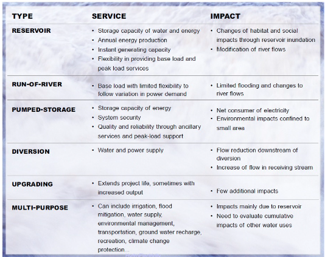
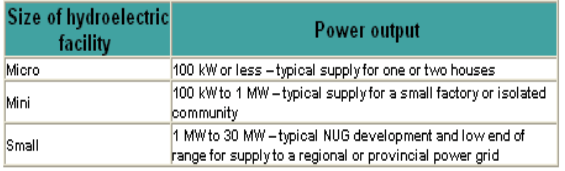

- ### Land-based Hydro Power
	- #### Intro
		- **Dams**
		  collapsed:: true
			- Why build?
				- Water collection: drinking water, agriculture
				- Flood control
				- Energy production / storage
		- **Water availability**
		  collapsed:: true
			- Seasonal
				- river regimes
			- Water cycle
				- evaporation -> precipitation
			- High percentages of technical feasible hydropower developments in EU/N-A
		- **Problems**
		  collapsed:: true
			- Droughts
				- e.g.: Folsom lake
			- Build
				- Concrete -> lot of CO2 emissions (curing of the concrete, exothermic reaction)
			- Biodiversity decrease
				- Loss of CO2 retainments by these declined biotopes
			- International conflicts
				- (In region with potential availability)
				- Ethiopia, Sudan Egypt (grand renaissance dam)
				- Brazil
				- China (Mekong dam)
		- **Types**
			- {:height 345, :width 428}
	- #### Large-scale Hydro Power
	  collapsed:: true
		- use natural sources (geographical opportunities)
			- Rivers
			- Lakes
			- Dams (e.g. build for drinking/irrigation water retention)
		- Turbines used
			- ==Kaplan==
				- Specifiek toerental: $$n_s = n\frac{Q^{1/2}}{H^{3/4}}>2$$
					- For low height drop (hydraulic head), typically in a river
					- Large flow rate
				- Reaction turbine
				- Low revolution speed
					- ->High torques
					- -> Big sizes
					- ->Build vertical (otherwise bends under own weight)
				- application
					- Run of the river
				- e.g. ship (pumpvariant)
			- ==Francis==
				- Specifiek toerental: $$0.3<n_s<2$$
					- hydr. head $$H$$ of 10m to 100s m
				- Inwards reaction turbine
					- Tangential in, axial out
					- with decreasing diameter (-> water squeezed out)
				- Applications
					- Big dams
				- (+) Large efficiency
				- (+) popular
			- ==Pelton==
				- Specifiek toerental: $$n_s<0.3$$
					- large hydr. head
					- relatively small flow rate
				- Impulse turbine
				- Large revolution speed
				- (-) less popular
		- Generators used
			- Salient-pole synchronous machines
				- Physical speed is proportional to grid frequency
				- Turbines turn at slow speed -> High amount of poles needed ($$n=\frac{f}{p_1}$$; repeat magnetic field)
				- rotor spins at fixed speed -> induces voltage in stator windings -> AC voltage in stator
				- Vertical positioning because of size
		- Type
			- ==Reservoirs==
				- Energy conversion: $$E_{pot}\rightarrow E_{kin} \rightarrow E_{elec}$$
				- Subypes
					- Mountain power plant
				- (+) controllable
			- ==Run-of-River==
				- Energy conversion: $$E_{kin} \rightarrow E_{elec}$$
				- Subtypes
					- Power plant in plains
					- Power plant in plain, but with relatively large height drop due to bend
						- Natural waterfall
						- e.g. Niagara
			- ==Pumped Hydro Power==
				- = reversible turbine/generator, can pump/motor
				- Typically closed water system (not on river)
				- Use: balancing, arbitrage, black-start
				- See Storage section
		- CBA
		  collapsed:: true
			- Sustainability
				- (-) evaporation
				- (-) No seasonal change
					- affects agriculture and fertilizations downstream
					- -> use flood control (flush the valley)
				- (-) Sedimentation, clogging in the reservoir, upstream dam
				- (-) Biodiversity issues
					- regular submersion of wetlands
					- impact on fish stock
				- (-) Population impact
					- e.g. Three Gorges Dam, 1.24M people had to move
				- (-) Earthquake risks due to weight on earth crust?
				- (-) Political conflicts
					- E.g. Mekong delta, GERD in Ethiopia
	- #### Small-scale Hydro Power
		- Concept
			- Locally control problematic side-effects
			- A small-scale hydroelectric facility requires that a sizable flow of water and an adequate head of water is available without building elaborate and expensive
			  facilities.
			- Small hydroelectric plants can be developed at existing dams and have been constructed in connection with water level control of rivers, lakes and irrigation schemes.
			- By using existing structures, only minor new civil engineering works are required, which reduces the cost of this component of a development
		- Types
			- 
		- Turbines
			- Type determined by
				- Rate of water flow
				- Height of waterdrop (hydraulic head)
				- The turbine must also rotate at a speed that conforms to a synchronous generator speed
			- Types
				- Radial flow type
					- Francis
				- Axial flow type
					- Kaplan
					- Propellor
				- Impulse turbine
					- Pelton
					- Banki/Crossflow
		- Waterwheels
			- Types
				- Undershot
				- Overshot (Also pitchback)
				- Breastshot
			-
		- CBA
			- Advantages
				- (+) They do not need much space
				- (+) They rarely cause shoreline flooding
				- (+) Avoids problems of building big hydro power plants
				- (+) Reduces risks of fuel supplies
				- (+) Supply of low-cost electric energy
				- (+) Stable price (local production) not influenced by international market
				- (+) More economic benefits to the region (employment,...)
				- (+) Opportunity for wealth creation in not developed areas
			- Disadvantages
				- (-) Special cold climate requirements
				- (-) They have to provide fish protections where needed
				- (-) Higher costs due to not standardized purchase contracts and interconnection requirements
				- (-) The regulations focus more on large-scale hydroelectric issues than on small-scale hydroelectric issues that sometimes impose disproportionate demands on small hydroelectric developers.
### Ocean Energy
	-