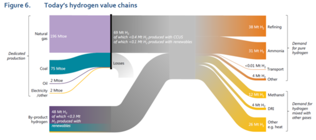
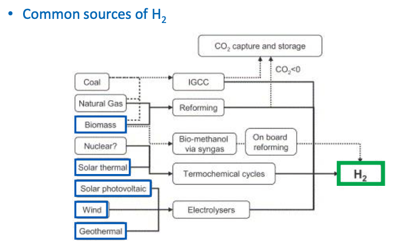
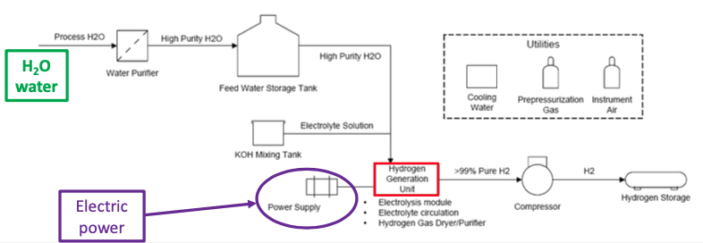
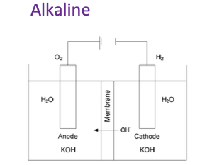
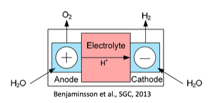
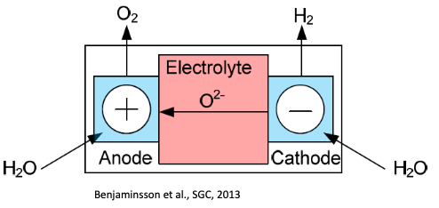
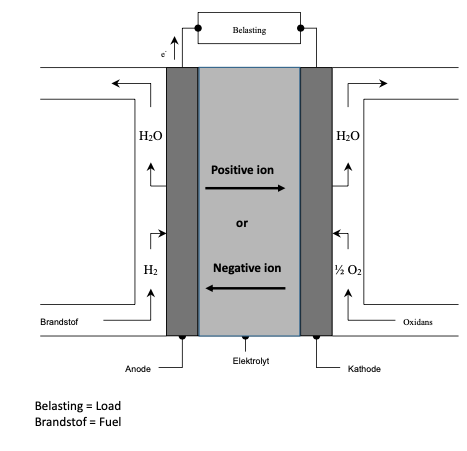
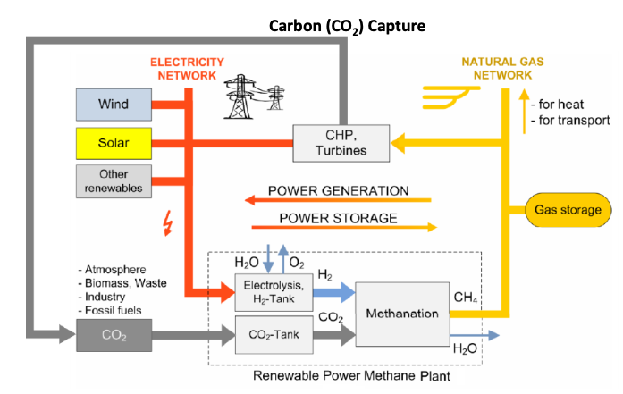
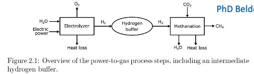
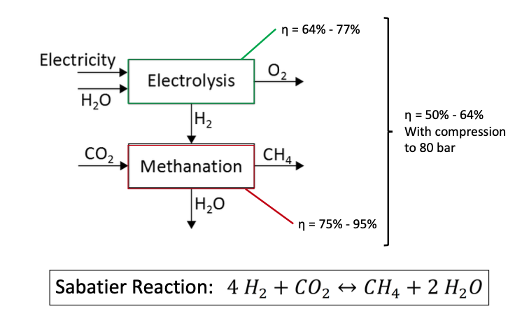

- ## Intro
  collapsed:: true
	- $H_2$ demand increased over the last 5 decades
	- Problem
	  collapsed:: true
		- Major problem: fluctuating power delivery from most renewables (nf-REES)
			- Need good integration in electric grid (adaptations required)
			- Storage of electricity?
		- Electricity storage (in large quantities) remains difficult issue
		- Future short-term storage likely via electric batteries (Li-ion)
		- Medium-term storage: Indirect storage via pump/turbine hydro
		- But LT / seasonal storage? -> via hydrogen (electrolysis/fuel cells) or electric power to synthetic methane (P2G)
	- Why excitement?
		- general
		  collapsed:: true
			- Current H2 usage basically as feedstock for industry
			- But H2 could be a clean fuel
				- for climate
					- no CO2 emitted by ‘end use’
					- no CO2 if ‘carefully’ produced
				- no local emissions (transportation & combustion in boilers or prime movers)
			- ~ 2000: To aid problem electricity storage – mainly for HEV (Hydrogen Electric Vehicles)
			  →electricity→electrolysis→H2→Fuel Cells→electricity
			- Now: To ‘solve’ overcapacity issue due to nf-REES/iREES/VREE in elec pwr sector &
			  LT (indirect) electric storage problem
			- Now: Realization that ‘all’ electric society is not likely; still molecules needed
				- Ships, aircrafts, long-haul trucks... but need liquid fuels based on hydrogen (and CCSU)
				- Sector coupling to help decarbonize transportation & heating sectors (incl industry) – H2 based liquid fuels
		- Origin
		  collapsed:: true
			- Interest for hydrogen originated from the renewable promoters
				- Hydrogen as a storage medium for (excess) electricity
			- Then hydrogen was adopted by the fossil fuel sector
				- Goes hand in hand with development of CCS (mostly through IGCCs – from synthesis gas H2 & CO+shift)
				- Fuel diversity – security of supply
			- other sectors followed
		- Hydrogen is not an energy source but a “carrier” / “vector”
		  collapsed:: true
			- Hydrogen must be produced from other (primary) sources
			- Absence of local emissions (important for transport)
			- Storable and transportable energy carrier
			- High conversion efficiencies potentially possible (fuel cells)
			- Allows integration of renewable, naturally fluctuating energy sources
			- Also applicable for transportation (fuel-cell vehicles)
	- Readings
		- Production and usage
			- Usage
			  collapsed:: true
				- 70Mt pure (only small level of additives) hydrogen
				- 45Mt as part of mixture gases
					- for methanol and steel production
			- production
			  collapsed:: true
				- Majority from fossil fuels
				- 60% produced in dedicated hydrogen facilities
					- Most from natural gas
					- Some from coal and small fraction electrolysis
				- 33% is "by-product"-hydrogen
					- comes from facilities and processes designed primarily to produce something else
				- only 0.7% from renewables or fossil fuel plants equipped with CCUS
			- Hydrogen value chain
			  collapsed:: true
				- {:height 275, :width 562}
		- Chemical energy carrier
			- similar to electricity
			  collapsed:: true
				- versatile
				- different applications
				- No emissions by usage
				- CO2 intensive upstream (production)
			- difference -> chemical energy carrier
			  collapsed:: true
				- molecules not electrons
				- allows to be transported in a stable way
				- Add stock based element to flow based electricity system
				- Round-trip efficiency of H2 from electricity is only 30%
		- H2 vs H2 based fuels and feedstocks
		  collapsed:: true
			- H2 based fuels and feedstocks
				- H2 combined with other inputs
				- H2 produced from any source
		- P2X
		  collapsed:: true
			- Conversion of electricity to other energy carriers or chemicals, generally through hydrogen produced by the electrolysis of water
		- H2 categories
			- colors refer to different sources
			  collapsed:: true
				- black -> coal
				- grey -> natural gas
				- brown -> lignite
				- blue -> fossil fuels with CO2 emissions reduced by the use of CCUS
				- green -> from renewable electricity
				- turqoise -> pyrolysis
				- pink -> nuclear-electrolysis
			- CO2 content
		- relevant physical properties
			- high energy density per unit of mass
			  collapsed:: true
				- -> attractive as a transport fuel
			- low energy energy density per unit of volume
			  collapsed:: true
				- -> larger volumes need to be transported compared with other fuels
			- intermezzo LHV vs HHV
			  collapsed:: true
				- >The lower heating value (LHV) accounts for the heat released when a fuel is burned while considering that the water vapor produced during combustion remains in the gaseous state. It assumes that the water vapor in the exhaust is not condensed and the heat it contains is not recovered. This is the more conservative measure of energy content and represents the available energy after subtracting the heat carried away by water vapor. 
				  The higher heating value (HHV) takes into account the heat released during combustion as well as the latent heat of vaporization of water. It assumes that the water vapor produced during combustion is condensed and that the heat of condensation is recovered, which is not practically achievable in most applications. HHV includes the energy content of the water vapor formed during combustion, as it assumes complete condensation of the water vapor back to a liquid state. 
				  In practical terms, the LHV represents the available energy content that can be directly utilized in applications like power generation, while the HHV includes additional energy that is not practically recoverable. Therefore, LHV is typically the more commonly used value for practical purposes and comparing different fuels' energy content.
				-
- ## Hydrogen from Renewable sources
  collapsed:: true
	- ### Introduction
	  collapsed:: true
		- Sole -> multi carrier
			- electrical RES wind and solar ‘intermittency’ and consequent overcapacities, with ample over-generation whilst also often deficiency of generation (‘Dunkelflaute’), integration of many sectors will likely be the rule: sector coupling
		- ultimate goal
			- Provide cheap and abundant energy carrier
				- that can easily be transported, stored and converted into end energy,
				- such that the overall cost of the energy chain is affordable,
				- so as to lead to end-energy conversion that is “clean” also for small-scale applications
		- Issues
			- production, transport, storage, safety
			- But mostly cost!
		- Fuel cell
			- Conversion: chemical -> electrical energy
			- Alkaline (AFC), proton exchange membrane (PEMFC), Phosphoric acid ( PAFC), Molten carbonide (MCFC), solid oxide Fuel Cell (SOFC)
	- ### Renewable energy sources
	  collapsed:: true
		- {:height 299, :width 420}
	- ### Hydrogen production
		- #### Reforming (biogas, landfill gas)
		  collapsed:: true
			- Well-known technology
			- CCS possible
			- Efficiencies up to 80%; but purification necessary
		- #### Gasification/pyrolysis of waste/biomass
		- #### Technologies under development
		  collapsed:: true
			- Thermal splitting of water (solar heat)
			- Photo(electro)chemical or photo-biological production (algae, bacteria)
		- #### Electrolysis
			- **general**
			  collapsed:: true
				- 
				- $2H_2O(l) \rightarrow 2H_2(g)+O_2(g)$
				- Well-known, Commercially available
				- $\eta =$ 65% - 80%
				-
			- **Types**
				- ==Alkaline EL==
				  collapsed:: true
					- Unipolar – bipolar KOH systems
					- 
					- (+) Mature for steady state operation
					- (+) Possible for dynamic operation
					- (-) Operating range: 30% - 100% of rated capacity
				- ==Proton-Exchange Membrane EL==
				  collapsed:: true
					- Solid Polymer Electrolyte systems (high pressure)
					- 
					- (+) Dynamic operation
					- (+)Operating range: 5% - 100% of rated capacity
					- (-) Less efficient
					- (-) Early commercial phase
				- ==Solid Oxide EL==
				  collapsed:: true
					- Solid Oxide Electrolyte systems (high temperature)
					- {:height 186, :width 355}
					- Promissing, highly efficiencient technology, ... but still in research phase
				- Steam-assisted electrolysis
			- **other**
			  collapsed:: true
				- Characteristics -> lezen
	- ### Environmental impact and costs
		- Emissions
		- Cost evolution
		  collapsed:: true
			- Cost highly dependent on electricity price
		- Cost of large P2G systems / Sector Coupling
		  collapsed:: true
			- Correct cost metric for input electric energy:
				- LCOE = cost wind/solar (recovering investment cost)
			- Often argument: zero electricity prices because ‘zero marginal cost’ →input elec cost for electrolyzer = 0→this is a ‘dream’ (for long time to come)
			- Richard Green (Imperial college): H2 production via electrolysis increases elec demand → reinstates non-zero electricity price
			- Coupling H2 sector with elec pwr sector see example Energinet DK (see later RR)
	- ### Transition towards a hydrogen economy
		- Blending / Mixing of Hydrogen in NG Pipelines
			- Challenges
			  collapsed:: true
				- energy content reduction of delivered gas as the energy density per kg of hydrogen is one third of the one of natural gas (losing exergy)
				- Increased risk of flame spreading as hydrogen burns faster than methane
				- variability in the volume of hydrogen impacts the operation of equipment designed to accommodate onky a narrow range of gas mixtures when blended
				- The upper limit for hydrogen blending in grids depends on the equipment connected to it. Component with lowest tolerance defines tolerance for whole network
			- Hydrogen could be injected into the natural-gas grid
			  collapsed:: true
				- Transport towards end user
				- Using H2/NG mixture in conventional boilers
				- Separating H2 by means of membranes
			- On the high-pressure level, compression stations, hydrogen embrittlement and energetic capacity can cause problems
			  collapsed:: true
				- New high-pressure hydrogen transmission grid seems necessary
				- Can be used as a huge storage facility: linepack
			- Mixing/Blending of hydrogen in to the distribution grid
			  collapsed:: true
				- Influences pressure drop and Wobbe index
				- Up to 3 vol% H2: no problems expected
				- Up to 17 vol% H2: adjustments to boilers/furnaces/engines are needed (Ref. Haeseldonckx)
			- Production and transportation of H2 to injection points
			  collapsed:: true
				- High-p transmission grid is needed: who will pay for this?
				- Interaction with transportation sector may offer possibilities (tank stations)
				- First, a focus on codes and standards is needed!
	- ### Conclusion
	  collapsed:: true
		- Hydrogen could play an important role in our energy future
		- Combination of renewables and hydrogen can contribute to a
		  sustainable energy economy; environmental impact is very low
		- Costs largely depend on the technology used and the electricity price
		- Indirect costs for infrastructure development can become very high
		- Using the existing energy infrastructure can facilitate the difficult transition period
		- Unclear whether pure H2 economy will emerge, or ‘P2G’ (P-2-CH4)
- ## Fuel cells
  collapsed:: true
	- #### Usage
		- Transportation (competing with electrical vehicles & biofuels)
			- Passenger cars
			- Trucs, Ships, (airplanes?)
			- Lift Trucs (forklifts) & special applications at airports
		- FCs in CHP mode in residential & commercial sectors
		- Stationary fuel cells for electricity generation only (indirect storage issue elec → H2 →elec)
		- Electric power only & back-up cells (emergency/stand-by generators replacing diesel aggregates in banks, sensitive equipment, ...)
		- Special applications (space ships, submarines, ...) for air-independent propulsion
		- Other ...
	- #### Working principle
	  collapsed:: true
		- {:height 292, :width 296}
			- Anode: $H_2 \rightarrow 2H^+ +2e^-$
			- Cathode: $1/2O_2 + 2H^+ + 2e^- \rightarrow H_2O$
			- Cell: $H_2 + 1/2 O_2 \rightarrow H_2O$
	- #### Properties
		- (+)
		  collapsed:: true
			- high electrical efficiencies at partial load higher that at full load
			- can operate in CHP mode
			  → large fuel utilization ratio
			- limited amount of harmful emissions
				- in principle only H2O (with fuel H2)
				- but often also CO2 (with fuel CH4)
				- little NOx even if air is used
			- no moving parts; almost without noise
			- modular structure
		- (-)
		  collapsed:: true
			- commercial offer still limited
			- expensive investment; mostly only in niche markets
			- some fuel cells have problems with corrosion
			- limited life time
			- long start-up times for certain types
			- external reformer often a source of “problems”
				- $\eta$~ 60 à 70%
				- occupies space (for mobile applications)
				- leads to CO2 emission when based on CH4
				- many classical engineering “problems”
	- #### Types
		- See figures!
		- Alkaline Fuel Cell (AFC)
		  collapsed:: true
			- $T \sim 60-90^\circ C$, low T
			- does not tolerate CO_2, reacts with KOH -> need for pure H_2, O_2
			- $\eta \sim 60-70\%$
		- Proton Exchange Membrane Fuel Cell (PEMFC)
		  collapsed:: true
			- $T \sim 80^\circ C$, low T
			- $\eta \sim 50-60\%$
		- Direct Methanol Fuel Cell (DMFC)
		- Phosphoric Acid Fuel Cell (PAFC)
		  collapsed:: true
			- $T \sim 200^\circ C$, Intermediate T
			- acid in electrolyte allows for CO_2 in fuel (CO_2 does not react with acid)
			- $\eta \sim 55\%$
			- exists in market PC25 (200KW)
		- Molten Carbonate Fuel Cell (MCFC)
		  collapsed:: true
			- CO_2 now integrated in reaction scheme
			- $T \sim 650^\circ C$, High T
			- $\eta \sim 65\%$
			- internal reforming possible
			- $CH_4 + 2H_2O \rightarrow CO_2 + 4H_2$
		- Solid Oxide Fuel Cell (SOFC)
		  collapsed:: true
			- Solid electrolyte
			- Yttrium stabilized $ZrO_2$, $Y2O_3$
			- Conducts well at $T \sim 1000^\circ C$, High T
			- $\eta \sim 60-65\%$
			- internal reforming possible
	- #### Fuel Cell Systems
	  collapsed:: true
		- fuel preparation (reforming, cleaning)
		- fuel cell (stack)
		- electric invertor
		- gas- and water outlet
		- possible CHP-applications
	- #### Other
	  collapsed:: true
		- Fuel Cell Cost
		- Fuel Cell Installed Electrical Power Generation Capacities
	- #### Conclusion
	  collapsed:: true
		- Fuel cells may be a promising technology
		- but further technological improvement necessary
			- cost still too high (several factors)
			- Fuel cells can (?) breakthrough if a market is formed
		- government aid needed for demonstration & market boost - risk capital needed for further R&D
		- Massive commercialization fuel cells hopefully by 2030... (?)
- ## P2G
  collapsed:: true
	- #### Recent developments - SNG/P2G
	  collapsed:: true
		- To avoid negative prices and accomodate superfluous electricity, avoid curtailment, produce synthetic fuels like “renewabl emethane”,CH4 (SNG–synthetic naturalgas)
		- Use electrolyzer to produce hydrogen H2
		- Perform electric power balancing with OCGT or CCGT, but
		  fed with SNG. Capture CO2 from these GTs.
		- Combine H2 with CO2 via the Sabatier reaction to produce
		  synthetic CH4 (and H2O)
		- So, superfluous RES are indirectly stored via SNG, which is then used for balancing, to produce electricity...
	- #### Principle
		- Figures
		  collapsed:: true
			- {:height 396, :width 506}
			- 
			- {:height 302, :width 488}
		- Sabatier reaction
		  collapsed:: true
			- Catalyc
				- Ni-based catalyst most used
				- Sensitive to traces of H_2S
				- Zie sl.153
			- Biological
				- Bacterial digestion <-> archaea
				- sensitive to oxygen (strictly anaerobic)
		- Low efficiencies
	- #### Example 3: DK system Operator Energinet
		- European scenarios...
		  collapsed:: true
			- GCA
			- DG
			- ST
		- ->to modelling of Denmark in 2035
		- 
		- ((646e4585-2e74-43d3-b258-5d54b3546f9e))
		- ((646e45a2-0ee4-4772-b140-7c6576ba9114))
		- RR slide 173
			- ((646e46dd-b3ac-4397-905e-d7f453d82964))