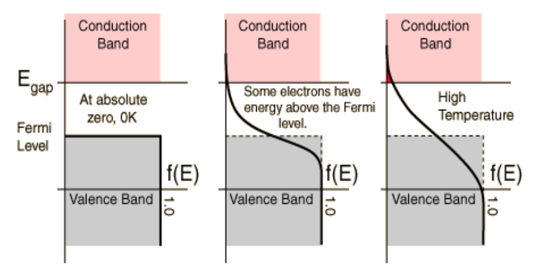

- ## Semiconductors
	- Energy bands in semiconductors
		- Discrete energy levels of electrons disappear when atoms are placed in a crystal structure, brought closer together (energy bands are consequence of crystal periodicity)
	- Occupation probability of energy states
		- $T=0^\circ K$ => all energy levels are filled up to the Fermilevel ($E_f$)
		- $T>0^\circ K$ => electrons are excited to higher levels, according to the Fermi-Dirac distribution function f(E)
			- $f(E) = \frac{1}{1+exp[(E-E_f)/kT]}$
		- {:height 225, :width 417}
			- Energy levels above Ef have a small but finite probability to be occupied by an electron, whereas energy levels below Ef have a small but finite probability to be empty
			- $E_f = \frac{E_{gap}}{2}$
		- physical interpretation
			- At higher temperatures, there is a finite probability that bonds are broken and electrons are becoming free to move around in the lattice (these are called conduction band electrons)
			- These electrons leave behind a ‘vacancy’ which can also move (by movement of valence band electrons)
	- Conduction
		- In the conduction band, the conduction can be described by the movement of electrons
		- In the valence band it is better to describe the conduction by the movement of the empty space (i.e a hole), although in reality it is the valence band electrons that are moving.
		- The total current is the sum of electron and hole current: $J_{tot}=J_n+J_p$
	- Drift current
		- $J_{drift,n}=-qv_nn = q\mu_nn\xi=\sigma_n\xi$
			- $\mu_n=electron\; mobility$
			- $\xi = electrical\; field$
			- $\sigma_n = conductivity$
	- Intrinsic carrier concentration
		- Intrinsic semiconductors
			- Pure and perfect semiconductor
			- Each excited electron in the conduction band leaves behind an empty state (i.e. hole) in the valence band
				- $n=p=n_i=(N_cN_v)^{1/2}e^{-E_g/2kT}$
				- Nc , Nv are effective density of states in conduction and valence
				  bands
	- The doped semiconductor equilibrium
		- n-type doping
			- donors = group V elements (P, As, Sb...)
				- => donor level $E_D$, close te lower level of conduction band
			- electron concentration = donor concentration -> majority carrier
				- $n\approx N_D$
			- Hole concentration
				- $p = n_i^2/N_d$
		- p-type doping
			- acceptors = group III elements
			- => acceptor level $E_A$, close to valence band
			-