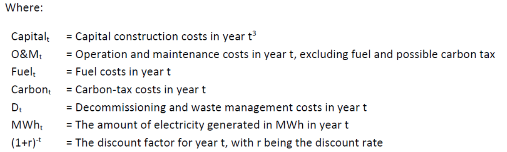

- ## The role of renewables
	- ### Challenges
		- low energy / power density
		  collapsed:: true
			- much place and many devices needed
		- PV & wind unpredictable; possibly out of phase with demand
		  collapsed:: true
			- storage needed or back up
		- Could be ‘costly’, partly because of above mentioned issues
		- Role in context with other sources, e.g., CCUS or nuclear
		- Not quite totally environmentally friendly:
		  collapsed:: true
			- indirect CO2 emissions, large hydro, birds, noise, visual, ...
		- non-centralized generation
		  collapsed:: true
			- creates potential issues for the grid: harmonics, reactive power control ->power electronics... cost of system integration
			- centralized generation can be better controlled; e.g., environmental “clean up”
			  stoves with biomass ↔ centralized boilers
		- liberalization energy markets
		  collapsed:: true
			- integration/compatibility in liberalized markets? Subsidized?
			- they cannibalize each other by driving down wholesale electricity prices
	- ### Objective reasons
		- (Cheap) fossil fuels will be exhausted in time
		  collapsed:: true
			- -> need alternatives (eventually)
		- Because of enhanced greenhouse effect,
		  collapsed:: true
			- we must abandon fossil fuels ‘resolutely’
			- ->need alternatives ‘quickly’ (next decades)
		- Geopolitical (in-)stability & energy security
		  collapsed:: true
			- recent oil & gas price fluctuations (volatility)
			- ->should encourage development indigenous sources
		- Other sources (esp fossil –e.g. coal) only appear cheap! ->Must include external costs
		  collapsed:: true
			- ->renewables/alternatives much “cheaper”; competitive with internalized fossil costs
			- -> leaves renewable & nuclear routes (& fossils with CCUS possibly for a limited time)
			- winners will be determined by ‘full scope economics’:
				- external (environmental) costs
				- private (investment & fuel) costs... affordability
				- be careful with distributional effects...
				- but beware of ‘surprises’ – DAC, CO2 sequestration in minerals, ...
	- ### What is the long-term solution?
		- Energy Efficiency
		  collapsed:: true
			- historically ~ 1%/a decrease energy intensity
			- future perhaps ~ 2%/a decrease
			- But welfare is increasing ...
			- So energy efficiency is very valuable, but likely insufficient (especially from global perspective)
		- Renewables
		  collapsed:: true
			- have a high theoretical energy potential
				- RES are getting boost due to recent dramatic cost reductions (esp PV)
				- but still many challenges (technical, economic,...) for market integration
				- will need coherent policies & market designs
				- ->uncertainties in short & long term (dependent on the countries & energy systems)
		- Energy efficiency & renewables
		  collapsed:: true
			- to be pursued with all “reasonable” means; concentrate on “wise” integration of RES in the system & concentrate on flexibility & appropriate market designs.
			- But keep other options alive (nuclear fission, natural gas + CCUS, and develop new concepts via R&D e.g., fusion); do not overreact, be cost-effective & save capital for investments in energy transition.
			- **Be ambitious but realistic**
				- Plan / consider ‘timely’ phase out of fossil fuels; do not act blindly; current economies are built upon fossil fuels; and need natural gas as transition fuel for flexibility.
- ## Renewable flows, conversion, conventions
	- ### Characteristics
		- ==Capacity factor== (or load factor) [-]
			- $CF = \frac{\int_0^{8760}Pdt}{P_{inst}\cdot 8760 h}$
			- *the ratio of the actual output of the plant over a period of time to its maximum possible output if it were running at full capacity during that same period of time. It is usually expressed as a percentage and is a measure of how efficiently the plant is operating over that time period*
		- ==Effective Number of Operating Hours== (ENOH) [h]
			- $ENOH = \frac{\int_0^{8760}Pdt}{P_{inst}} = CF\cdot 8760h$
			- *The effective number of hours the plant should run at full capacity to equal its yearly output in MWh*
- ## Historical trends
- ## EU vision, policy targets and situation in 2020
- ## Future scenarios
	- ### EU fit-for-55
		- ‘New proposed’ EU Policy (July 2021) to reach NZE by 2050
			- Proposed legal initiatives by the Eur Commission
			- Was ~ the EU input to COP 26 in Glasgow (Nov 2021)
			- More stringent targets for 2030:
				- GHG reduction by 55% compared to 1990 (ETS / ESR)
				- 40% RES share of total final energy demand by 2030
				- EnEff: 36% less final energy demand in 2030 compared to a reference baseline (produced in 2007)
- ## Cost aspects
	- ### To recall: Social cost = private cost + external cost
		- Private costs
		  collapsed:: true
			- the costs experienced by the party making the decisions leading to an action
		- External costs
		  collapsed:: true
			- costs that are not taken into account by ‘actors’ when making decisions about pursuing the action, even though they are real costs to some members of society or to third parties
		- Social costs
		  collapsed:: true
			- all of the costs of the action, no matter who experiences them
	- ### Past cost evolution of renewable technologies
		- #### Levelized cost of electricity
			- *The LCOE is defined as the fictitious average electricity price during its operation hours and needed over the lifetime of the plant to break even the full (investment and operational) costs for the investor (including the desired rate of return which is included in the discount rate r)*
			- $LCOE = p_{MWh} = \frac{\sum_t[(Capital_t+O\&M_t+Fuel_t+Carbon_t+D_t)\cdot (1+r)^{-t}]}{\sum_t MWh (1+r)^{-t}}$
				- 
			- A higher capacity factor means the power plant is producing electricity for a larger portion of the time. This leads to more kilowatt-hours of electricity being generated, which helps spread the fixed costs (such as capital costs) over a larger energy output, reducing the LCOE
	- ### Past costs suggesting future cost ‘projections’ for renewable technologies
		- Learning rate, experience curves
			- Production price relation
				- (e.g. for PV) Each time the cumulative PV production doubled, the price went down by 25% over the last 40yrs
	- ### External & system cost aspects
	- Market prices depend on system and are affected by #.ol
		- amount of RES in the system. RES tend to reduce the wholesale market price (zero marginal cost generation).
			- At high shares, they operate mostly at times when prices are low (often self-caused!)
			- At lower shares, they are ‘price takers’, but operation depends on meteorological conditions
			- Dispatchable REES can shift operation to high price moments!
		- Price of fossil fuels - often natural gas. Since gas often sets the wholesale price
		- Price of CO2; related to carbon intensity of power mix
	- Value of REES due to #.ol
		- Avoided costs of electricity purchase.
		- Deliver and sell electric power to the grid
		- Mostly 1 > 2 if for 2 market prices are used.
			- No difference when “net metering” (i.e., meter running backwards.)
		- But local consumers will have to pay for fixed part of ‘system’ or ‘grid’ costs (expected to increase in the future) -> eg “capacity tariff”
-
-
-
- ## [[intro_EX]]