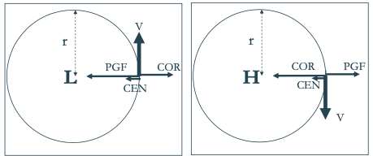

- ### Intro
	- Global challenge
		- Energy security while
			- Mitigate global warming -> decarbonization
			- Reducing air pollution
		- Safe and clean energy
		- Renewable energy generation increases
			- Global: larger hydropower trend
	- **Idea**: *Energy production largely dependent on atmospheric conditions*
		- Wind energy: windspeed
		- Solar energy: clouds, pollution, haze (optical depth atmosphere), temperature
		- Hydropower: Precipitation, evaporation
		- Biomass: precipitation, temperature, evapotranspiration affect growth
- ### Why, when and where is it windy?
	- General circulation
		- No rotation
			- convection cells driven by $$T$$ gradient
		- Rotation
			- Coriolis acceleration
				- Deflection of the wind
			- Structure (Per hemisphere)
				- Hadley cell
				- Forell Cell
				- Polar cell
	- Geostrophic wind
		- Forces
			- Pressure gradient force
				- Acceleration of the air package
				- Why doesn't the air flow from high to low pressure? <- Coriolis force
					- Deflection (to the right on the N hemi)
			- Coriolis force
				- apparent deviation to the right for counterclockwise rotation
		- Equation
			- Def.: Geostrophic wind -> equilibrium Coriolis and pressure gradient
			- Synoptetische schaal: $$\sum F = F_D +F_C =0 \Rightarrow V_g = \frac{1}{\rho f}\frac{\partial p}{\partial n}$$
				- Afleiding
					- $$
					  \begin{equation*}
					  \begin{aligned}
					  \frac{\mathrm{D}\boldsymbol{U}}{\mathrm{D}t} &= -2\boldsymbol{\Omega} \times \boldsymbol{U} - \frac{1}{\rho} \nabla P + \mathbf{g} + \mathbf{F}_\mathrm{r}\\
					  \Rightarrow \frac{\mathrm{d}u}{\mathrm{d}t} &= -\frac{1}{\rho}\frac{\partial P}{\partial x} + f \cdot v
					  \end{aligned}
					  \end{equation*}
					  $$
					- Coriolis parameter $$f$$, varies with latitude
				- geostrophic wind blows parallel to the isobars: low-pressure on the left
				- large PGF (isobars or contour lines tightly packed together)-> large COR ->large Vg
		-
		- Pressure systems
			- NH
				- L -> cyclonic (=direction same as the rotation of the earth)
				- R -> anticyclonic (=direction opposite to the rotation of the earth)
			- SH
				- L -> anticyclonic
				- R -> cyclonic
	- Accounting for Centripetal force
		- Centripetal force: *The force that maintains the circular motion of the object. $$F_{ctp}$$ is directed inwards.*
			- Accounting for the rotation of the flow
			- In order for the object to deviate from that straight line, a force is needed.
		- Equation
			- Synoptic scale: $$\sum F = F_D +F_C =F_{ctp}$$
			- NH
				- 
					- PGF: H->L
					- Cor: to right of wind speed (NH)
		- Where is windspeed higher?
			- In high pressure system:
			  $$
			  \begin{equation*}
			  \begin{aligned}
			  F_{D}&<F_C\\
			  \frac{1}{\rho}\frac{\partial P}{\partial x}&<V_G f\\
			  \Rightarrow V_G &> \frac{1}{\rho f}\frac{\partial P}{\partial x}
			  \end{aligned}
			  \end{equation*}
			  $$
			- ->super geostrophic, thus higher windspeed
	- Effect of altitude
		- Jet stream
			-