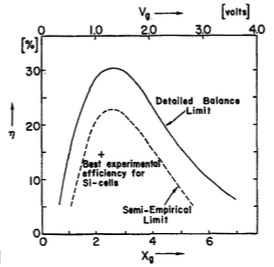
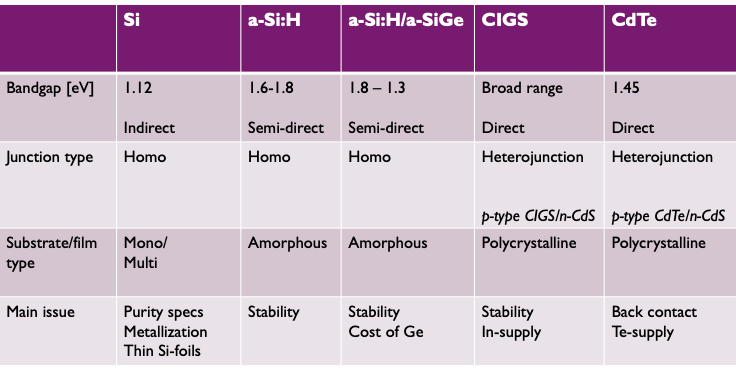
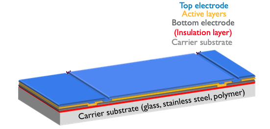

- ### PV cell technology
	- #### Shockley-Queisser model: limiting efficiencies a.f.o. bandgap
		- Intro
			- ==Radiative recombination==
				- the energy of the recombining electron-hole pair is emitted as a photon
			- ==Auger Recombination==
				- the energy of the recombining electron-hole pair is transferred to another carrier
		- **Model**
			- Assumptions
				- Cell is black-body in thermal equilibrium with a thermal bath at temperature T
				- Isotropic irradiation
				- Unit absorbance for photons > Eg
				- Zero absorbance for photons < Eg
				- Only source of recombination is radiative (no Auger recombination)
				- Cell behaves like an ideal diode (ideality factor $$n=1$$): 
				  $$J(V)=J_0(exp(\frac{qV}{kT})-1)$$
				- Sun assumed to be black body radiator
			- Results
				- 
					- Efficiency: $$\eta(V_g=bandgap)$$
					- Maximum ($$\pm 30\%$$)<- Trade off:
						- Lower bandgap
							- Higher absorbance (more photons with lower energy)
							- But extraction of electron-hole pairs happens at lower voltage
						- Higher bandgap
							- Mutatis mutandis
				- 
					- Iterated experiment with AM1.5 solar spectrum (instead of black body radiator)
					- Si well positioned relative to maximum (but model as such not applicable because indirect bandgap material)
	- Overview of PV-technologies
		- {:height 275, :width 542}
	- #### Crystalline Si solar cells
		- Sand to cell
			- Sand -> reduction -> metallurgical grade Si -> purification -> break and melt again -> wafers -> cells -> modules
		- Metallurgical grade silicon is obtained by a carbothermic reduction of silica in an arc furnace
		- MG-Si is reacted with HCl to form trichlorosilane in a fluidized bed rector by heating powdered MG-Si
		- Wacker process for poly-silicon production
		- PV crystalline silicon wafers are monocrystalline Si grown via Czochralski process or multicrystalline fabricated via a casting process
		- feedstock to Wafer with multiwire sawing
		- Screen printed cell
			- Texturing: make wafer even rougher
				- Chemical solution to remove mechanical damage but increase unevenness
				- Why? -> reduces reflection
			- Create pn junction
				- diffusion of fosphorus -> n side
					- Through POCl3 vapor diffusion
					- Gettering:
						- Intrinsic effect of P emitter formation
						- Diffusion of impurities to P rich layers
				- remove phosphorus-silicate glass (PSG) chemically
			- Put on Anti-Reflective Coating (ARC)
				- to reduce reflection even more
				- Si-N coating
					- Antireflection coating
						- Optimal refractive index: $$n_{ARC}=\sqrt{n_0 n_{Si}}=2$$
						- Optimal thickness: $$=\frac{\lambda_{highest\; flux}}{4n}$$
					- Bulk passivation
						- reduces recombination
					- Surface passivation
						- reduces recombination
						- Achieved because of Hydrogen
							- Positive fixed charge repels electrons from the surface and reduces the surface recombination velocity
			- Contacting: screen printing
				- Rear -> Al
				- Front -> Ag
				- Working
					- Screen with openings
					- Put paste (ink) on it
					- Squeegee pushes the paste through the openings, from the screen onto the wafer
				- CBA
					- Pro
						- Robustness
						- Flexibility
						- Environmentally benign
					- Contra
						- Smallest line width limited to 80 microns
						- Cost of Ag
		- Problems:
			- cost of Ag and wafer breakage
			- bowing for wafer thickness < 200 micron
	- ### Thin-film PV Technologies
		- Why look for Si alternative?
			- Much less material needed for same absorption fraction
			- However those materials not always readily available
		- ==Amorphous Si==
			- hydrogen needed to passivate dangling bonds (Covalent binding)
				- Improve electronic qualities
					- increased bandgap
					- Improves minority carrier lifetime $$\tau$$
			- But used for pin-junction
				- Carrier generation by $$L_{drift}$$ instead of $$L_p$$
			- CBA
				- Pro
					- High absorption coefficient
					- Thinner layers
					- Production at lower temperature (RF-PECVD, High-frequency PECVD, ETP, HW-CVD)
					- Compatible with cheaper substrates
						- Flexible solar cells
							- Glass
							- Steel foils
							- Polymers
					- Monolithic module production = production of cell & module at the same moment
				- Contra
					- Low $$\eta \;(\pm6\%)$$
						- Can be slightly increased by using multijunction (multi layers increase absorption)
		- ==CdTe==
			- Main properties
				- Basic properties:
					- Bandgap = 1.5 eV
					- Direct bandgap → high absorption coefficient
					- CdTe has a strong tendency to grow stoichiometric and behaves a p-type semiconductor (doping not really controllable)
					- CdTe solar cells based on a heterojunction with n-type CdS
				- Simple deposition techniques
					- Sublimation/condensation (heat sources to 600oC, deposition on glass substrates in the range 400-500oC)
					- High deposition rate in the order of 10 mm/min
					- Also spraying, electrodeposition and screenprinting can be used
					- Substrate: soda-lime glass
		- ==I-III-VI compounds==
			- Cover broad bandgap range
			- See CIGS
	- ### Multijunction cells
		- Stack cells with different bandgaps on top of each other
			- Still broad spectral absorption
			- reduce thermalisation losses (excess energy losses)
			- -> go above Schockley-Queisser limit
		- Latices should match (same lattice constant) to avoid defects
		- Requires tunnel junction with nanofeature to guarantee series connections of the cells
		- High concentration solar cells
			- Idea:
				- Replace solar cell by cheaper passive optical system like a lens or a mirror
					- optimise cell area
					- Only direct part (and not diffused part) can be concentrated
				- Concentration increases efficiency ($$V_{OC} \sim ln(I_{sc})$$)
				- Thus:
				  $$
				  \begin{equation*}
				  \begin{aligned}
				  J_{sc}&\rightarrow n\cdot J_{sc}\\
				  P_{in}&\rightarrow n\cdot P_{in}\\
				  V_{OC} &\sim ln(n)\Rightarrow FF \nearrow
				  \end{aligned}
				  \end{equation*}
				  $$
				  $$
				  \begin{equation*}
				  \left.
				  \begin{aligned}
				  V_{OC}&\nearrow\\
				  FF&\nearrow
				  \end{aligned}
				  \right\}
				  \Rightarrow \eta \nearrow\; (\pm 44\%)
				  \end{equation*}
				  $$
- ### PV module technology
	- #### Si-PV modules
		- STD cell
			- Front
				- Metal grid contacting front polarity while letting as much solar radiation as possible through
				- Current collected by fingers, collected at busbars
			- Back
				- Al metalization
				- Ag Busbars (solderable) will bring out backside polarity of cell
		- Build-up
			- Cells -> string
				- Interconnecting individual cells
					- in series ($$V$$ buildup)
					- Stringing: Front side of one cell to back side of other by soldering connective ribbon in between their busbars
			- String ->  module
				- Cells ($$t\pm = 0.2mm$$) are fragile -> mechanical support/protection by encapsulation in module
				- Lay-up of strings and bussing
					- Strings switched upside down
					- Placed onto front glass with encapsulating polymer foil (that will melt later during lamination)
					- Strings are soldered in series using thick bussing ribbons
				- Layup for lamination
					- First extra encapsulant
					- Followed by backsheet (Polymer layer that will not melt during lamination)
					- Contacts brought out of module through hole in the backsheet
				- Lamination
					- To protect against humidity
					- Vacuum applied
					- Exposed to heat of laminator, melting the encapsulant material, while membrane pushes on the stack
					- After 10-30min laminate is brought out to cool down
					- (For cells thinner than 0.12mm process becomes tricky, as mechanical yields can become problematic)
				- Framing
					- Al frame glued around laminate
					- Junction box, output cables and bypass diode applied
						- to provide two polarities of the module
				- Modules are measured
					- classification
					- Provide data for installer
					- Performance parameters (through simulation)
						- At operating cell temperature (NOCT): 800 W/m2 @ AM1.5g, 20gr. C (ambient), 1m/s wind
						- Through $$I-V$$ characteristics
						- Parameters: $$I/V_{sc,oc,mpp}$$
						- -> $$W_p$$
					- results in datasheets
						- I-V curves at various temperature and irradiance levels
						- Mechanical data
						- NOC T Temperature coefficients
		- Cell-to-module performance
			- ==Geometrical losses== ($$\eta$$)
				- 1. Border loss
					- Area increased without adding extra Power
				- 2. Spacing loss
			- ==Optical losses/gains== ($$I_{sc}$$)
				- 3. Air-glass reflection
				  4. Glass absorption
				  5. Glass-encapsulant reflection
				  6. encapsulant absorprtion
				  7. (Additional) ribbon shading
				  8. Coupling front (Refractive index matching)
				  9. Coupling backsheet
			- ==Electrical (resistive) losses== ($$FF$$)
				- 10. Cell interconnections
				  11. String interconnections
				  12. Cabling
			- Balance depends on actual implementation
				- e.g. Higer cell current -> Electrical losses increase
				- or, more absorbing encapsulant -> Optical losses increase
			- Ongeveer: $$\pm19\%-15\%$$
	- #### Thin-film PV-modules
		- Thinner cells
			- Therefore already fabricated on carrier substrate or superstrate
			- Module can be made similarly as is done for the deposition of the different layers of the cell
			- Upscaling is challenging
			- Interconnection in monolithic way on the carrier
		- {:height 233, :width 433}
- ### PV-systems
	- Different PV-systems
	- #### Maximum Power Point Tracking (MPPT)
		- Voltage at which you can extract maximum power changes with temperature $$T$$ (and for example intensity)
			- ->How does system account for this?
			- DC-DC converter has to be set up in a way that it biases the PV module so that it extracts maximum power
			- This is done through a closed control loop, with the MPPT-control
			- Then DC -> AC through invertor
		- Power controler
			- MPPT control
			- Voltage/current control
			- Synchronization with the grid (PLL: Phase Load Loop)
			- PWM: Pulse Width Modulation
			- Fault detection
		- MPPT methods
			- ==Open-circuit method==
				- Constant ratio: $$k=\frac{V_{mp}}{V_{oc}} =0.76$$, so measure $$V_{oc}$$ and multiply with $$0.76$$
					- (+) simple
					- (-) circuit open for a short time
			- ==Constant voltage method==
				- Put MPP at certain voltage
				- (+) Very simple
				- (-) Very inaccurate
			- ==Short-circuit method==
				- Constant ratio: $$k=\frac{I_{mp}}{V_{sc}} =0.92$$, so measure $$I_{sc}$$ and multiply with $$0.92$$
				- (-) regularly switch to a short circuit
			- ==T-method==
				- measurement of T and use of a model
				- +measurement of incoming radiation
			- ==P&O==
				- Perturb and Observe
				- Working
					- Measure $$\Delta P, \Delta V$$
					- Right direction? <- $$\Delta P$$
					- Which step? <- $$\Delta V$$
					- See flowchart
				- (-)Rapidly varying conditions
					- Algorithm might make wrong decisions (away from MPP) because it reacts too slow
					- Can be sped up with ==Incremental Conductance method==
						- IC: $$\frac{dP}{VdV}=\frac{I}{V}+\frac{dI}{dV}$$
						- Seems to be scoring the best theoretically (but higher cost than normal P&O)
					- Example:
						- S2>S1, P1=P2 -> ($$\Delta P=0,\Delta V>0$$) step away from MPP?
				- (-) Oscillation around MPP
				- (-) Doesn't work with partial shading