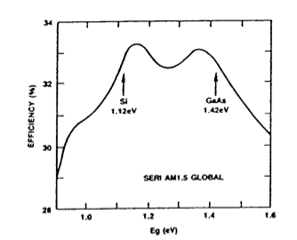

- ### PV cell technology
	- #### Shockley-Queisser model: limiting efficiencies a.f.o. bandgap
	  collapsed:: true
		- Intro
			- ==Radiative recombination==
				- the energy of the recombining electron-hole pair is emitted as a photon
			- ==Auger Recombination==
				- the energy of the recombining electron-hole pair is transferred to another carrier
		- **Model**
			- Assumptions
				- Cell is black-body in thermal equilibrium with a thermal bath at temperature T
				- Isotropic irradiation
				- Unit absorbance for photons > Eg
				- Zero absorbance for photons < Eg
				- Only source of recombination is radiative (no Auger recombination)
				- Cell behaves like an ideal diode (ideality factor $$n=1$$): 
				  $$J(V)=J_0(exp(\frac{qV}{kT})-1)$$
				- Sun assumed to be black body radiator
			- Results
				- 
					- Efficiency: $$\eta(V_g=bandgap)$$
					- Maximum ($$\pm 30\%$$)<- Trade off:
						- Lower bandgap
							- Higher absorbance (more photons with lower energy)
							- But extraction of electron-hole pairs happens at lower voltage
						- Higher bandgap
							- Mutatis mutandis
				- 
					- Iterated experiment with AM1.5 solar spectrum (instead of black body radiator)
					- Si well positioned relative to maximum (but model as such not applicable because indirect bandgap material)
	- Overview of PV-technologies
		- {:height 275, :width 542}
	- #### Crystalline Si solar cells
		- Sand to cell
			- Sand -> reduction -> metallurgical grade Si -> purification -> break and melt again -> wafers -> cells -> modules
			- Metallurgical grade silicon is obtained by a carbothermic reduction of silica in an arc furnace
			- MG-Si is reacted with HCl to form trichlorosilane in a fluidized bed rector by heating powdered MG-Si
			- Wacker process for poly-silicon production
			- PV crystalline silicon wafers are monocrystalline Si grown via Czochralski process or multicrystalline fabricated via a casting process
			- feedstock to Wafer with multiwire sawing
			- Screen printed cell
				- Texturing: make wafer even rougher
					- Chemical solution to remove mechanical damage but increase unevenness
					- Why? -> reduces reflection
				- Create pn junction
					- diffusion of fosphorus -> n side
						- Through POCl3
					- remove phosphorus-silicate glass (PSG) chemically
				- Put on Anti-Reflective Coating (ARC)
					- to reduce reflection even more
				- Contacting
					- Rear -> Al
					- Front -> Ag
		- Problems:
			- cost of Ag and wafer breakage
			- bowing for wafer thickness < 200 micron
		-
	- Thin-film PV Technologies
	- Multijunction cells
- ### PV module technology
  collapsed:: true
	- Si-PV modules
	- Thin-film PV-modules
	  P V-systems
	- Different PV-systems
	- Maximum Power Point Tracking (MPPT)