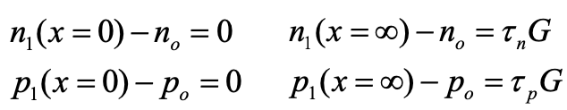

- #### Diode under illumination: qualitative
  collapsed:: true
	- First equilibrium concentration of carriers in both conduction (excited through heat e.g.) and valence band (determined by intrinsic concentration of carriers in semiconductor)
		- No external factors
	- ==Photovoltaic effect==
	  collapsed:: true
		- external illumination: solar light
			- penetratrion of photons (depth is function of absorption coefficient)
		- absorption of fotons, causing excitation of charge carrier (electrons) to a higher-energy state
			- holes in valence band
			- free electrons in conduction band
			- ->recombination
				- conversion: heat-> heat
		- Solve by separation
			- Use p-n junction (inherent potential difference) to establish potential difference
			- Electrical field in the depletion layer
	- Photovoltaic cell
	  collapsed:: true
		- rear side: metal cover
			- to close system
		- front: fingerstructure
			- let light penetrate
			- in between contacts
	- Diode in the dark
		- Diode at zero voltage
			- Thermal equilibrium
				- Diffusion of few majority carriers from n->p
				- Balanced by drift current: thermally generated minority carriers which drift from p->n
		- Diode at forward voltage
			- Potential barrier decreased with $$qV$$
			- Diffusion of many majority carriers from n->p
			- Exponential increase $$I_D>I_{drift}$$
			- (Current)diffusion in quasi-neutral region under influence of concentration gradient: $$-\frac{dp}{dx}$$ and $$\frac{dn}{dx}$$
				- $$
				  \begin{equation*}
				  \left\{
				  \begin{aligned}
				  j_p &= -qD_p\frac{dp}{dx}\\
				  j_n &= qD_n\frac{dn}{dx}
				  \end{aligned}
				  \right.
				  \end{equation*}
				  $$
		- Diode at reverse voltage
			- Potential barrier increased with $$qV$$
			- Very few diffusion majority carriers from n->p
			- With negative $$V$$, $$I_D = I_0$$
				- With: $$I_0$$ limited by thermally generated minority carriers which diffuse to junction, then drift from p-> n
		-
			-
	- Diode under illumination
		- Carrier generation
			- Absorption of photons→creation of excess carriers
			- Separation of carriers by the junction
				- Far from junction
					- generation recombination
				- Near junction
					- Minority carriers are swept over by the field near the junction
				- This results in gradient of minority carriers to the junction
					- from the region where it is minority carrier to the region where it is majority carrier
						- electrons: p->n
						- holes: n->p
			- Current flows through short cicruit (No load)
		- What if load?
			- See sl.13
				- Net current is superposition of:
					- Current bij forward bias: $$I_d = I_{dark}$$
					- Photogenerated current (other direction; $$V=0V$$): $$I_{ph}$$
						- Shift from Q1->Q4: Deliver $$P$$ to environment
			- See sl. 14
				- Diffusion is determined by concentration profiles of minority carriers in quasi neutral regions
			-
			-
			-
- #### Diode under illumination: quantitative
	- Simplified 1-D description of diode under illumination
		- {:height 89, :width 224}
			- In p-type region
			- Divergence of diffusion current + recombination - generation =0
		- {:height 91, :width 262}
			- in n-type region
			- Diode under illumination and no bias
				- Boundary conditions:
					- {:height 88, :width 244}
					-
- Networkmodel
- Alternative collecting junction structures
	- Heterojunctions
	- pin-structures
	- Excitonic solar cell
- Definition of energy conversion efficiency
- Factors influencing energy conversion efficiency