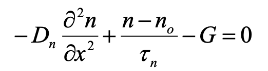
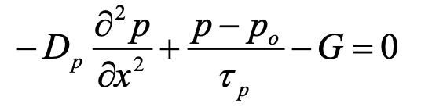
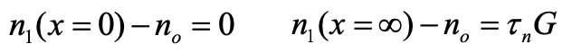
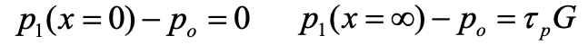
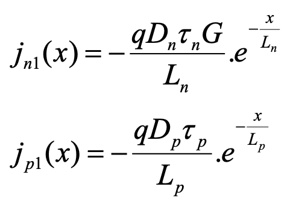
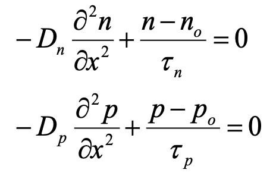
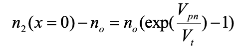
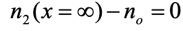
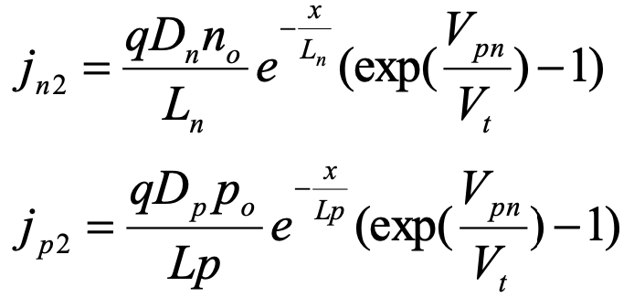
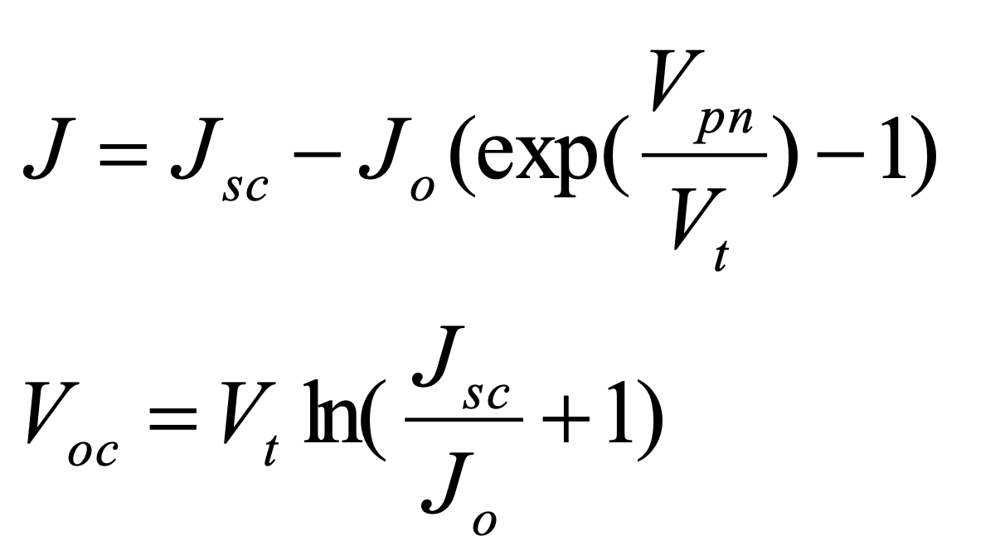

- #### Diode under illumination: qualitative
  collapsed:: true
	- First equilibrium concentration of carriers in both conduction (excited through heat e.g.) and valence band (determined by intrinsic concentration of carriers in semiconductor)
		- No external factors
	- ==Photovoltaic effect==
	  collapsed:: true
		- external illumination: solar light
			- penetratrion of photons (depth is function of absorption coefficient)
		- absorption of fotons, causing excitation of charge carrier (electrons) to a higher-energy state
			- holes in valence band
			- free electrons in conduction band
			- ->recombination
				- conversion: heat-> heat
		- Solve by separation
			- Use p-n junction (inherent potential difference) to establish potential difference
			- Electrical field in the depletion layer
	- Photovoltaic cell
	  collapsed:: true
		- rear side: metal cover
			- to close system
		- front: fingerstructure
			- let light penetrate
			- in between contacts
	- Diode in the dark
		- Diode at zero voltage
			- Thermal equilibrium
				- Diffusion of few majority carriers from n->p
				- Balanced by drift current: thermally generated minority carriers which drift from p->n
		- Diode at forward voltage
			- Potential barrier decreased with $$qV$$
			- Diffusion of many majority carriers from n->p
			- Exponential increase $$I_D>I_{drift}$$
			- (Current)diffusion in quasi-neutral region under influence of concentration gradient: $$-\frac{dp}{dx}$$ and $$\frac{dn}{dx}$$
				- $$
				  \begin{equation*}
				  \left\{
				  \begin{aligned}
				  j_p &= -qD_p\frac{dp}{dx}\\
				  j_n &= qD_n\frac{dn}{dx}
				  \end{aligned}
				  \right.
				  \end{equation*}
				  $$
		- Diode at reverse voltage
			- Potential barrier increased with $$qV$$
			- Very few diffusion majority carriers from n->p
			- With negative $$V$$, $$I_D = I_0$$
				- With: $$I_0$$ limited by thermally generated minority carriers which diffuse to junction, then drift from p-> n
		-
			-
	- Diode under illumination
		- Carrier generation
			- Absorption of photons→creation of excess carriers
			- Separation of carriers by the junction
				- Far from junction
					- generation recombination
				- Near junction
					- Minority carriers are swept over by the field near the junction
				- This results in gradient of minority carriers to the junction
					- from the region where it is minority carrier to the region where it is majority carrier
						- electrons: p->n
						- holes: n->p
			- Current flows through short cicruit (No load)
		- What if load?
			- See sl.13
				- Net current is superposition of:
					- Current bij forward bias: $$I_d = I_{dark}$$
					- Photogenerated current (other direction; $$V=0V$$): $$I_{ph}$$
						- Shift from Q1->Q4: Deliver $$P$$ to environment
			- See sl. 14
				- Diffusion is determined by concentration profiles of minority carriers in quasi neutral regions
			-
			-
			-
- #### Diode under illumination: quantitative
  collapsed:: true
	- Simplified 1-D description of diode under illumination
		- {:height 89, :width 224}
			- In p-type region
			- Divergence of diffusion current + recombination - generation =0
				- electron minority carrier lifetime: $$\tau_n$$
				- Diffusion constant: $$D_n$$
		- {:height 91, :width 262}
			- in n-type region (analogous)
		- Diode under illumination and no bias
		  collapsed:: true
			- Boundary conditions:
				- {:height 67, :width 255}
					- in p-type region
					- x=0 (edge of depletion layer)
						- excess carriers are 0
						- Because any $$e^-$$ at edge of depletion layer is immediately swept over
					- x =$$\infty$$
						- Equilibrium between generation and recombination
				- {:height 56, :width 279}
					- in n-type region (analogous)
			- Solution:
				- {:height 198, :width 222}
		- Diode in the dark
		  collapsed:: true
			- {:height 149, :width 241}
				- No generation
			- Boundary conditions
				- {:height 50, :width 257}
					- excess carriers (electrons at p-side) are exponentially more than the equilibrium concentration because of forward (barrier decrease) bias at start depletion layer
				- {:height 28, :width 140}
					- far from junction, the excess carrier concentration is zero
				- Analogous for wholes on n-side
			- Solution:
				- {:height 129, :width 291}
		- Diode under illumination
			- Superposition of the previous
				- $$J = J_1(x=0)+J_2(x=0)$$
				- {:height 139, :width 220}
			- Effect of temperature
				- Short circuit current: $$I_{sc}$$
					- small increase
				- Open circuit voltage: $$V_{oc}$$
					- strong dependence on intrinsic carrier concentrations $$n_i$$
					- Which is independent on $$T$$
		-
	-
- #### Networkmodel
  collapsed:: true
	- Idea
		- Start from photogenerated current (current source) $$I_{ph}$$
			- losses:
				- Current lost in diode
					- Can be modelled by forward bias when not illuminated
					- Can be further splitted in losses of $$J_{01}$$ and $$J_{02}$$
						- with different ideality factors $$n_i$$
				- Series resistance
					- dissipation
					- Finger structure
				- Shunt resistance
					- leakage
- #### Alternative collecting junction structures
	- ==Heterojunctions==
		- Emitter and base material are not necessarily based on the same material
		- e.g.:
			- p-CuInGaSe(S)2/n-CdS junction
				- CdS is window layer (high band gap, therefore all absorption on p-side)
	- ==pin-structures==
		- Comparison to pn:
			- Electrical field present throughout nearly whole cell volume
			- Collection determined by drift (driftlength)
			- Recombination determined by depletion layer (~ni)
			- Fill factor lower: $$L_{drift}=\mu\tau E$$
				- Mobility of carrier: $$\tau$$
				- Electrical field: $$E$$
			- Problem: low efficiency
	- ==Excitonic solar cell==
		- Exciton bound pair
			- In many materials however the coulombic interaction between excess hole and electron is sufficiently strong to make them move together
			-
- Definition of energy conversion efficiency
- Factors influencing energy conversion efficiency