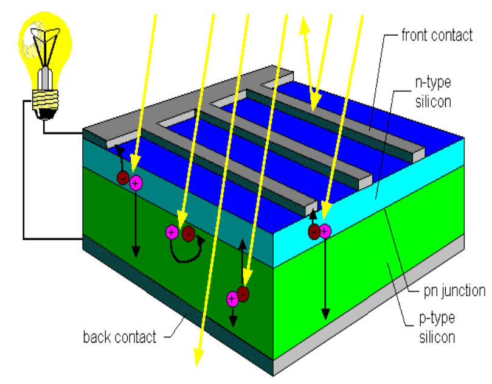

- Given: A diode with J0 = 10-16 A/cm²
  background-color:: blue
  collapsed:: true
	- Under AM1.5 illumination, this cell gives a current of 20 mA/cm²
	  background-color:: blue
	  collapsed:: true
		- Compute the illuminated I-V-characteristic under AM1.5 (100 mW/cm²) illumination and T=300K (the value of Boltzmann constant = 1.4 * 10-23 m² kg s-2 K-1)
		- What is the open-circuit voltage of this cell?
		- What is the max fill factor of this cell? (ideality factor = 1)
		- What is the efficiency of this cell?
		- How does this compare to the
		  efficiency of a typical crystalline Si solar cell?
		- What is the physical meaning of J0?
- Solar PV #PV_EX
  collapsed:: true
	- same as past exam question where he gives the equation for the efficiency of the solar cell and you have to explain what all the terms mean.
	  background-color:: blue
	  collapsed:: true
		- ((64341221-a033-4a55-b6e6-171f1a1c37a3))
	- Explain why there is a theoretical maximum efficiency for a given bandgap.
	  background-color:: blue
	  collapsed:: true
		- *Shockley-Queisser limit*
		- *Considers only radiative recombination mechanism (+ see other assumptions)*
		- *It provides an upper bound on the amount of solar energy that can be converted into electrical energy by a solar cell under ideal conditions.*
		- *In single cells there exists a trade-off between bandgap and extraction voltage. A higher bandgap allows higher absorbance (more photons with lower energy absorbed), but extraction* 
		    ($V_{OC}$) *happens at lower voltages, and vice versa*
		- *Limit is mainly formed by*
		  collapsed:: true
			- *Absorption limit -> incomplete absorption*
			- *thermalization limit -> excess-energy losses*
			- *Other inevitable loss factors*
			  collapsed:: true
				- *Long-wavelength losses*
				- *Voltage factor*
				- *FF*
		- *Shockley queissler limit* $\approx 30\%$
	- Why can multijunctions increase efficiency?
	  background-color:: blue
	  collapsed:: true
		- *Multijunction cells try to increase the limited efficiency of single cells (Shockley-Queisser) by increasing absorption. Absorption in a single cell is limited by long-wavelength (absorption limit, only photons with sufficient energy to let electron bridge bandgap are absorbed) and excess energy (thermalization limit, absorbed photons with energy higher than bandgap -> excess energy will be lost through heat dissipation). See figure.*
		- *Multijunction cells try to reduce those limits and increase absorption by stacking multiple cells with different (increasing) bandgaps upon each other. The higher range of bandgaps allows to absorb photons with lower energy (higher wave length) ->decreases long-wavelength losses. Additionally photons with higher energies can be absorbed by subsequent cells with larger bandgaps which reduces thermalization (excess energy) losses. Finally as the thickness of the cell improves, also incomplete absorption losses decrease.*
		-
- PV: #PV_EX
  collapsed:: true
	- what goes wrong with the perturb and observe algorithm? Which component is affected most by a passing cloud: the direct or the indirect component? Does it change the frequency distribution of the incoming radiation?
	  background-color:: blue
	  collapsed:: true
		- Mijn antwoord
		  collapsed:: true
			- Perturb and observe is a mppt algorithm that uses measurements of current and voltage at discrete time steps in a closed loop control system to converge towards the voltage to extract maximum power. In short it determines its next voltage value based on the previous measurements. The computed change in power determines the direction of the next step while the voltage determines the magnitude of that step. (draw flow chart if spare time).
			  collapsed:: true
				- If P increases, than V follows the current change in V (decrease, decrease further)
				- If P decreases, than V counteracts the current change in V
			- However P&O fails in rapidly varying weather conditions. If the granularity of the time of the changes is much smaller than that of the discrete time steps, than the algorithm could make wrong decisions because it reacts too slow.
			- It affects the direct component as only direct irradiance is affected heavily in partially clouded situations
			- Yes, it affects the spectrum
			  collapsed:: true
				- Shorter wavelengths, such as blue and green light, are more easily scattered by clouds, leading to a larger proportion of diffuse light in the spectrum reaching the surface. As a result, the presence of clouds can cause a shift towards longer wavelengths in the overall spectrum of incoming irradiance.
		- Antwoord burgieclan
		  collapsed:: true
			- Perturb and observe fails in fast changing weather conditions. It works
			  by measuring V(t) and I(t) at discrete time steps. If both P and V increase or
			  decrease, V will be increased during the next measurement to increase P and get
			  closer to Pmax. Otherwise, V will be decreased to get closer to Pmax. + draw
			  slide 9
			- When solar radiation increases, Pmax increases and we could end up on
			  the wrong side of the graph giving the wrong commands.
- PV #PV_EX
  collapsed:: true
	- What is the difference between bifacial and monofacial PV systems?
	  collapsed:: true
		- Monofacial PV panels are the traditional and most common type of solar panels. They consist of a single layer of photovoltaic cells mounted on a supporting structure. These panels are designed to capture sunlight only from one side, usually the front or top surface of the panel. The front surface is where the active photovoltaic material is located, which converts sunlight into electricity. The back surface of a monofacial panel typically consists of a protective layer and a backing material, most commonly used is an Aluminium backside.
		  collapsed:: true
			- {:height 236, :width 216}
		- Bifacial PV panels, on the other hand, are designed to capture sunlight from both the front and back surfaces of the panel. They feature photovoltaic cells on both sides, allowing them to generate electricity from sunlight that strikes the front surface as well as from sunlight that is reflected or diffused onto the back surface. Bifacial panels are typically constructed with a transparent or translucent backsheet or glass back cover, which allows light to pass through to the rear cells. Note that back side generation also requires the necessary busbars and fingering designs on the rear side.
	- Why is it difficult to estimate the production of these systems?
	  collapsed:: true
		- No consensus on gain estimates
		- Lack of standardization in calculation methods
		- A lot of uncertainty
		  collapsed:: true
			- rear side irradiance is non-uniform and dependent on:
			  collapsed:: true
				- characteristics on the ground
				- shading
				- location and stance of the modules
				- Neigbouring PV systems
	- What is the typical gain of this bifacial module compared to a monofacial? What is the reason of these gain?