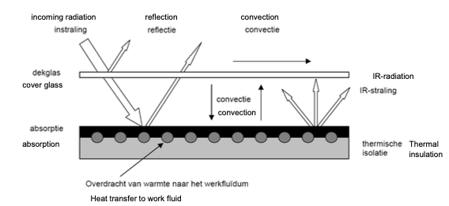
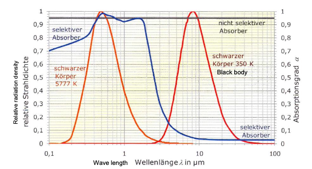

- ### Introduction
  collapsed:: true
	- Solar thermal collectors
	- Solar Irradiance
		- Characteristic figures
			- Solar Constant: $$G_{sc}=1.367kW/m^2$$
			- Solar radiation intensity in Belgium at earth surface: $$\sim 1kW/m^2$$
			- annual irradiated solar energy density (in Belgium ~1000 hrs sunshine): $$\sim 1000kWh_{th}/m^2a$$
			- Annual average yield of collector at optimal inclination and orientation: $$\sim 375 kWh_{th}/m^2a$$
				- Optimal orientation and inclination vary with seasons/time of day
					- => Acceptable orientation: SW-SE
					- => optimal inclination: $$\sim 20^{\circ}-50^{\circ}$$
- ### Working principle Solar Boiler
	- #### Flat plate collector
		- Structure
			- {:height 203, :width 413}
				- For absorber (absorber plate): $$\tau=0$$
			- Collector Aperture Area
				- The aperture area of a (concentrating) solar collector is the area of the
				  opening into which the insolation passes.
				- The size of this area does not include any area reduction due to the angle
				  of incidence effects or shadowing.
				- After passing through the aperture, the insolation may be absorbed.
		- Energy yield
			- Guidelines for maximal yield:
				- large absorption coefficient absorber
				- small emission coefficient absorber
					- -> selective absorber: High absorbance for solar and low emittance for infrared-radiation
					- {:height 221, :width 379}
				- limitation heat loss to environment through cover
				- use cover glass with high transmission coefficient
				- coating on inside cover glass to avoid IR transparency
				- put insulation behind absorber to limit heat loss