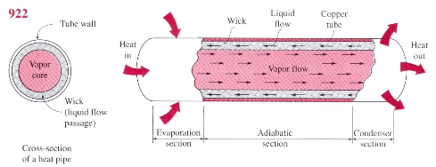
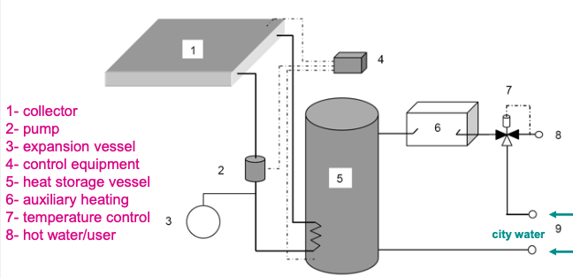

- ### Introduction
  collapsed:: true
	- Solar thermal collectors
	- Solar Irradiance
		- Characteristic figures
			- Solar Constant: $$G_{sc}=1.367kW/m^2$$
			- Solar radiation intensity in Belgium at earth surface: $$\sim 1kW/m^2$$
			- annual irradiated solar energy density (in Belgium ~1000 hrs sunshine): $$\sim 1000kWh_{th}/m^2a$$
			- Annual average yield of collector at optimal inclination and orientation: $$\sim 375 kWh_{th}/m^2a$$
				- Optimal orientation and inclination vary with seasons/time of day
					- => Acceptable orientation: SW-SE
					- => optimal inclination: $$\sim 20^{\circ}-50^{\circ}$$
- ### Working principle Solar Boiler
	- #### Flat plate collector
		- Structure
			- {:height 203, :width 413}
				- For absorber (absorber plate): $$\tau=0$$
			- Collector Aperture Area
			  collapsed:: true
				- The aperture area of a (concentrating) solar collector is the area of the
				  opening into which the insolation passes.
				- The size of this area does not include any area reduction due to the angle
				  of incidence effects or shadowing.
				- After passing through the aperture, the insolation may be absorbed.
		- Energy yield
			- Guidelines for maximal yield:
				- large absorption coefficient absorber
				- small emission coefficient absorber
					- -> selective absorber: High absorbance for solar and low emittance for infrared-radiation
					- {:height 221, :width 379}
				- limitation heat loss to environment through cover
				- use cover glass with high transmission coefficient
					- Zie sl. 36
				- coating on inside cover glass to avoid IR transparency
				- put insulation behind absorber to limit heat loss
			- Efficiency $$\eta$$
				- collapsed:: true
				  $$
				  \begin{equation*}
				  \begin{aligned}
				  \eta &= \frac{Useful\; heat\; recovered}{Incoming\; irradiated\; energy}\\
				  &= \eta_0 - U_0T^*-U_T\cdot (T^*)^2\cdot G\\ 
				  &= \tau\cdot \alpha- U_0T^*-U_T\cdot (T^*)^2\cdot G
				  \end{aligned}
				  \end{equation*}
				  $$
					- Empirical
					- Effective heat loss coefficients $$U_0,\;U_T$$
					- Normalized temperature: $$T^* = \frac{T_F-T_0}{G}$$
						- Temperature environment: $$T_0$$
						- Average Fluid temperature: $$T_F$$
						- incoming radiation ($$W/m^2$$): $$G$$
					- More losses at higher $$T$$
	- #### Other collectors
		- ==Evacuated/vacuum collector==
			- vacuum = good thermal insulator
			- (-) difficult to guarantee vacuum for ≥ 20 years
			- (+) less losses vs flat plate collector, especially at higher $$T$$
			- (-) Start at lower $$\eta_0=\alpha\tau$$ (because \tau is smaller)
		- ==Heat pipe vacuum collector==
			- Work principle
				- consists of vacuum tube in which metal tube
				- inside metal tube fluid with low boiling point: alcohol
				- upon absorption heat: alcohol evaporates and rises
				- above: heat exchanger that condenses alcohol
				- liquid alcohol descends (often through a wick – capillary effect)
			- Configurations
			  collapsed:: true
				- Vertical (standard)
				- Tilted
				- Horizontal
					- Uses Wick: use capillary forces to create flow
					- {:height 164, :width 359}
		- ==Line/Point focus concentrators==
	- #### Solar Boiler System
		- {:height 228, :width 395}
		- Control
			- Measurements
				- in tank
				- Collector output
				- at user point
			- Control flow
				- If $$T_{coll}\geq T_{tank}+5^\circ C$$
					- Pump activated
					- Tank heats up
				- If $$T_{coll}\leq T_{tank}+2^\circ C$$
					- Pump stops
				- If $$T_{user}\; too\; low$$: auxiliary heating (6)
				- If $$T_{user}\; too\; high$$: mixing city water (9)
		- Necessary precautions
		  collapsed:: true
			- against freezing
				- glycol filling
				- “emptying” provision (for winter season)
			- against the legionella bacteria
				- auxiliary / after heating is necessary!
					- needed when solar heating is insufficient
					- T > 65° C to kill legionella; then hot water mixed with cold water
- ### Economic evaluation
	- Solar “coverage” = the percentage contribution of solar in total heat demand.
		- Saturation of curves due to asymmetric yield in summer versus winter. E.g., larger collector area, gives unused surplus heat in summer and little gain in the winter
	- If you account for the present value of the investment
		- Not able to regain investment, classic boiler is still more interesting
		- However gas prices can be higher
	- Potential in Belgium
		- SIC has not really decreased (as opposed to PV) and limited subsidies
		- Energy yield is higher but SIC of PV is lower
			- -> kWh cost is similar, but $$kWh_t<kWh_{el}$$ -> PV is preferable to cover roof area
			- be aware of temporal mismatch between PV generation and HP use -> (seasonal) storage in between needed
				- P from PV in summer but less heating needed, while heating needed in winter but less P from PV a
				- Look at other synergies: energy communities, cool data centers
	-