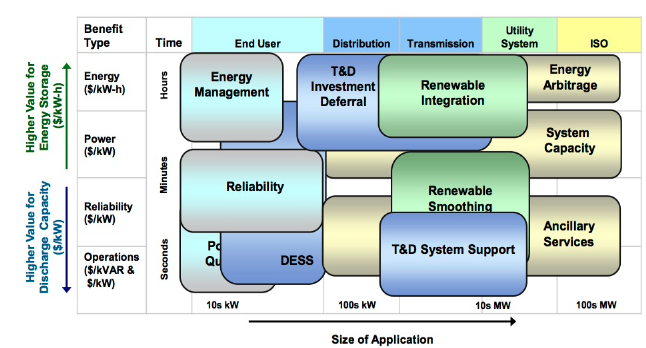
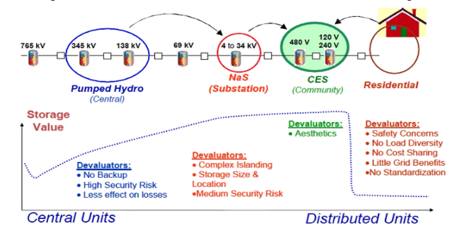
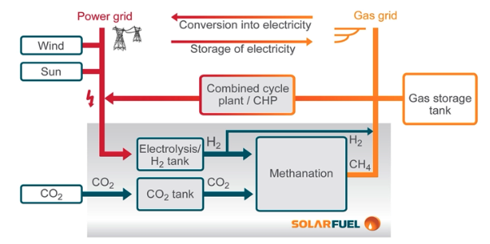
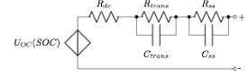
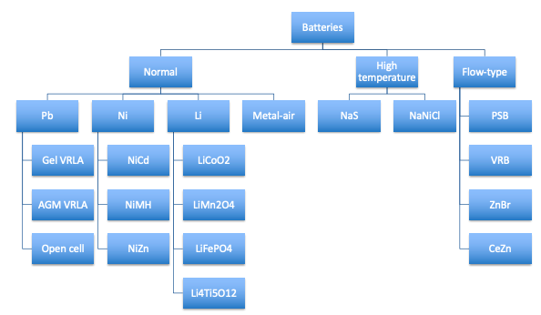
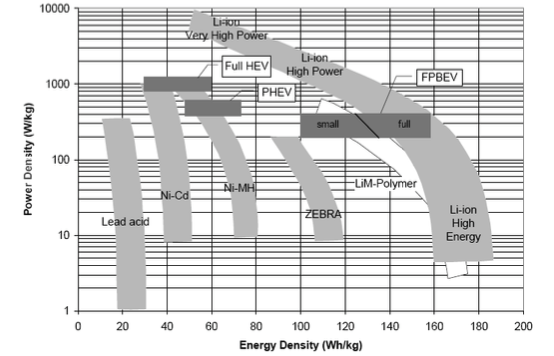

- ### Overview and general characteristics
  collapsed:: true
	- Why needed?
		- Solve electrical imbalance in space and time
		- Flexibility needed to equate demand with supply
			- Flexible demand
				- Flatten demand curve
				- By increasing self consumption
					- Of PV
					- with tariffs (direct)
			- flexible supply
	- Categorize technologies regarding
		- conversion process
		- Energy vs Power
		- Application
			- {:height 283, :width 485}
			- Very important picture!
		- Location
			- Central vs distributed?
			- {:height 264, :width 491}
	-
		- Maturity
	- Efficiency
		- Every conversion in the system yields a kind of efficiency
- ### Mechanical storage
	- #### Pumped Hydro Storage (PHS)
		- General
		  collapsed:: true
			- Position of body of water in gravitational field
			- Pure and mixed
			- Power pumping ≠ turbine
			- Roundtrip efficiency 65-85%
			- Most often in HV grid
			- Asset of producers in liberalized market
			- Energy: $$\Delta E_{pot} = \rho\cdot g\cdot \Delta h\cdot V$$
				- Big heights $$\Delta h$$ (e.g. mountains)
				- Big lakes $$V$$
			- Power: $$P = \rho\cdot g\cdot \Delta h\cdot Q\cdot \eta$$
		- Roll out
		  collapsed:: true
			- together with Nuclear
				- complimentary flexibility
		- Potential
		  collapsed:: true
			- Sizable potential still
			- Geographically limited
			- Of limited use with congestion issues
			- Not really long-term (security of supply context)
			- Limited power control flexibility (pumping), specifically around 0 MW (dewatering)
		- Energy island
		  collapsed:: true
			- ((644434c5-a6be-4994-a54a-906bc62b063b))
			- Recently proposed project (JD: will never be built)
			- Proven (mature) technology in a new innovative context
			- Facilitating the integration of off shore wind power
			- Future off shore Supergrid building block
	- #### CAES
		- = Compressed Air Energy Storage
		- used for storing energy by compressing air into an underground reservoir or storage tank with use of a compressor, which can be released later to generate electricity using a turbine.
		- Often combined with Gas plant
		- CBA
		  collapsed:: true
			- (+) Low capital cost (integrated in CCGT plant)
			- (-) Need for natural cavity (typically salt cavern)
			- (-) Lower round trip efficiency
				- Energy lost to the boundaries of the cavern
			- (-) Depends on presence of gas turbines and natural gas pipeline
		- Adiabatic Compressed Air Storage
		  collapsed:: true
			- Same but in combination with heat storage to increase efficiency
			- the compressed air is heated before it is stored and cooled before it is expanded through a turbine to generate electricity
	- #### Flywheel
	  collapsed:: true
		- Storage of kinetic energy, by rotation of large inertia
		- High speeds
			- Special generators/motors needed
		- Vacuum
		- Heavy inertia
		- Magnetic bearings
		- (+)Fast charge/discharge
			- high Power/low Energy
		- Applications
			- Not in renewable energy
			- Maybe in exotic applications like CERN
			- Supercapacitors took over the market that flywheels were occupying 20years ago
- ### Electromagnetic Storage
	- #### Supercapacitors
		- *A supercapacitor or an ultracapacitor is an electrochemical capacitor that has an unusually large amount of energy storage capability relative to its size when compared to common capacitors.*
		- Concept
		  collapsed:: true
			- electrochemical energy storage device that stores electrical energy in an electric field between two electrodes separated by an electrolyte
			- Supercapacitors can store much more energy than traditional capacitors due to their larger surface area and thinner dielectric layers, allowing them to store more charge
				- Electrostatic: low capacitance, no electrolyte, insulating material in between electrodes: mica, teflon, ceramic, ...
				- Electrolytic: “Elco”, DC-link energy storage, high single cell voltage compared to EDLC, high capacitance compared to electrostatic caps, inherently polar
		- CBA
		  collapsed:: true
			- (+)
				- (+) Very high rates of charge and discharge.
				- (+) Little degradation over hundreds of thousands of cycles.
				- (+) High cycle efficiency (95% or more) due to its low equivalent
				  series resistance (ESR)
			- (-)
				- (-) The amount of energy stored per unit weight is considerably lower than that of an electrochemical battery (3-5 Wh/kg for an Ultra Capacitor compared to 30-190 Wh/kg for a battery).
				- (-) The voltage varies strongly with the energy stored. To effectively store and recover energy requires sophisticated electronic control and switching equipment.
				- (-) Exhibits the highest dielectric absorption (inability, when being charged for a long time, to completely discharge) of all types of capacitors: 15-25 % Vnom
				- (-) Low cell voltage (2,5-2,7 V): series coupling of several tens of cells to obtain a useful voltage
		- Applications
		  collapsed:: true
			- Leuven buses
				- Store braking energy
				- But hybrid buses are being pushed out the market
	- #### Superconducting Magnet Energy Storage (SMES)
		- Concept
		  collapsed:: true
			- Formula: $$E = \frac{1}{2}L I^2$$
				- High inductance
				- High current needed
					- Low resistance needed-> superconductor
			- type of energy storage system that uses a superconducting coil to store electrical energy in a magnetic field
			- The superconducting coil is made of a material that exhibits zero electrical resistance when it is cooled to a very low temperature, typically near absolute zero (-273.15°C or -459.67°F). This allows a large amount of electrical current to flow through the coil without any energy loss due to resistance.
				- e.g. Liquid nitrogen
			- When energy is stored in the SMES system, a large current is passed through the superconducting coil, creating a strong magnetic field. When energy is required, the magnetic field is used to generate an electrical current that can be used to power devices or systems.
		- CBA
		  collapsed:: true
			- (+) High $$P$$
			- (-) Low $$E$$
			- (-) Losses related to the high cooling efforts
		- Applications
		  collapsed:: true
			- only CERN
			- Out of picture for renewable energy storage
- ### Chemical Storage
	- #### Electricity to gas (P2X)
	  collapsed:: true
		- 
		- More for direct use than for storage
		- Fuel cells needed to do the oxidation (conrtolled)
			- By definition, the process of any fuel cell could be reversed.
			- However, a given device is usually maximized for operating in one modus and may not be built in such a way that it can be operated backwards.
			- Fuel cells operated backwards generally do not make very efficient systems.
		- (-) Low efficiency
	- #### Batteries
		- Concept
		  collapsed:: true
			- Negative electrode: good electron donor
			- Positive electrode: electron acceptor (lithium cobalt oxide,
			  lead oxide)
			- Electrolyte: pure ionic conductor, usually liquid solvent- based, only stable in certain voltage ranges otherwise decomposition
		- At low discharge depth: flat voltage characteristic (not linear as with capacitors)
		  collapsed:: true
			- battery management system added (keeps track of how much energy is charged/discharged by integrating the currents)
			- Avoid the voltage collapse
		- Losses
		  collapsed:: true
			- Electrical (Joule losses because of internal resistence)
			- Chemical losses
		- Equivalent circuit
		  collapsed:: true
			- 
			- With capacitors $$C_{trans}$$, $$C_{ss}$$ High
			- With capacitors $$C_{trans}$$, $$C_{ss}$$ small, otherwise $$\tau = RC$$ is big and discharge is slow
			- -> possible to design towards requirements
		- See safety slide
		- {:height 314, :width 394}
			-
		- {:height 315, :width 417}
	- **Normal**
	  collapsed:: true
		- **Lead Acid**
			- Lead-acid baderies are the oldest type of galvanic cells and are the most commonly used rechargeable baderies today
			- They have the second lowest energy density (next to the obsolete NiFe badery)
			- Effective lead pollution control system is a necessity for sustainable environment
			- Problems
				- Gel instead of liquid to avoid dry out
				- Salt crystal growth on diodes, reduces conduction
			- Technologies
				- Absorbed Glass Mat (AGM) VRLA: low resistance
				  microporous glass fiber immobilizes the electrolyte and acts as separator, newer and more abuse tolerant than Gel VRLA
				- Gel VRLA: mixing electrolyte with micron diameter silicon dioxide, very small rate of charge (C/20) to prevent excess gas from damaging the cell
				- Open / Flooded Cells: during overcharging gasses escape ->replenishing with water
		- **Nickel batteries**
			- (+) Extremely flat discharge curve,closest toideal
			  battery
			- (+) Extremely low ESR: high peak discharge currents
			- (-)  Impossible to estimate SOC based on voltage
			- Types
				- ==Nickel Iron batteries==: Completely abandoned technology due to their
				  poor low temperature performance and poor energy efficiency
				- ==NiCd==
					- popular type of rechargeable battery using the metals nickel (Ni) and cadmium (Cd) as the active chemicals
					- CBA
						- (+)
							- (+) beneficial weight/energy ratio as compared to PbAc
							- (+) Long storage life
							- (+)  Wide operational temperature range
						- (-)
							- (-)  Low energy efficiency: 60-70 %
							- (-) High self discharge
							- (-)Suffers from memory effect (dendrites are formed at electrode surface when recharging at low DOD)
							- (-) Toxic -> careful recycling needed
					- Now forbidden to sell, except for specific applications because of the Cd content
				- ==Nickel-metal hydride==
					- CBA
						- (+) Mature and safe
						- (-) High self-discharge: can lose up to 30 % of its capacity in a month, as always self discharge increases with temperature
						- (-) High temperature operation results in accelerated aging => cooling very important
						- (-) Modest energy density: 35-70 Wh/kg
						- (-) Low storage efficiency
						- (-) low potential for cost reduction and
						  increase in energy density
					- Vs Li-ion
						- When stored without charging, Ni-batteries will deplete rather fast due to the high self- discharge, but cells can be depleted to zero voltage without harm. Capacity loss due to self- discharge is reversible and nickel-metal hydride batteries can recover to full capacity by proper recharging.
						- When stored without charging, Li-ion batteries will deplete very slowly, but if depleted beyond a certain voltage, the damage is irreversible.
		- **Li-ion Cells**
			- A lot of slides skipped: 91-95, 111-118, 125-129
			- Positive electrode
				- LFP probably dominant technology for the coming years
					- Used by Tesla
					- Home storage batteries (You don't want toxic elements in house in case of fire)
			- Negative electrode
			- Charging
				- Process #.ol
					- 1st stage: max. charging current until V reaches ± 4,2 V.
					- 2nd stage: charging at constant voltage until current drops below 0.03 C
						- Increasing charge current shortens stage 1 but prolongs stage 2!
					- 3rd stage: to compensate self-
					  discharge, NO trickle charge
				- High amount of cycles possible
			- Li batteries are very T sensitive
			- Li-ion failure modes
				- Li-ion failure modes due to internal damage
				  collapsed:: true
					- separator failure
					- dendrite growth from the anode through the separator
					- Li plating on the anode
				- Li-ion failure modes due to external causes
				  collapsed:: true
					- mechanical damage
					- external short circuit
					- cell overcharge
					- cell overdischarge
					- low temperature recharging
					- high temperature storage
					- design errors
					- poor manufacturing processes
				- -> Safety features
				  collapsed:: true
					- BMS monitors electric quantities and temperatures of each cell
					- Cell level safety-features
						- Current interrupt device
						- PTC disks in the cell header
						- Current limiting fuses
						- (Bypass) diodes
						- Valves
						- Strong and puncture resistant containment
			- Types
				- $LiCoO_2$
				  collapsed:: true
					- (+) High energy density
					- (-) high internal resistance combined with low thermal stability (T limited to 130°C) => high currents
					  result in excessive heating and thermal runaway
					- Not used anymore (except exotic appliactions, in space etc.)
				- $LiMnO_2$ (LMO)
				  collapsed:: true
					- Three-dimensional spinel structure improves ion flow
					  between electrodes (LMS)
					- (+) Lower internal resistance combined with high thermal stability (T up to 250°C) => high currents are
					- (-) Lower energy density: 110-120 Wh/kg
				- $LiNiCoAl$ (NCA) and $LiNiCoMn$ (NMC)
				  collapsed:: true
					- (+) High thermal stability allows high current discharge
					- () Energy density: 95-130 Wh/kg
				- $LiFePO_4$ (LFP)
				  collapsed:: true
					- (+) High thermal stability allows high current discharge
					- () Energy density: 95-140 Wh/kg
					- Will be number one battery for all kind of static storage
				- $Li_4Ti_5O_{12}$ (Li-Titanate)
				  collapsed:: true
					- (+) Safer battery
					- (+) High power density: 4 kW/kg
					- (-) Lower energy density: 50-90 Wh/kg
						- Compensated by limited ageing
				- Li-polymer
				  collapsed:: true
					- Polymer electrolyte replaces traditional porous separator: resembles plastic-like film that allows ion-exchange
					- (+) Very flexible form factor
					- (+) Improved safety: resistant to overcharge, no liquid electrolyte leakage
					- (-) Poorer conductivity: high internal resistance does not allow current bursts
			- Structure
				- Cells put in 19inch racks -> Racks to towers -> Container filled with towers
		- **Metal air**
			- Zn-air
				- One time use
	- **High Temperature**
	  collapsed:: true
		- **NaS batteries**
			- Operating $$T>\pm 300^{\circ}C$$
			- Sodium also interchangeable with Li
			- CBA
			  collapsed:: true
				- (+) high roundtrip efficiency, Good cyclability
				- (+) Relatively high energy density
				- (+) High energy-storage efficiency
				- (+)Suited for both power and energy applications
				- (-) substantial energy loss because of heat-up in between charge discharge (start-up)
					- Global efficiency influenced by the auxiliaries for thermal management
					- Outside that kept warm because of own cell-losses
					- Thermal leakage during discharge: 0.6-1% of the nominal capacity per hour
		- **NaNiCl**
	- **Flow batteries**
	  collapsed:: true
		- Decoupling between power and energy
			- Power: number of cells
			- Capacity: storage tanks
		- **Vanadium (VRB)**
			- A lot of ions -> a lot of charges
	- **EV as storage device**
		- Plug-in vehicles
			- Large flexibility potential when being plugged in sufficiently
			- Grid support
				- Controlled charging
					- Bidirecfonal / unidirecfonal / Q?
			- V2G / V2H
			- Expensive due to degradation of battery
			- Competition from home battery
		-
-