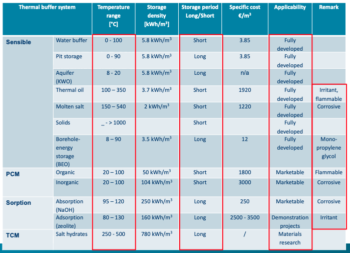

- ### Intro
	- #### Energy Storage
		- Increased importance
			- the growing share of renewable energy sources
				- Why renewables?
					- mismatch demand-supply in time and location
					- potential congestion of electricity grid
					- higher demand for flexibility, smart grid
					- the highly fluctuating electricity price (optimization towards minimal cost) and financial incentives
				- Role of storage in relation to renewables
					- Intermittent renewable energy sources (variable and difficult to
					  predict), e.g. solar thermal, PV, wind ...
					- Time shift towards consumption during off-peak periods and production during peak-periods, e.g. geothermal heat pump (consumption), biomass-fired-CHP (production) ...
					- Increasing performance (and thus reducing emissions) by less transient operation and less cycling, e.g. heat pumps, biomass boiler ...
					- Avoid problems of electricity grid infrastructure (voltage fluctuations), e.g. PV, heat pumps ...
			- more emphasis on energy conservation: residual heat recovery
		- Implies losses ($$\eta<1$$)
		- Types
			- TES
			- Electrical Energy Storage (EES)
			- Power-to-Heat, Power-to-Cold + TES
	- #### TES
		- *TES is a technology that stores thermal energy by heating or cooling a storage medium so that the stored energy can be used later for heating and cooling applications or power generation*
		- Offers flexiblity
			- Demand shifting
			- Variable supply integration
			- Sector integration
			- Network management
			- Seasonal storage
		- Sectors
			- Power
			- Buildings
			- District heating and cooling
			- Cold chain
			- Industry
		- Energy density
			- TCM (thermochemical materials)> PCM (phase changing materials)> water
		- TES selection
			- Parameters
				- Temperature range
				- Storage density (space limited?)
				- Long versus short term
				- Application scale: decentralized versus centralized
				- Cost
				- Applicability – market readiness
					- Sensible: fully developed
					- Latent: improvements in thermal conductivity still needed
					- Thermochemical:
						- sorption is applied
						- chemical reaction in demonstration phase
			- Selection
				- 
					- Sensible:
						- Water
							- Highest Energy density/heat capacity
							- with $$T \in [0,100]^{\circ}C$$
					- PCM
					- TCM
- ### TES - Sensible Storage
	- **General**
		- Heat is stored as internal energy, in the temperature increase of a medium (usually liquid or solid): $$Q = m\int_{T_1}^{T_2}c_p(T)dT$$
		- Temperature difference ($$\Delta T$$) drives the heat transfer; $$\Delta T$$ decreases while charging/discharging
		- Low energy storage density (large physical footprint); volumetric thermal capacity ($$c_p\rho$$) is important if space limitations
		- Power density can be limited by low thermal conductivity (solid) or low convective heat transfer rates (liquid) of some storage materials
		- State-of-the-art: well demonstrated, clearly understood, reliable, widely used, cheap
		- Considerable self discharge (heat losses) à insulation needed if high T or long storage times
	- **Materials**
		- Low cost:
			- Water: best choice in T range 20-80°C
			- Solid state: soil, rocks
		- Higher cost:
			- Oil: for higher temperatures
			- Salt solutions (brines):when old salt mines (caverns) are used as storage tanks and flooded
			- Blocks or plates of different solid materials (graphite, concrete, iron, iron oxide ...)
			- Molten salts
	- **Types**
		- Water
			- Characteristics
				- the best choice in T range 20-80°C
				- High thermal capacity (4.2kJ/kgK)
				- (-) Low cost
				- (-) Limited temperature range, but appropriate for building applications and for connection with solar thermal
				- High convective heat transfer rate
					- High heat injection and extraction rates
					- Makes stratification more difficult (because of mixing)
			- Configurations
				- ==Water tanks== (TTES)
					- Immersed coil heat exchanger
						- Generally located at bottom of tank (profit from high $$\Delta T$$, HT easier when $$\Delta T$$ is higher)
						- Mixed tank (not stratified)
					- External (side-arm) heat exchanger
						- Natural convection HEx to eliminate a circulation pump
						- Potential for increasing thermal stratification in tank
					- Mantle heat exchanger
						- Double walled storage tank, heat transfer fluid circulated through the storage mantle
						- Large heat transfer surface area
						- More costly
				- ==Aquifer== (ATES)
					- Working
						- Wells are used to carry (ground) water to/from the aquifer, allowing transport of heat
						- Cold and warm wells (distance 50-250m)
					- Characteristics
						- Potential for economical large scale and long term (seasonal) storage
						- Amount of energy stored depends on allowable temperature change, thermal conductivity, natural ground water flow
				- ==Solar Ponds==
					- Surface water (ponds or lakes) used to collect and store solar heat, with very little losses
					- As a result of the fact that Solar ponds contain salt solutions
						- Salinity gradient results in higher salt concentrations (and thus
						  higher density) at the bottom
						- Heat absorbed at the bottom remains trapped there
						- Salinity gradient inhibits natural convection and the cooler water at the surface acts as an insulator
						- Economically attractive in regions with little snow fall and areas where land is readily available
						- Maintenance similar to that of a swimming pool, control of algae and bacteria growth
		- Solid State
			- Characteristics
				- Working
					- Heat transport fluid (water, air) circulated through a bed of solid material, discharging/charging heat
				- Considered for seasonal storage when geological conditions favour this type of system
				- Materials:
					- ceramic bricks, beds of rock or concrete, for higher T refractory bricks based on oxides, carbonates and their mixtures
				- Lower thermal capacity than water, but can easily operate at higher temperatures
				- (+)Simple, relatively cheap, scalable
				- Air based systems: low energy density (3 times more space needed compared to water but economically favourable for short-term storage)
			- Configurations
				- ==Ground== (soil or solid rock), closed system
					- Low-cost system since soil is free, however drilling is expensive (21-24% of total storage system cost)
					- Ground is drilled to insert tubes (vertical or horizontal), in which a heat transport fluid circulates, injecting/extracting heat in/from the ground
					- Energy piles can also be integrated in foundation
					- Thermal energy storage versus energy dissipation: depends on thermal conductivity and groundwater flow, storage efficiency is rather low
					- Usually connected with a heatpump (for heating) and heat exchanger (for direct cooling)
				- Concrete Core Activation (CCA)
					- ==Thermally Activated Building Systems== (TABS)
						- Concrete floors/ceilings of a building are activated by embedding water tubes in the concrete and forcing warm/cold water through the tubes
						  id:: 643bcabb-2ed8-4a14-9a5b-292ab4abac4e
						- High temperature cooling and low temperature heating -> High COPs
						- Thermal capacity of concrete presents storage capacity
						  (thermal inertia, large time constant)
						- Difficult to control since heat/cold transfer to building
						  rooms is governed by $$\Delta T$$
						- Self regulating effects
					- ==GEOTABS==
						- *sensible storage in ground and building mass*
						- Both cooling and heating load in buildings (e.g. offices) => beneficial to long term ground thermal balance
							- Heating: high source temperature (ground) and low emission temperature (TABS) => high HP performance
							- Cooling: cold directly available in ground and high emission temperature (TABS) => passive cooling
						- GEO-HP + TABS: energy saving potential of 20-70%
		- ==Thermal Oil==
			- Used at higher temperatures (compared to water), typically till 350°C
			- Types
				- Derivates of natural oil: mineral oil
				- Synthetic oil: more pure and thermally stable
			- Lower thermal capacity compared to water (about half)
			- Mainly used in:
				- Process industry (to replace steam)
				- Thermal solar plants (thermal oil often replaced by molten salt for even higher temperatures to drive Rankine cycle)
		- ==Molten Salt==
			- Inorganic chemical compounds, maintained at temperatures above their melting points so that they are in liquid form
			- Used for the storage of high-grade heat
			- Vulnerable to solidifying -> can cause considerable damage to auxiliary equipment
			- Use is limited to highly controlled environments where high temperatures are required
			- Applications in power sector
				- in combination with CSP: heat can be stored during the day and discharged at night to drive a turbine and maintain continuous electricity production
	- **Stratification**
		- *stratification refers to the separation of hot and cold fluids in a storage tank. This separation occurs due to differences in fluid density caused by temperature variations*
		- CBA
			- (+) Allows increase of energy quality (exergy) within a store
			- (+) Easier to store collected heat
			- Highly stratified
				- (+) Continuous possibilities to transfer heat to the cooler regions of an almost fully charged store
				- (+) Proper energy quality being available from warmer regions of almost discharged store
			- Fully mixed tank
				- (-) Difficult to inject heat in the tank when it is almost charged
				- (-) Difficult to obtain much use from lower quality heat when the system is almost discharged
		- How to increase stratification?
			- Baffles or stratifiers to reduce mixing
			- Shape of store (increasing aspect ratio H/D)
			- Fluid inlets and outlets, variable position inlets
			- Water flow rate
			- Segmentation of storage system
	- **Self discharge**
		- *Higher Heat Losses as a result of large volume and high temperature at full charge*
		- (-) Less stratification, caused by more natural convection
		- How to decreases self discharge
			- Insulated or burried (pit storage)
			- Geometries with low surface over volume ratios
			- Condensation in the tank insulation may be a problem for buried tanks
- ### TES - Latent Storage
	- General
		- Heat is stored nearly isothermally in PCM as the latent heat of phase change (solid-liquid, limited density change)
		- Constant temperature charge/discharge (-> useful in sensitive applications (e.g. cold chains))
		- Material
			- PCM (phase change material), cPCM (composite PCM) stored in ceramic supporting materials
		- CBA
			- (+) Relatively high energy density, smaller physical footprint
			- (-) Low thermal conductivity
		- Examples
			- Melting ice (freezing point)
			- Organic: paraffin, fatty acids, alkanes, alcohols ...
			- Inorganic: salts and their eutectic mixtures
	- Materials
		- PCM
			- Sub-zero temperature PCMs: eutectic mixtures
				- Melting temperature of the mixture is lower than the melting temperatures of the individual components, e.g. salt-water eutectics
				- Applications where colder temperatures are required than standard space cooling, e.g. for refrigeration in the cold chain
			- Low-T PCM (0°C up to 120°C)
				- used in buildings, integrated in domestic heating and airco systems
				- Ice
					- has excellent material properties for cold storage at 0°C
						- High heat of fusion (334 kJ/kg), low physical footprint
						- Good heat capacity (4.2 kJ/kg K)
						- Non-corrosive behaviour
						- Readily available and inexpensive
						- Commercially available for buildings and district cooling systems
						- Bulk ice storage (block of ice) or ice-on-coil storage
				- Paraffin waxes
					- versatile
					- stable chemical properties (non-toxic and non-corrosive)
					- moderate flammability, which limits their application
					- low cost
					- moderate latent heat (around 200 kJ/kg)
					- wide range of melting temperatures
					- low thermal conductivity (0.2 W/m K) -> high thermal conductivity particles and fillers such as graphite or metal can be added
				- inorganic salt hydrates (e.g. strontium bromide)
					- commercialized for domestic heating
			- High-T PCM (150°C up to 800°C)
				- Binary and ternary mixtures of inorganic salts: carbonate, nitrate, chloride and sulphate salts of alkali and alkaline metals
					- Chemically stable
					- Optimal performance in a broad T range
					- High storage density
					- (-) Corrosive
					- Cycling stability? Phase separation/segregation
					- Subcooling
					- Low thermal conductivity, which limits charging/discharging rates
					- If porous supporting materials incorporated -> HT-cPCMs
		- Encapsulated PCM
			- Heat transfer fluid is circulated through bed of capsules or modules
			- Way to overcome thermal conductivity problem and to avoid leakage
			- Increase in heat exchange area
			- Combined sensible/latent storage
			- Compared to tank filled with transport fluid
				- (+) Higher energy storage density
				- (+) More stable storage temperature
				- (-) Limited advantage for space and water heating
			- (+) Easier management of volume changes
		- Alternative PCM systems
			- PCM particulates in the structure of other compounds, e.g. building materials, expanded graphite
			- Phase change slurries:
				- Carrier fluid contains the PCM
				- Compromise between volumetric storage capacity and pressure increase needed to circulate the slurry (viscosity)
- ### TES Chemical storage
	- General
		- Material = TCM (thermochemical material)
		- (+) Highest energy density
		- (+) Good control of reactions involving catalyst
		- (+) Advantage of allowing storage of reaction products at ambient temperature => no long-term self discharge of the storage unit (benefit for seasonal storage)
		- (+) Possibility to use sorption reactions for cooling purposes
		- Current state-of-the-art:
			- A number of promising materials and technologies
			- Much research remains before they become practical and economical
	- Types
		- Chemical reactions (higher temperatures)
			- based on a reversible reaction of 2 chemical substances
			- heat is used to excite an endothermic chemical reaction
			- stored heat can be recovered by reversing the reaction (sometimes by adding a catalyst)
		- Thermo-chemical (sorption) processes (up to 350°C)
			- heat is stored by using it to break the bonding of water (sorbent) with a substance (sorbate) (desorption - endothermic), evaporate one of the products and condense it for further use
			- heat is recovered by re-evaporating the condensed product and re-bonding it with the other substance (sorption – exothermic)
			- Subtypes
				- ==Adsorption== (adhesion of atoms, ions or molecules from a gas, liquid or dissolved solid to a surface, e.g. zeolite, silica gel)
				- ==Absorption== (atoms, molecules or ions enter some bulk phase - liquid or solid material, e.g. water, NaOH solution)
				- ==Hydration/Dehydration==: solid/gas reaction (e.g. salt-steam)
					- Salt hydration
						- Hygroscopic salts, e.g. MgCl2, Na2S, SrBr2, MgSO4
						- Principle:
							- Heat addition leads to dehydration (charging)
							- Water molecules and salt are stored separately o Hydration releases heat (discharging)
						- Challenges
							- Aggressive materials
							- Corrosion issues (containment structure)
							- Material stability, degradation/agglomeration
- ### Conclusion
	- Key findings
		- TES technologies help to decouple heating and cooling demand from immediate power generation and supply availability.
		- The global market for TES could triple in size by 2030, 234 GWh (2019)à> 800 GWh (2030)
		- Molten-salt storage is commonly deployed in the power sector (in combination with CSP), 491-631 GWh in 2030
		- Global TES capacity for cooling needs to double to meet expected cooling demand in 2030.
		- TES use in DHC (TTES and UTES) effectively decouples demand from supply, allowing energy to be stored on a seasonal basis.
		- Water tank TES (WTTES) is already used in buildings globally, and come into wider use in industry for low-T heat (combined with solar thermal).
		- Need for investments in technological developments and measures to enhance market pull.
	- Technology push
		- Invest more in research and development activities to help overcome the relative immaturity of some technologies.
		- Increase the number of TES demonstration projects in all parts of the energy system to improve stakeholder awareness of the benefits that these technologies can deliver
	- Market Pull
		- Consider removing fossil-fuel subsidies and introducing a
		  price on carbon
		- Create market mechanisms (e.g. ToU tariffs, balancing
		  markets)
		- Ensure participation in ancillary services is as technology neutral as possible and provide additional revenue streams for owners/operators of TES
		- Adopt a long-term view on the development and deployment of TES, and provide incentives that de-risk these projects